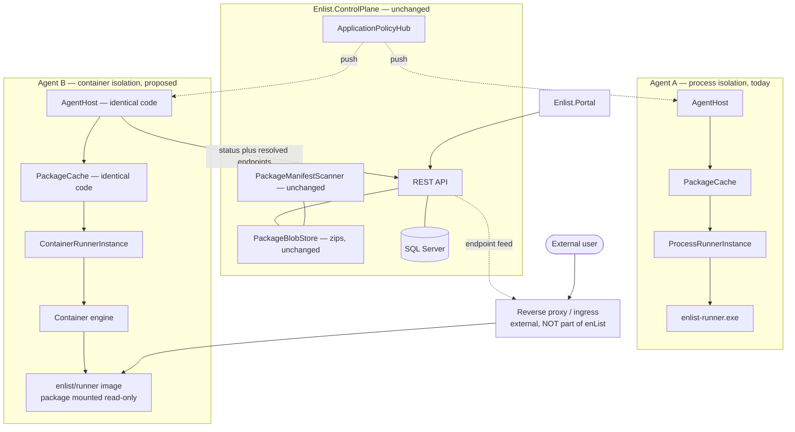
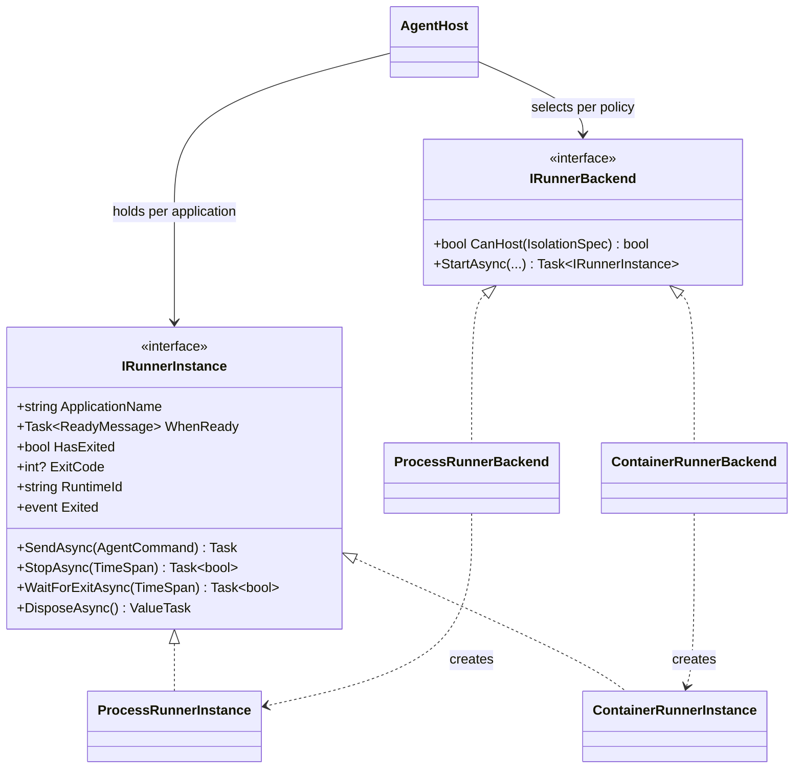
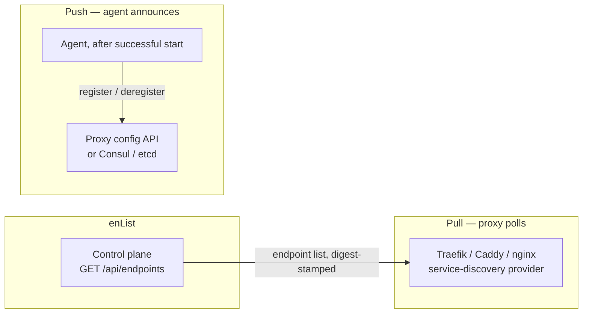
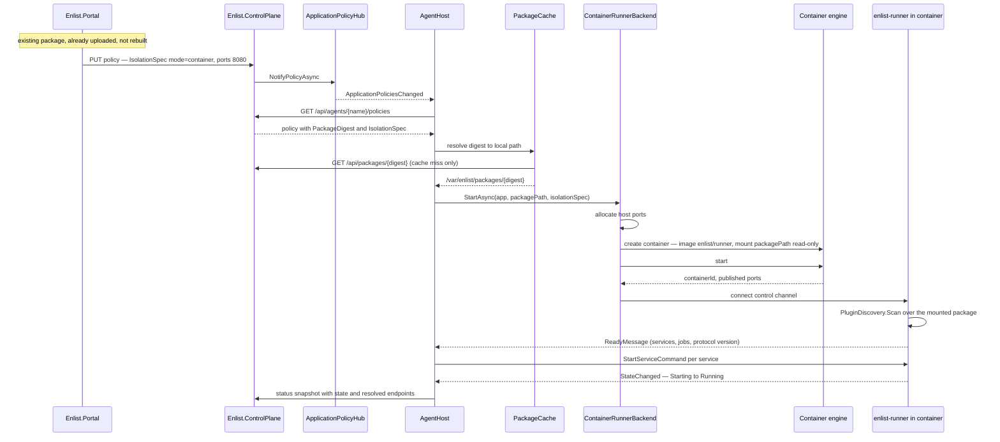
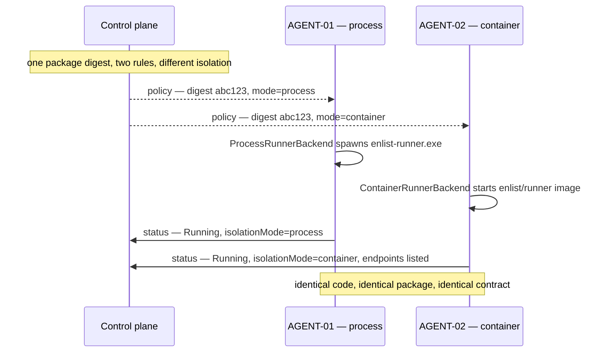
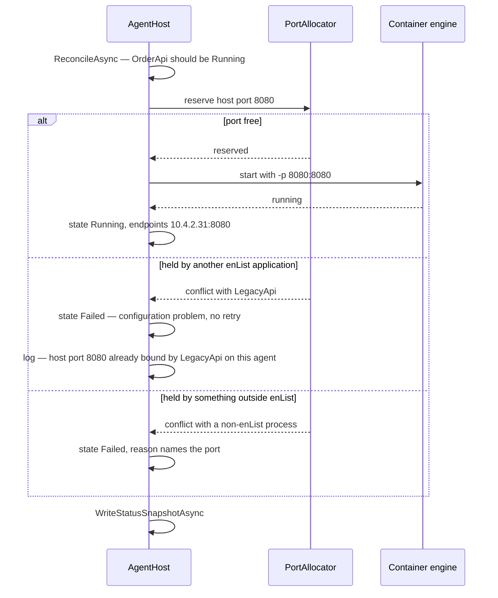
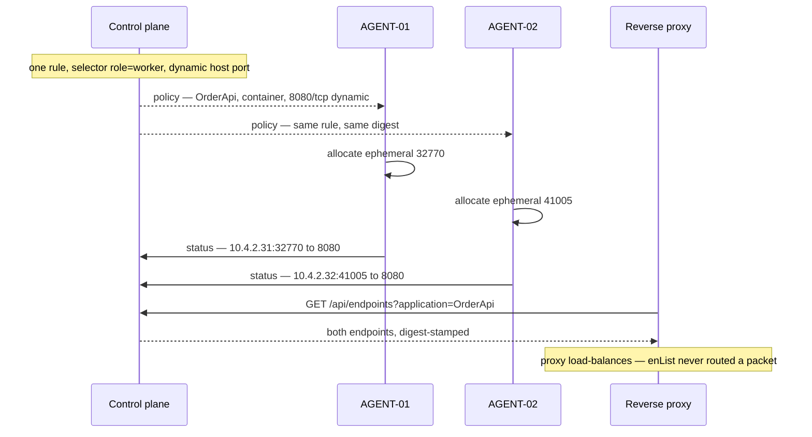
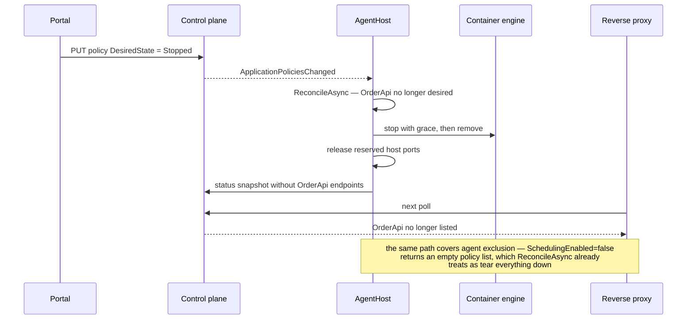

# enList Container Story

**Product:** enList v3
**Document status:** **Design proposal — six phases implemented and regression-reviewed; only C6 (optional extras) remains.** Written 2026-09-06 against the shipped v3 architecture (post tags-only targeting, post portal restructure). **Phases C0 (§12.1) through C5 (§12.6) shipped 2026-09-07/08 and are real code in `src/Enlist.Agent/Supervision/` and `src/Enlist.Runner/Protocol/`: the runner seam, the pluggable transport (named pipe, Unix domain socket, TCP listen), protocol versioning, and a working container backend with its runner image. Containers are now selectable from a policy rule and the portal, and the same package digest demonstrably runs as a process on one agent and in a container on another at the same time. Application ports are published and reported, with cross-application port-collision detection, and an endpoint feed a real Traefik consumes. Only C6 (net472 Windows containers, health-check surfacing, Design B) remains proposed. §12.9 records a full regression pass across every phase and the five defects it corrected.** Statements about *today* are verifiable in `src/`; §6 additionally describes the pre-C0 state in the past tense where the refactor has since changed it. Sits alongside [`SAD.md`](SAD.md) (current components), [`HLD.md`](HLD.md) (module decomposition), and [`enList-v3-Design.md`](enList-v3-Design.md) (original design intent).

---

## 1. The question this answers

> "How do we integrate containers into enList? Specifically: if an agent manages containers, and we host an application that needs to expose a port to an external user — or be part of a container network — how would enList go about that?"

Containers fit the *scheduling* half of enList almost for free, and collide with exactly one thing: **networking**. Today an enList service is a .NET type loaded in-process by `enlist-runner`, sharing the host's network namespace — bind a port and it is simply *on the host*, so enList never needed an opinion. A container has its own network namespace by construction, so exposure must be **declared, resolved, reported, and possibly routed**. That is the substantive new problem; §8 is where it lives.

---

## 2. Two features that are easy to conflate

The word "containers" hides two different products. Separating them is the most important decision in this document.

| | **A — The enList Runner Image** | **B — Arbitrary container images** |
|---|---|---|
| Deployment artifact | Today's zip of .NET build output, unchanged | An OCI image built by the app team |
| What the container holds | `enlist-runner` itself — one generic image, shipped with enList | The application, in whatever language |
| Plugin contract | `[EnlistService]` / `[EnlistJob]`, unchanged and still universal | Replaced by OCI image labels |
| Who can use it | Any existing net10.0 enList application, with **zero application changes** | Anything — Python, Go, off-the-shelf nginx |
| Discovery | `PackageManifestScanner`, unchanged | A new label scanner |
| Blob store impact | None — packages stay small zips | Image tars are 100–1000× larger |
| Risk | Low. One new backend behind an existing seam. | High. New artifact type, new contract, new distribution story. |

**This document proposes A as the design, and defers B to §14 as a later, separate capability.**

The reasoning: A delivers what containers are actually wanted for — dependency isolation, resource limits, a pinned runtime, a stronger blast-radius boundary — for every workload enList has today, while changing nothing about the artifact, the contract, or the portal. B serves a genuinely different need ("run something that isn't ours") and can be built later without rework, because nothing in A forecloses it.

### 2.1 The property that makes A worth doing

Because the artifact does not change, **the same package digest can run in-process on one agent and containerized on another, at the same time.** Containerization becomes a deployment-time decision — A/B it, migrate an application one agent at a time, roll back instantly — rather than a build-time fork. Under B you would build a zip *or* an image, and switching means rebuilding.

A second, easily-underrated benefit: **the agent host stops needing .NET installed.** Today a host must have the right runtime for every flavor it hosts. With a runner image it needs only a container engine, and the runtime version is pinned inside the image alongside the runner that depends on it.

---

## 3. What does not change

Most of the system. This is an extension at one seam, not a re-architecture.

| Concept | Today | With the runner image |
|---|---|---|
| Deployment artifact | Zip of build output, content-addressed by SHA-256 | **Unchanged.** |
| `enlist-deploy` | Zips a directory, uploads, prints the digest | **Unchanged.** No new flags. |
| Plugin contract | `contracts/EnlistAttributes.cs`, distributed as source | **Unchanged**, and still universal — see §2 |
| Upload-time inspection | `PackageManifestScanner` (`MetadataLoadContext`, executes nothing) | **Unchanged.** |
| Targeting | `TagSelector` against `AgentEntity.Tags`, plus the `{"agent": name}` self-tag | **Unchanged.** |
| Desired state | `DesiredState` = `Running` / `Stopped` | **Unchanged.** |
| Reconciliation | `AgentHost.ReconcileAsync` diffs desired vs actual | **Unchanged** — only the leaf "start one unit" call differs |
| Crash supervision | `CrashBackoff`, restart, `Failed` after max attempts | **Unchanged.** |
| Cron | `JobScheduler` fires on the cron expression | **Unchanged.** |
| Policy conflicts | `ConflictReason` → app reports `Failed` | **Unchanged**, and extended with a port-collision class (§8.2) |
| Agent exclusion | `SchedulingEnabled = false` → empty policy list → tear down | **Unchanged.** |
| Package caching | `PackageCache` downloads and extracts once per digest | **Unchanged** — and reused by the container path (§4.3) |
| Logs | Runner `Log` messages → `AgentFileLogSink` → forwarder | **Unchanged** — same messages over a different transport |
| Portal | Applications / Agents / Logs | **Unchanged**, plus an endpoints column (§8.3) |

---

## 4. Design A — the enList Runner Image

### 4.1 The shape

One image, built and versioned as part of enList itself — not per application:

```dockerfile
# enlist/runner:3.2.0  (illustrative)
FROM mcr.microsoft.com/dotnet/runtime:10.0
COPY runner/ /opt/enlist/runner/
ENTRYPOINT ["dotnet", "/opt/enlist/runner/enlist-runner.dll"]
```

Its contents are exactly what `_runnerBinDirectories["net10.0"]` points at today. It is infrastructure, the same way the runner binary is infrastructure — it ships on enList's release cadence, not the application's.

At start, the agent creates a container from that image with the application's package directory bind-mounted read-only, and a control channel connected. The runner inside does precisely what it does today: `PluginDiscovery.Scan` over the mounted assemblies, report a `ReadyMessage`, accept `StartServiceCommand` / `RunJobCommand`, stream `Log` / `StateChanged` / `JobResult` back.

The runner itself needs **no changes at all** beyond how it obtains its channel stream (§7.1).

### 4.2 Isolation mode is not a runtime flavor

An earlier draft of this document modelled `container` as a third `RuntimeFlavor`. That was wrong under this design.

- `RuntimeFlavor` (`net10.0`, `net472`) is a fact about the **package** — what it needs in order to run at all. A containerized net10.0 package is still net10.0.
- Whether the agent hosts it in-process or in a container is a fact about the **placement** — an isolation choice, orthogonal to the flavor.

They are two independent axes, and keeping them separate is what later allows net472-in-a-Windows-container without special-casing anything:

| | in-process | container |
|---|---|---|
| **net10.0** | today | Design A, phase C2 |
| **net472** | today | possible later, Windows containers |

Proposed model — an optional isolation block on the policy, defaulting to in-process so every existing rule keeps its exact meaning:

```csharp
public sealed record IsolationSpec(
    string Mode,                               // "process" (default) | "container"
    string? Image,                             // null = the agent's configured default runner image
    IReadOnlyList<PortMapping> Ports,          // §8
    IReadOnlyList<string> Networks,            // named networks to attach to
    IReadOnlyDictionary<string, string> Env,   // non-secret only
    ResourceLimits? Resources);

public sealed record PortMapping(int ContainerPort, int? HostPort, string Protocol = "tcp", string? Name = null);
public sealed record ResourceLimits(double? Cpus, long? MemoryBytes);
```

Stored as one nullable `IsolationJson` column (this document proposed `IsolationSpecJson`; the shipped column is `IsolationJson`), following the precedent `CronOverrides` already sets — one migration, no new tables, and the shape can evolve without further schema churn.

An agent that cannot honour `Mode = "container"` (no engine configured) fails that one application to `Failed` with a clear reason, exactly as it does today for a missing runner-bin — see `StartApplicationAsync`'s existing "configuration problem, not transient, do not retry" branch. Nothing else on that agent is affected, because failure is already scoped per application.

### 4.3 Package delivery: the agent fetches, the container mounts

The obvious design is for the container to pull its own package from the control plane. The better one is for it not to.

| | Container fetches | **Agent fetches, mounts (recommended)** |
|---|---|---|
| Reuses `PackageCache` | No — re-downloads per container | **Yes, unchanged** — download once, share across every instance of that digest |
| Container needs control-plane reachability | Yes | **No** — can be fully network-isolated |
| Container needs credentials | Yes | **No** |
| Extra code | A fetch client inside the runner image | **None** — bind-mount an existing local path |

The agent already resolves a digest to a local extracted directory for the in-process path. The container path reuses that same resolved path as a read-only mount, which means the container image stays stateless and identical for every application — the only per-application inputs are the mount, the env, and the channel.

---

## 5. Component architecture



The two agents run **the same `AgentHost` code**. The only difference is which `IRunnerInstance` implementation gets constructed — which is the subject of the next section.

---

## 6. The agent↔runner seam

This section exists because of a specific design question: *should the agent's named-pipe protocol handler be an interface, replaceable based on need?* The answer is yes, but not at the layer the question implies — and part of it is already done.

### 6.1 Transport is already abstracted

`MessageChannel<TOut, TIn>` takes a **`Stream`**:

```csharp
// Enlist.Runner/Protocol/MessageChannel.cs — today
public MessageChannel(Stream stream)
```

Its own doc comment says "in practice a `NamedPipeClientStream`/`NamedPipeServerStream`" — *in practice*, not by construction. The framing (newline-delimited JSON, `SendAsync`/`ReceiveAsync`, the write lock, the tolerant dispose) is entirely transport-agnostic already. Running the same protocol over a Unix domain socket or a loopback TCP socket needs **no interface and no new abstraction** — only a different `Stream` handed to the same class.

So the protocol layer needed nothing — C1 changed not one line of MessageChannel. What it needed was a *connection factory* one level up, and that is where the real variation lives: see IChannelListener, and §12.2.

### 6.2 What actually needs an interface

`RunnerInstance` was a `sealed class` bundling four concerns, only one of which is the protocol. (C0 has since split it into `ProcessRunnerInstance` + `ProcessRunnerBackend` behind the two interfaces below; the analysis that motivated the split is preserved here as written.)

| Concern | Today | In a container |
|---|---|---|
| Execution lifecycle | `Process.Start`, `HasExited`, `ExitCode`, `Kill(entireProcessTree)` | engine create / start / inspect / wait / remove |
| Transport establishment | `NamedPipeServerStream` + connect-with-timeout | socket connect, or a mounted socket |
| Protocol | `MessageChannel<AgentCommand, RunnerMessage>` | **identical** |
| Containment | `JobObject` (Windows process-tree cleanup) | **unnecessary** — the container *is* the boundary |

Three of four differ. That is the seam, and it sat at `RunnerInstance`, not at `MessageChannel`.



Two interfaces, because two things vary: **how a unit is created** (the backend, chosen per policy) and **how a live unit behaves** (the instance, held per application in `AgentHost._instances`).

> **Note:** this diagram is the **target** shape, after C2/C3. The interfaces as actually shipped in C0 are narrower — `RuntimeId` and `CanHost` are absent, because both depend on `IsolationSpec`, which does not exist yet. See §12.1.

`RunnerInstance.StartAsync` was a `static` factory. That static was the thing blocking substitution — in C0 it became `IRunnerBackend.StartAsync`, a dependency `AgentHost` holds as an interface, and which C3 will select from `IsolationSpec.Mode`.

### 6.3 Two members that need care when extracting the interface

`AgentHost` used `RunnerInstance` in about a dozen places. Most of that surface generalized cleanly; two members did not:

- **`Pid`** feeds `AgentApplicationStatusDto.Pid`. A container has an ID, and possibly a host PID that means little. Proposal: keep `Pid` as `int?` for the process backend, add `RuntimeId` (`string`) carrying the PID or the container ID, and report both — the portal already treats status fields as optional.
- **`JobObjectAssigned`** exists to report a *weakened* guarantee ("agent death may not kill this runner") on Windows when a job object could not be created. It is process-specific and should not appear on the interface at all. A container provides that guarantee natively, so the container implementation is not "reimplementing job objects" — it simply has nothing to report.

### 6.4 The invariant

**`AgentHost` must never branch on backend type.** Reconciliation, crash-backoff, job scheduling, command dispatch, status assembly and log handling are all backend-agnostic today and must stay that way. If `if (isContainer)` appears anywhere in `AgentHost`, the seam is in the wrong place and the backend abstraction is leaking.

This is not a novel imposition — it is the convention this codebase already follows. `IAssignmentSource` keeps the control-plane and local-file assignment sources interchangeable; `ILogForwarder` does the same for log delivery. `IRunnerBackend` is the same move applied to execution.

### 6.5 What not to abstract

Resist adding an `IMessageChannel`. Both backends would use identical framing over different streams, so such an interface would absorb no variation and buy only indirection. The test for a seam worth having: *do the implementations behind it actually differ?* Transport: yes (a `Stream` factory covers it). Backend and instance: yes. Framing: no.

### 6.6 A new risk: protocol version skew

Today the runner binary is deployed alongside the agent, so the two cannot meaningfully disagree about the protocol. A separately-versioned runner **image** can. `ReadyMessage` should carry a protocol version, and the agent should fail the application with a clear reason on mismatch rather than proceeding and failing obscurely later — the same posture already used for a missing runner-bin.

---

## 7. Lifecycle mapping

| enList concept | Process backend (today) | Container backend (proposed) |
|---|---|---|
| Start application | `Process.Start`, wait for pipe connect | create + start container, wait for channel connect |
| Ready | `ReadyMessage` over the pipe | `ReadyMessage` over the socket — identical message |
| Start / stop service | `StartServiceCommand` / `StopServiceCommand` | **identical** — the runner is the same code |
| Job execute (cron) | `RunJobCommand` on the scheduler tick | **identical** |
| Job disable | scheduler does not fire it | **identical** |
| Stop application | `StopAsync` grace period, then kill tree | stop with grace, then remove |
| Unexpected exit | process exit → `CrashBackoff` | container exit (non-zero, unrequested) → **same** `CrashBackoff` |
| Log capture | `Log` messages over the pipe | **identical** — same messages, same sinks |
| Containment on agent death | `JobObject` (Windows) | native — the container is the boundary |
| Resource limits | none | cgroups via `ResourceLimits` |
| Runtime dependency | .NET installed on the host | pinned inside the image |

The striking part of this table is how much of it reads "identical." That is the whole argument for Design A: the runner is unchanged, so everything downstream of `ReadyMessage` is unchanged.

---

## 8. Networking

The one genuinely new problem, and it applies to Design A and B alike.

### 8.1 Four levels of exposure

| Level | Meaning | Resolved by | enList's role |
|---|---|---|---|
| **0 — none** | Outbound only: a worker, an ETL job | nobody | Nothing to do. Most jobs live here. |
| **1 — host publish** | `containerPort` → `hostPort` on the agent's IP | agent, at start | **Declare, allocate, report.** Fully owned. |
| **2 — named network** | Joins a bridge/overlay so siblings resolve it by name | agent, at start | **Declare and attach.** Validates the network exists; does not create topology. |
| **3 — external ingress** | Public hostname, TLS, path routing, LB across agents | a reverse proxy | **Report only.** |

Levels 0–2 are a good fit and should be built. Level 3 is where the honest answer is "publish the facts and integrate" (§8.4).

### 8.2 Port allocation, and a new conflict class

`PortMapping.HostPort` may be **static** (`8080`) or **null** (allocate ephemeral). Both matter: static is required when something outside enList already points at that port; dynamic is what makes tag-selector fan-out work, since one hard-coded port cannot serve a rule that lands on twelve agents if two such applications ever coincide.

Static ports introduce a collision with no equivalent today — and it maps onto machinery that already exists. `PolicyConflictDetector` currently answers *"do two rules matching this agent disagree about what to run?"* Ports add a sibling question: *"do two rules matching this agent both want host port 8080?"*

It should surface in the same three places the existing conflict already does, all built this cycle:

1. **Wizard-time** — the policy wizard already warns before saving a rule that collides with an existing one, naming the agent. A port collision is the same warning with a different sentence.
2. **Policy screen** — the conflicting rules already get a red `conflict` chip next to their state.
3. **Applications tab** — the rule count already carries a conflict indicator, and the expanded view already collapses a conflicted agent to a single "Policy conflict / Failed" row rather than showing stale per-instance state.

A static port already bound by something enList does not manage should fail that application to `Failed` with the port named — the same non-retrying posture used for a missing runner-bin and for `ConflictReason`.

### 8.3 Endpoint reporting

Whatever is resolved gets reported in the status snapshot. This costs **no control-plane migration**: `AgentReportEntity` stores the snapshot as an opaque JSON blob precisely so the agent's status shape can evolve independently — a decision [`SAD.md` §5](SAD.md#5-cross-cutting-design-decisions) calls out explicitly. It is an agent-and-portal change only.

```csharp
public sealed record AgentApplicationStatusDto(
    string Name, string State, int? Pid, int RestartCount,
    List<AgentServiceStatusDto> Services,
    List<AgentJobStatusDto> Jobs,
    string? Description = null,
    // proposed:
    List<ResolvedEndpointDto>? Endpoints = null,
    string? RuntimeId = null,        // PID or container ID
    string? IsolationMode = null);   // "process" | "container"

public sealed record ResolvedEndpointDto(
    string? Name, string Protocol, int ContainerPort, int HostPort, string HostAddress);
```

Rendered in the expanded application view alongside what is already there:

| Name | Type | Agent | Endpoint | State |
|---|---|---|---|---|
| Order API | Service | DEV-AGENT-03 | `10.4.2.31:32770 → 8080/tcp (http)` | Running |
| Nightly ETL | Job | DEV-AGENT-03 | — | Enabled |

An operator can then answer "where is this actually listening right now?" from the screen that already answers "is it running?".

### 8.4 Where enList stops, and why

The temptation is to keep going: hostnames, TLS, path routing, health-checked load balancing across every agent a selector matched. That is a coherent product — it is also, almost exactly, why Kubernetes Services and Ingress exist, and enList would be re-implementing it badly.

**The boundary:** enList is authoritative for *placement and endpoints*, and is not a router. Two integration shapes:



Start with pull: stateless, no partial-failure story, trivially testable, and a pure projection of data the system already has.

---

## 9. Sequence diagrams

### 9.1 Running an existing package in a container — no rebuild



Everything from `ReadyMessage` onward is byte-identical to the in-process path.

### 9.2 The same package, both isolation modes at once



### 9.3 Reconciliation with a static port already taken



### 9.4 Dynamic allocation across a fanned-out selector



### 9.5 Teardown



---

## 10. Use cases

### UC-1 — Containerize an existing application, no rebuild
**Actor:** platform engineer. **Precondition:** `OrderProcessor` already deployed and running in-process.
Edit the policy rule, set isolation to container, save. The agent tears down the in-process runner and starts the same digest in a container. **No rebuild, no re-upload, no application change.** Rolling back is editing the same field back. This is the headline capability and the reason Design A is worth doing.

### UC-2 — Run on a host with no .NET installed
**Actor:** operations, adding capacity.
A new host gets a container engine and the agent, and is tagged `container=true`; it never gets a .NET runtime. Rules whose isolation is container schedule onto it. The runtime version is pinned in the image, so "works on my agent" stops being a class of incident.

### UC-3 — Resource-capped noisy neighbour
**Actor:** operations, after an incident.
An application that has previously starved its host gets `Resources = { cpus: 2, memoryBytes: 2GiB }` and container isolation. The cgroup ceiling is enforced by the engine; enList's role is to declare it and report the outcome. In-process hosting has no equivalent.

### UC-4 — Internal HTTP API reachable from the LAN
**Actor:** platform engineer.
`Ports = [{ containerPort: 8080, hostPort: null, name: "http" }]`. The agent allocates ephemeral ports, the portal shows exactly where each instance landed, consumers discover them via `/api/endpoints`. **Level 1 plus reporting.**

### UC-5 — Public web application behind an existing proxy
**Actor:** operations.
As UC-4, plus the organisation's existing Traefik polls `/api/endpoints` and routes `orders.example.com` to the reported set. TLS, certificates, hostnames and health-based removal are Traefik's job. **Level 3 — report only.**

### UC-6 — Gradual migration across a mixed fleet
**Actor:** operations, mid-migration.
Container-capable hosts are tagged; some rules are containerized, some are not, and the same package runs both ways simultaneously (§9.2). A container rule reaching a non-container agent fails that one application with a clear reason and leaves the rest of that agent running. A rule matching nothing shows as **0 agents** with the warning the Applications tab already renders.

### UC-7 — Two rules, same host port
**Actor:** anyone, by accident.
Covered end to end by §8.2 — warned at wizard time, chipped on the policy screen and the Applications list, and collapsed to a single explanatory row in the expanded view. A port collision is the same *shape* of problem as the version conflict already handled, so it reuses that vocabulary rather than inventing a second one.

---

## 11. Worked examples

### 11.1 The same package, in-process (today, unchanged)

```jsonc
{
  "applicationName": "OrderProcessor",
  "tagSelector": { "agent": "DEV-AGENT-01" },
  "desiredState": "Running",
  "packageDigest": "48533b2c21cd…",
  "runtimeFlavor": "net10.0"
  // no isolationSpec — defaults to process, meaning exactly what it means today
}
```

### 11.2 The same package, containerized with a published port

```jsonc
{
  "applicationName": "OrderProcessor",
  "tagSelector": { "container": "true" },
  "desiredState": "Running",
  "packageDigest": "48533b2c21cd…",   // identical digest — no rebuild
  "runtimeFlavor": "net10.0",          // still net10.0 — the flavor did not change
  "isolationSpec": {
    "mode": "container",
    "image": null,                     // agent's configured default runner image
    "ports": [ { "containerPort": 8080, "hostPort": null, "protocol": "tcp", "name": "http" } ],
    "networks": [ "enlist-internal" ],
    "resources": { "cpus": 2.0, "memoryBytes": 2147483648 }
  }
}
```

### 11.3 Resulting status

```jsonc
{
  "name": "OrderProcessor",
  "state": "Running",
  "isolationMode": "container",
  "runtimeId": "3f9a1c2b7e44",
  "services": [ { "name": "Order Intake Listener", "state": "Running" } ],
  "endpoints": [
    { "name": "http", "protocol": "tcp", "containerPort": 8080, "hostPort": 32770, "hostAddress": "10.4.2.31" }
  ]
}
```

### 11.4 Deploying — unchanged

```bash
# exactly as today. No new flags, no image build, no registry.
enlist-deploy --control-plane http://cp:5293 --app OrderProcessor --source ./publish
```

### 11.5 Endpoint feed for a proxy

```jsonc
GET /api/endpoints?application=OrderProcessor
[
  { "application": "OrderProcessor", "agent": "AGENT-01", "name": "http",
    "address": "10.4.2.31", "port": 32770, "packageDigest": "48533b2c21cd…",
    "reportedAtUtc": "2026-09-06T14:02:11Z" },
  { "application": "OrderProcessor", "agent": "AGENT-02", "name": "http",
    "address": "10.4.2.32", "port": 41005, "packageDigest": "48533b2c21cd…",
    "reportedAtUtc": "2026-09-06T14:02:09Z" }
]
```

`reportedAtUtc` matters: this feed is derived from agent status snapshots and is therefore **eventually consistent by construction**. A consumer should treat a stale entry the way the portal already treats a stale agent — the "no recent report, treat as presumed stopped" convention the running-instances view uses today.

---

## 12. Phased plan

| Phase | Scope | Exit criteria |
|---|---|---|
| **C0 — Extract the seam** ✅ **done 2026-09-07** | `IRunnerInstance` / `IRunnerBackend`; `ProcessRunnerBackend` is the first implementation; `AgentHost` depends only on the interfaces; the `RunnerInstance.StartAsync` static is gone | **Met.** 55/55 existing tests green. Not one assertion, fixture or test body was changed — the only test edits were two *comments* naming the old type — which is the evidence the public surface behaves identically, since several tests reach straight into `AgentHost.Instances[...]`. Verified live too: start, policy-driven stop (graceful, not killed) and restart, across both a net10.0 and a net472-flavored application. |
| **C1 — Transport swap** ✅ **done 2026-09-07** | `IChannelListener` with named-pipe and Unix-domain-socket implementations; the runner accepts `--socket` alongside `--pipe`; `RunnerProtocol.Version` carried in `ReadyMessage` and checked by the agent | **Met.** 66/66 green (was 55). The real runner completes discovery, command round-trips and disconnect-detection over a socket, proven both through the test harness and through the production `ProcessRunnerBackend`. Named pipe remains the default and the live demo is unchanged. See §12.2. |
| **C2 — Container backend, level 0** ✅ **done 2026-09-07** | `IContainerEngine` + `DockerContainerEngine`, `ContainerRunnerBackend` + `ContainerRunnerInstance`, the runner image (`src/Enlist.Runner/Dockerfile`), read-only package bind-mount, `RuntimeId` on the seam | **Met, both halves.** 71/71 green. An unmodified SampleService package runs containerized with discovery and assembly isolation intact; `AgentHost` — handed only a different backend, otherwise untouched — restarts it after `docker kill`. See §12.3 and the [Container Developer Guide](../02-building-applications/Container-Developer-Guide.md). |
| **C3 — Isolation on the policy** ✅ **done 2026-09-07** | `IsolationSpec` persisted as one JSON column, validated on create/update, joined to conflict detection; backends selected per policy; portal wizard, edit dialog and policy screen expose the mode; `isolationMode` + `runtimeId` in status | **Met.** 71/71 green, and UC-6 demonstrated live: package digest `48533b2c…` running as a **process** on DEV-AGENT-01 (pid 49824) and in a **container** on DEV-AGENT-02 simultaneously, from two rules differing only in isolation. See §12.4. |
| **C4 — Ports and reporting, level 1/2** ✅ **done 2026-09-08** | `PortMapping` published (static and engine-allocated), named-network attach, cross-application port collisions caught at BOTH wizard time and policy resolution, `ResolvedEndpointDto` in status, portal Endpoint column | **Met.** 80/80 green. A declared port is published and reported live as `KENSHO:65404 → 8080/tcp (http)`. All three §8.2 surfaces built. Collision detection covers the three cases that must NOT be conflicts as well as the one that must. See §12.5. |
| **C5 — Endpoint feed, level 3 boundary** ✅ **done 2026-09-08** | `GET /api/endpoints` with staleness, `GET /api/endpoints/traefik` in Traefik HTTP-provider shape | **Met.** 84/84 green. UC-5 verified against a real **Traefik 3.1**: it polled the feed, registered `orderprocessor` as `status: enabled`, and when the container was killed and restarted on a new ephemeral port it followed `50605 → 58350` on its own. See §12.6. |
| **C6 — Optional** | net472 in Windows containers; health-check surfacing; Design B (§14) | — |

C0 deserves emphasis: it is a **pure refactor with no behaviour change**, independently reviewable and independently shippable, and it is where most of the architectural risk in this whole effort lives. Doing it first — and merging it before any container code exists — means the container work that follows is additive rather than entangled.

### 12.1 What C0 deliberately did *not* move

Holding the "zero behaviour change" line meant narrowing C0's scope in three places from what §6.2's class diagram shows. That diagram is the **post-C2 target shape**, not C0's deliverable, and the gaps are intentional rather than oversights:

- **`RuntimeId` and `CanHost(IsolationSpec)` are not on the interfaces.** Both need `IsolationSpec`, which does not exist until C3, and neither would have a consumer today. An interface member with no implementation that varies and no caller is speculation, not abstraction; they arrive with the second backend that gives them meaning.
- **RuntimeFlavor→runner-bin resolution and `RunnerStaging` stayed in `AgentHost`.** Moving them reads as the natural next step — both are process-shaped — but it changes observable behaviour on a *tested* path: a missing runner-bin currently goes **straight to `Failed` and is never retried** (`RuntimeFlavorRoutingTests` asserts exactly this), whereas routing it through the backend would land it in the crash-backoff/retry machinery instead. Staging has the same hazard, plus an unresolved question about which failure paths should clean up the staged directory. C2 moves them, with a container backend in hand to show what the generalized shape actually is.
- **The backend is constructed, not injected.** `AgentHost` names `ProcessRunnerBackend` exactly once, in its constructor; the field is typed `IRunnerBackend`. Selecting a backend per policy is C3's job — adding an injection point before a second implementation exists would be untested scaffolding.

One thing did move, deliberately: the **"could not assign to the Job Object" warning**, from `AgentHost` into `ProcessRunnerBackend`. It reports a property of how *that backend* contains a process, and §6.3 argues it should not appear on the seam at all. It is emitted after the connect handshake, not before, so a start that goes on to fail still logs only its own failure — exactly as before.

### 12.2 What C1 shipped

**Transport.** `IChannelListener` (in `Enlist.Runner.Protocol`, beside `MessageChannel`, since it belongs to the boundary and both ends plus the tests need it) with two implementations: `NamedPipeChannelListener` and `UnixSocketChannelListener`. A listener owns its endpoint *and* the `RunnerArguments` needed to reach it, so no launch site has to know whether it is handing out a pipe name or a socket path. `MessageChannel` itself was not touched — §6.1's claim that it was already transport-agnostic held exactly.

Unix domain sockets were chosen over loopback TCP per §15 decision 1: a socket file bind-mounts into a container, needs no port, and is unreachable from the host's network. `AF_UNIX` works on Windows 10 1803+, so this is exercised by the suite on the project's Windows dev box rather than waiting on a Linux container.

One subtlety the interface documents explicitly, because it is a trap: **for a named pipe the listener and the connection are the same object; for a socket they are two.** So `AcceptAsync` transfers ownership of the connection, and `Dispose()` afterwards must close the listening endpoint without touching it — the pipe listener no-ops, the socket listener closes its listen socket and unlinks the file.

**Protocol version.** `RunnerProtocol.Version` (= 1, naming the contract that already shipped, so nothing on the wire changed) travels in `ReadyMessage` and is checked by `AgentHost` before it acts on anything else in that message. A mismatch goes straight to `Failed` without retry, like a missing runner-bin — a differently-versioned binary will still be differently-versioned next attempt.

`ProtocolVersion` deliberately defaults to `Unreported` (0), **not** to the current version: System.Text.Json fills a missing property from the record parameter's default, so defaulting to current would make every pre-versioning runner silently claim to be current — the exact failure the check exists to prevent. "Too old to report a version" and "reports a different version" are also reported as distinct diagnoses, because they lead an operator to different fixes.

**A latent deadlock this uncovered.** `ProcessRunnerInstance.DisposeAsync` awaited its receive loop *before* killing the process. That loop only ends when the far end closes, so disposing a runner that is alive and healthy blocked forever. It had never fired because every existing caller stopped the runner first — but AgentHost's discovery-timeout path does not (a runner hung before sending `Ready` is alive, just not talking), and C1's own protocol-mismatch path does not either (there the runner is perfectly healthy, it just speaks the wrong version). Disposal now kills first, then drains the loop under a bounded timeout. Found by a test that disposed a healthy runner and hung the whole suite.

### 12.3 What C2 shipped — and the finding that redirected it

**Containers work.** `IContainerEngine` / `DockerContainerEngine` (driving the `docker` CLI) — and, since 2026-09-10, `WslContainerEngine` driving the `wslc` CLI that ships with WSL 2.9.11+, the seam's second real implementation, landed with no change above it, `ContainerRunnerBackend`, `ContainerRunnerInstance`, and a generic runner image containing only `enlist-runner`. The application is never baked in — it arrives as a read-only bind mount of the package directory the agent already extracted, which is what makes §2.1's claim literally true: the same digest, no rebuild.

`RuntimeId` joined `IRunnerInstance`, exactly as §6.3 proposed and exactly when C0 said it should — with a second implementation in hand rather than imagined. `Pid` stays, and the container backend reports **0** for it, deliberately: a container's "host pid" under Docker Desktop lives inside a Linux VM and means nothing to anything on the Windows host. Inventing a plausible-looking number nobody can act on would be worse than an obvious zero.

C0's invariant is now enforced by a test rather than by intention. `ContainerCrashRestartTests` hands `AgentHost` a `ContainerRunnerBackend` and changes nothing else — no container-aware config, no special casing — then kills the container. If anyone adds `if (isContainer)` to `AgentHost`, that test's shape is the guard.

**The finding: C1's chosen transport does not work for containers on this platform.** §15 decision 1 picked Unix domain sockets. Tested directly rather than assumed, a UDS created on the Windows host and bind-mounted into a Linux container arrives as an **ordinary empty regular file** — not a socket, not connectable. The `--socket` transport is genuinely working host-to-host and is exercised by the suite, but it cannot cross a Windows-host → Linux-container boundary at all.

So C2 added a third transport, and inverted the direction: `--listen`, where the **runner is the server** and the agent dials in. Two reasons, and the second is the stronger one:

1. It sidesteps the platform limit above.
2. The alternative — agent listens, container dials `host.docker.internal` — would require the agent to bind an interface reachable from off-box, and **this protocol has no authentication whatsoever**: anything that connects can start services and run jobs. Listening inside the container lets the engine publish the port to `127.0.0.1` only.

That the third transport cost one `ListenAsync` method and one CLI flag is C1's seam paying for itself. **The security posture still needs a real answer before containers run anywhere but a developer machine** — loopback-only publishing is the entire confinement today.

### 12.4 What C3 shipped

**Isolation is now a property of a policy rule**, persisted as a single `IsolationJson` column on `ApplicationPolicyEntity`. NULL and `{"mode":"process"}` mean the same thing, so nothing needed backfilling and every pre-existing rule kept its exact meaning. The column holds the whole `IsolationSpec` — including the `Ports`, `Networks` and `Env` that C4 will fill in — following the same reasoning already applied to `TagSelectorJson` and `CronOverridesJson`: always read and written whole, never queried by key. **C4 therefore needs no migration and no entity change**, which is the specific reason C3 and C4 were kept as separate phases rather than merged.

**Backends are selected per policy**, via a dictionary keyed by isolation mode — deliberately the same shape as `_runnerBinDirectories` keyed by runtime flavor, because it is the same kind of lookup. An agent without a container engine simply has no container entry, and a rule asking for one is reported as a configuration problem (`Failed`, no retry) with a message naming the mode and what that agent actually supports — the same posture as a missing runner-bin. Selecting a backend by declared mode is not the branching §6.4 forbids: nothing downstream of the lookup knows what came back.

**Staging finally moved behind the seam.** §12.1 flagged it and C2 turned it into a live wart — every containerized application was paying for a runner copy nobody read. The fix could not be an `if (isContainer)` in `AgentHost`, because that is precisely the invariant the seam exists to hold, so `IRunnerBackend` gained `Cleanup` and the process backend took ownership of both staging and its teardown. `AgentHost` asks every backend to clean up rather than tracking which one started what: teardown happens on paths where the assignment (and its declared mode) is already gone.

**One trap fixed before it could bite.** `IsolationSpec` is a positional record, so the compiler-generated `==` compares `Ports`/`Networks`/`Env` by REFERENCE. Conflict detection using it would have worked perfectly in C3 — those collections are always null — and then, the moment C4 populated them, reported phantom conflicts on rules that were identical. `AgreesWith` compares structurally instead.

### 12.5 What C4 shipped

**Application ports, level 1.** A `PortMapping` on the policy is published by the agent and reported back as a `ResolvedEndpointDto`. Static (`hostPort: 9100`) and dynamic (`hostPort: null`) both work, and the distinction is the reason resolved endpoints are reported *separately* from the mapping that requested them: a dynamic port has no answer until the engine has allocated it. The portal renders `KENSHO:65404 → 8080/tcp (http)` in an Endpoint column beside the state it already showed, so "is it running?" and "where is it listening?" are answered on one screen.

**Exposure differs deliberately between the two kinds of port.** The control channel publishes to `127.0.0.1` only — it is unauthenticated plumbing that must never leave the host. An application port publishes on all interfaces, because being reachable is the entire point of declaring one. That asymmetry is commented at the call site so it is not "tidied up" into consistency later.

**A second conflict class.** The pre-existing conflict is per-application: "do two rules for the same application disagree?" A static host port collides between DIFFERENT applications, so it is invisible to that check — it lives between groups, not inside one. It is caught at policy resolution rather than at container start, because the engine's own "port is already allocated" names neither the other application, nor the rule, nor the agent. Both sides are flagged, each naming the other, since there is no principled winner. Three non-collisions are tested as carefully as the collision: dynamic ports never collide, the same port on two different agents is fine, and different host ports sharing a container port is the ordinary way to run two of something.

**A C3 bug this surfaced.** Reconciliation compared `Path`, `RuntimeFlavor`, `ConflictReason` and `CronOverrides` — but not `Isolation`. Flipping a rule from process to container therefore did nothing until some unrelated event forced a restart, silently defeating the migrate-one-agent-at-a-time workflow that is §2.1's whole selling point. C4 only made it visible (a newly declared port never appeared). The comparison uses `AgreesWith`, never `==`: the spec is a positional record whose collections compare by REFERENCE, so `==` would see every freshly-deserialized spec as different and restart the application on every poll. The method written defensively for conflict detection turned out to be exactly what this needed.

**`StartAsync` became a request record.** The parameter list had grown every phase and each backend legitimately ignored parts of it. `RunnerStartRequest` means a later phase can append a field without touching backends that do not care — the cleanup C0 anticipated, done when the growth actually justified it.

### 12.6 What C5 shipped

**`GET /api/endpoints`** projects every endpoint every agent last reported, optionally filtered by application. **`GET /api/endpoints/traefik`** renders the same data in Traefik's HTTP-provider shape.

**It emits `services` and deliberately NOT `routers`.** A service is the live set of servers for an application — the thing enList uniquely knows and a proxy cannot discover for itself. A router is a hostname, a TLS certificate and a path rule: how an organisation wants traffic to arrive, which §8.4 explicitly refuses to own. An operator declares routers once in their own Traefik config and points each at a service named here; enList keeps the server list underneath current as applications move between agents. A test asserts `routers` is ABSENT, so the boundary is enforced rather than merely described.

**Staleness is reported, not applied, in enList's own feed.** An agent past the 5-minute liveness window still has a last-known report, and its endpoints come back with `stale: true` rather than vanishing — "the agent went quiet" and "the application stopped" are different events and an operator must be able to tell them apart. The Traefik projection then **excludes** stale entries, because a proxy routing live traffic to a host presumed dead is a different question from a human reading a screen. Facts in the feed; policy in the adapter.

**On reading the opaque blob.** This is the first thing in the control plane to parse `AgentReportEntity.SnapshotJson`, which is stored unparsed precisely so the agent's status shape can evolve with no server migration (docs/03-architecture/SAD.md §5). Reading at QUERY time is a much weaker coupling than storing parsed columns: no schema, no migration, and an unreadable shape degrades the feed (that agent contributes nothing) instead of breaking ingestion for everyone. The parse is tolerant and case-insensitive, and a test feeds it a deliberately wrong shape to prove one bad agent cannot take the feed down.

**Verified against a real proxy, not a mock.** Traefik 3.1 in a container polled the feed and registered `orderprocessor` with `status: enabled` and `provider: http`. The application container was then killed; the agent restarted it on a new ephemeral port, the feed moved from `50605` to `58350`, and Traefik followed within one poll — the whole placement-to-routing chain, unassisted.

**All three collision surfaces from §8.2 are built.** The wizard gained container-port inputs and warns BEFORE saving, naming the agent, the port and the application that already holds it — the thing the engine's own "port is already allocated" cannot tell anyone. The policy screen and the Applications tab each chip a `port collision`, distinct from the existing `conflict` chip because the cause and the fix both differ: one means two rules for THIS application disagree, the other that a DIFFERENT application holds the port.

The latter two were missed on the first pass and caught by a regression review. `FindConflictsByAgent` — which every reactive surface was built on — groups by application and asks whether rules for the same application disagree; a port collision happens BETWEEN applications, so it falls between the groups and is structurally invisible to it. `FindPortCollisionsByAgent` is the counterpart, and the shape of that mistake is worth remembering: a check can be correct, well-tested and simply unable to see the thing you assumed it covered.

This also exposed a C3 omission in the portal. `PolicyConflictDetector.Canonical` had not been extended with isolation when isolation joined the control plane's comparison, so its doc comment claiming to "mirror the control plane" had quietly stopped being true — two rules differing only in process-vs-container would have been flagged by the agent and silently accepted by the wizard. Isolation is compared there through `AgreesWith` semantics for the same reference-equality reason as everywhere else.

### 12.7 Flavor × isolation, and the end of the silent skip

Prompted by one question of the running system: *what happens if I deploy a net472 application and assign it to a container?* The answer was "it appears to work", for three compounding reasons — each fixed.

**A policy now inherits its package's detected flavor.** `ApplicationPolicyEntity.RuntimeFlavor` defaulted to net10.0 independently of the package it pointed at, so upload-time detection — which inspects the actual bytes — never reached the field the AGENT routes on. Every LegacySample rule in this project's own demo said `net10.0` while its package was `net472`. When a rule references a package, that package's flavor is now authoritative; a contradicting explicit value is rejected rather than silently resolved, since either resolution leaves the other value wrong with nothing to show for it. A Path-based rule has nothing to inspect and is untouched — deriving unconditionally on update would have silently reset such a rule to the default, which is the same bug from the other side and has its own test.

**net472 + container is rejected.** The runner image is Linux .NET 10; there is no .NET Framework in it. Validated on the RESULTING combination rather than the changed field, so switching an existing container rule onto a net472 package is caught even though that request never mentions isolation.

**A skipped assembly is no longer silent.** `DiscoverPlugins` swallowed load failures so one bad DLL could not fail an application — correct behaviour, invisible outcome: the application reported Running with zero services and no error anywhere. That is precisely why net472-in-a-container looked healthy. Load failures now ride `ReadyMessage.Warnings` to the agent log, like the type-load warnings `PluginDiscovery.Scan` already emitted.

One detail worth keeping: **`BadImageFormatException` cannot distinguish a native DLL from a corrupt managed one** — the runtime raises the identical exception, confirmed by a test that truncates a real assembly and watches it land there. So those are grouped into a single capped line for brevity but always NAMED; an anonymous count would hide exactly the file worth investigating.

### 12.8 The legacy runner drifted, and the version check caught it

Correcting the LegacySample policies exposed a second bug that the first had been hiding.

`Enlist.Runner.Legacy` (net472) keeps its OWN duplicated copy of the protocol types — deliberately, since it shares no assembly with the modern runner (design doc §11 step 5). C1 added protocol versioning to the modern copy and not to that one, so the legacy runner reported no version and the agent refused every net472 application with "its runner did not report a protocol version".

That had gone unnoticed for a reason worth recording: the flavor bug meant net472 policies were routed to the MODERN runner, so the legacy runner was never actually exercised. Two defects concealing each other — fixing the first is what made the second observable. The version check itself behaved exactly as designed; what drifted was the duplicated source it guards.

Both copies now carry `RunnerProtocol`, and each names the other in its doc comment with the rule stated plainly: **the two must change in the same commit.** That duplication is a deliberate design choice with a real cost, and this is the first time the cost came due.

### 12.9 Regression review — what a full pass turned up

After C5, a deliberate sweep for things "missed or left out" across every phase. Five real defects, all of the same family: **a change applied to one copy, one branch or one surface of something that had two or more.**

1. **The legacy runner still swallowed load failures silently.** The C4-era fix that surfaces unloadable assemblies as `ReadyMessage` warnings was applied to `Enlist.Runner` and not to `Enlist.Runner.Legacy`, which keeps its own discovery loop. A net472 application was therefore strictly harder to debug than a net10.0 one, for no reason. Mirrored, with each copy naming the other.

2. **`IsolationSpec.Image` was accepted and ignored.** The API stored it, the portal round-tripped it, and `ContainerRunnerBackend` used the agent-wide image regardless — so a per-policy image pin, whose entire purpose is migrating one application without reconfiguring an agent, did nothing. Now honoured, with a test asserting the ENGINE received it rather than that the API stored it.

3. **`IsolationSpec.Env` was accepted and ignored**, identically. Same fix, same style of test.

4. **Port collisions were invisible on two of their three surfaces** — see §12.5, corrected there.

5. **Port numbers were never validated.** A typo travelled to `docker run`, which rejects it with a message about its own command line, naming neither the rule nor the application. Range and protocol are now checked where the person who typed it is still standing.

The common thread is worth stating because it recurs: **enList deliberately duplicates several things** — two runner builds sharing no assembly, a portal conflict detector mirroring the control plane's, a status DTO mirrored on both sides of an opaque blob. Each duplication is a considered decision with a real justification. Each is also a place where a fix lands on one side and not the other, and neither the compiler nor the tests will say so. Every defect above, and both bugs found the day before it, are that same shape.

### 12.10 What each phase deliberately left for the next

Newest first. Each note was written when its phase shipped, saying what it had chosen NOT to do and
who would pick it up — which is why they read as a chain and why they are kept together rather than
buried in the section of the phase that wrote them.

**Not done in C4:** level 3 (external ingress, `GET /api/endpoints`) — which was C5, and shipped (§12.6). This note is left as written because it is the record of what C4 knew at the time; only the verdict is added.

**A correction to C2's reasoning, found by inspecting real containers.** §12.3 claimed containment "needs nothing at all, because the container IS the boundary a Job Object approximates." That is backwards on the case the Job Object actually exists for: it ensures an ABNORMALLY DEAD agent takes its runners with it. A container has no such link and outlives a killed agent indefinitely — so on orphan cleanup containers are **weaker** than processes, not stronger. Every hard agent restart was leaking a stopped container.

Fixed by an explicit startup reap. Containers now carry `enlist.agent` and `enlist.application` labels, and on startup — before anything is started, when the agent demonstrably owns nothing — each backend is asked to remove whatever it still considers its own. `ReapOrphansAsync` lives on `IRunnerBackend` with a default no-op (the process backend genuinely needs none) rather than as an `if (isContainer)` in `AgentHost`, per §6.4.

The reap is scoped by the ownership **label**, never by the `enlist-` name prefix, and that is the load-bearing detail: several agents routinely share one engine, and a prefix sweep by one agent would destroy another agent's live containers. A test asserts exactly that non-effect, because it is the property most likely to be quietly broken later. One consequence to know: containers created before labelling carry no label and no agent will ever reap them — clear those once by hand.

**Not done in C3:** application port publishing and endpoint reporting — that is C4. Isolation is visible everywhere it is asked about: the wizard and edit dialog set it, the policy screen chips the rule, and BOTH running views chip the instance — the Applications tab (what is this application doing, and where) and the Agents tab (what is this agent running, and how). Each chip is tooltipped with the container id, since that is what `docker logs` takes.

**Not done in C2:** nothing selects the container backend from a policy — it is reachable only by constructing `AgentHost` with one. That injection point exists now (C0 deferred it until a second backend existed; it does). `IsolationSpec`, persistence and the portal are C3. `AgentHost` also still stages a runner binary the container backend ignores — harmless, but it belongs behind the backend, which is the C3 move §12.1 already flagged.

**Not done in C1:** nothing selects the socket transport in production yet. `ProcessRunnerBackend` takes a `RunnerTransport` that defaults to `NamedPipe`, and `AgentHost` still constructs its backend directly (C0's §12.1 note). Wiring transport choice to a policy belongs with C2/C3, alongside the container backend that actually needs it.

---

## 13. Testing notes

The seam extracted in C0 is what makes the rest testable without a container engine:

- `IRunnerBackend` can be faked, so `AgentHost` reconciliation, backoff and conflict tests stay engine-free — the same way `IAssignmentSource` already lets those tests run without a control plane.
- `IContainerEngine` should be a separate, thinner seam over the actual engine API, so `ContainerRunnerBackend` logic (port allocation, mount construction, exit-code mapping) is unit-testable and only true integration tests need a daemon.
- The existing `StubAgent` harness in the runner tests already exercises `MessageChannel` over a pipe. Pointing it at a socket instead is the cheapest possible proof that C1 did not change protocol behaviour.

---

## 14. Design B — arbitrary container images (deferred)

Design A cannot run an image enList did not build, because the generic runner only knows how to load .NET packages by reflection. Off-the-shelf images — Python ETL, redis, nginx — need a different design, summarized here so the deferral is a decision rather than an omission.

It would require, at minimum:

- **A discovery mechanism replacing reflection.** OCI image labels (`io.enlist.application`, `io.enlist.kind`, `io.enlist.job.cron`, …) read at upload time by a new label scanner, producing the same `PackageManifestDto` the portal already renders.
- **A distribution decision.** Either OCI tars through the existing blob store — consistent with today's model but 100–1000× larger blobs, with real consequences for `PackageRetentionSweepService` and disk headroom — or digest-pinned registry references, which are cheaper but put credentials and registry reachability on every agent.
- **An honest admission about the contract.** If an image can be any language described only by labels, `contracts/EnlistAttributes.cs` becomes a .NET-only convenience rather than *the* universal contract. That is a real conceptual shift and should be decided deliberately, not drifted into.
- **No control channel.** There is no runner inside an arbitrary image, so there is no `ReadyMessage`, no per-service Start/Stop, no `[EnlistStop]`, no way to cancel one job mid-run. Lifecycle collapses to whole-container start/stop, and "services and jobs within an application" flattens to "one container is one unit."

That last point is the deepest one: Design A preserves enList's per-service granularity, and Design B does not. They are genuinely different products, and A's granularity is most of what makes the portal useful.

---

## 15. Out of scope, and open questions

**Deliberately out of scope** — each is a mature product of its own, and enList should integrate rather than absorb:

- Multi-host overlay networking and service mesh.
- TLS termination, certificate issuance and renewal, DNS records.
- Autoscaling and bin-packing by measured load. enList schedules by *declared tags*, not measured capacity — a deliberate simplification worth keeping.
- Secret management. `IsolationSpec.Env` is explicitly non-secret; secrets belong in a real store the application reads at startup, not in a policy row the portal renders in plain text.

**Decided** (2026-09-07, before C0 was implemented):

1. **Transport for the control channel: sockets.** A Unix domain socket bind-mounted into the container on Linux; the same `MessageChannel` framing rides it unchanged, since it already takes a `Stream` (§6.1). This is C1's job, and named pipes remain the process backend's transport — the two coexist rather than one replacing the other.
2. **Isolation mode belongs on the policy, not the agent.** Confirms what §5 and §11 already assume, and preserves gradual migration (UC-6): the same application can run containerized on one agent and as a process on another, which is Design A's most attractive property and the reason to prefer it over an agent-level flag.
3. **Keep a warm container per application.** A job firing every minute must not pay container-create cost every time. The runner inside the container is long-lived and already accepts `RunJobCommand` over its channel, so the warm model costs nothing extra — it is simply the service model applied to jobs, and it keeps container and process job latency comparable.

**Still open:**

4. **Windows containers.** The agent is Windows-first today (`JobObject`, named pipes, LocalDB). Linux containers imply Linux agents; Windows containers are heavier and their images are large. C6 at the earliest, and the "host needs no .NET" benefit is weaker there.
5. **Image distribution for the runner image itself.** It is platform infrastructure, so it can come from a registry the ops team already runs — but an air-gapped site would need it through the blob store, which is Design B's distribution problem arriving early through a side door.

---

## 16. Summary

Containers fit enList well because the hard parts — declarative targeting, reconciliation, crash supervision, conflict detection, status reporting, and a portal that explains all of it — are backend-agnostic and already shipped.

The key decision is **what goes in the container**. Putting the *application* there (Design B) means a new artifact, a new contract, a new discovery mechanism and a much larger blob store. Putting the *runner* there (Design A) changes none of those: the artifact stays a zip, the contract stays universal, `PackageManifestScanner` keeps working, and the same digest can run both ways at once — making containerization a reversible deployment decision instead of a build-time fork.

The enabling refactor is extracting `IRunnerBackend` / `IRunnerInstance` from `RunnerInstance`. Notably, the *protocol* needs no abstraction at all — `MessageChannel` already takes a `Stream`, so the transport is swappable today. What varies is execution lifecycle and containment, and that is where the seam belongs.

Networking is the only genuinely new concept, and it splits cleanly: **publishing a port on the agent already running the thing is enList's job**, and it composes neatly with the conflict machinery built this cycle. **Routing external users to that port is not** — there, the highest-value contribution enList can make is an accurate, current, digest-stamped answer to "where is this running right now," which the status pipeline is already most of the way to providing.
