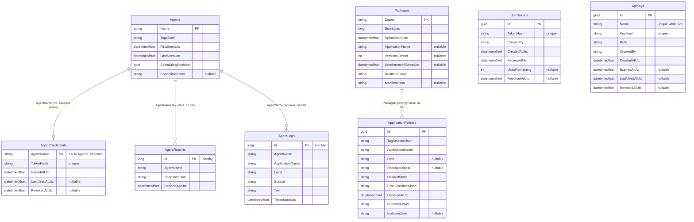

# Database Design Document / Data Model Specification

**Product:** enList v3
**Database:** SQL Server, database name `EnlistControlPlane` (LocalDB in development — see `ConnectionStrings:ControlPlane` in `src/Enlist.ControlPlane/appsettings.json`)
**ORM:** Entity Framework Core 10, code-first, migrations under `src/Enlist.ControlPlane/Migrations/`
**Document status:** Derived from the current implementation; last reconciled with it on 2026-09-11 (the authentication tables).

---

## 1. Entity-Relationship Overview

There is **one foreign key** in this schema — `AgentCredentials.AgentName` → `Agents.Name`, cascade — and it is there for a security reason (§2.6). Every other cross-table reference (`AgentReports.AgentName`, `AgentLogs.AgentName`, `ApplicationPolicies.PackageDigest`) is a plain column matched by value, deliberately not FK-constrained — see §4 for why.

Eight tables: `Agents`, `ApplicationPolicies`, `Packages`, `AgentReports`, `AgentLogs`, and since 2026-09-11 the three authentication tables `AgentCredentials`, `JoinTokens` and `ApiKeys` ([Authentication-Design.md §11](Authentication-Design.md)).



> **`ApplicationPolicies` has no `AgentName` column**, and there is no relationship from `Agents` to it. A rule targets agents *only* through `TagSelectorJson`, evaluated at query time — which is why an agent can start or stop matching a rule without either row changing. Earlier revisions of this document showed a `Machines` table and an `Assignments` table with a nullable `AgentName`; both the names and that column are gone.

---

## 2. Table Definitions

### 2.1 `Agents` (`AgentEntity`)

One row per agent ever heard from, or pre-registered.

| Column | Type | Nullable | Notes |
|---|---|---|---|
| `Name` | `nvarchar` | No | **Primary key.** The agent's identity string (`--agent` CLI arg, defaults to `Environment.MachineName`). Also the ownership tag stamped on containers it creates (`enlist.agent`), which is what makes orphan reaping safe on a host shared by several agents — so it must be STABLE across restarts. |
| `TagsJson` | `nvarchar` | No | Default `"{}"`. Serialized `Dictionary<string,string>` — the tag set matched against `ApplicationPolicies.TagSelectorJson`. Every agent additionally carries an implicit self-tag `{"agent": name}`, synthesized at resolution time and never stored. |
| `FirstSeenUtc` | `datetimeoffset` | No | Set once, at row creation. |
| `LastSeenUtc` | `datetimeoffset` | No | Updated on every `GET /api/agents/{name}/policies` call and every `POST /api/agents/{name}/report` — the sole liveness signal; no separate heartbeat table or column exists. Also drives the 5-minute staleness window in the endpoint feed and the portal. |
| `SchedulingEnabled` | `bit` | No | Default `1`. `0` excludes the agent from scheduling entirely: its resolved policy list comes back empty and `AgentHost.ReconcileAsync` tears down everything it is running. Needs no agent-side code at all. |
| `CapabilitiesJson` | `nvarchar` | **Yes** | Serialized `AgentCapabilitiesDto`, last reported by the agent via `PUT /api/agents/{name}/capabilities`. Carries the isolation modes it is configured for and — crucially — a PROBE result for its container engine, not merely whether one was configured. `null` for an agent that has never reported or predates the concept. |

**Key:** `Name` (configured via `HasKey(a => a.Name)` — not the CLR default `Id`).
**Indexes:** none beyond the primary key.

### 2.2 `ApplicationPolicies` (`ApplicationPolicyEntity`)

One row per rule declaring which agents should run one application, and how.

| Column | Type | Nullable | Notes |
|---|---|---|---|
| `Id` | `uniqueidentifier` | No | Primary key, `Guid.NewGuid()` assigned by the API on create. |
| `TagSelectorJson` | `nvarchar` | No | Default `"{}"`. Serialized `Dictionary<string,string>` — the ONLY targeting mechanism. An empty selector matches every agent; `{"agent":"NAME"}` reproduces what used to be a separate explicit-agent mode, via the implicit self-tag. |
| `ApplicationName` | `nvarchar` | No | The deployment unit's name. |
| `Path` | `nvarchar` | **Yes** | Alternative to `PackageDigest` — a pre-existing local folder on the target agent. |
| `PackageDigest` | `nvarchar` | **Yes** | Alternative to `Path` — SHA-256 digest of a `Packages` row. Exactly one of `Path`/`PackageDigest` is expected non-null, enforced at the API layer. |
| `DesiredState` | `nvarchar` | No | `"Running"` or `"Stopped"` — stored as text, not an int enum, so it is human-readable directly in the database. |
| `CronOverridesJson` | `nvarchar` | No | Default `"{}"`. Serialized `Dictionary<string,string>` (job name → cron expression override). |
| `UpdatedAtUtc` | `datetimeoffset` | No | Set on every create/update. |
| `RuntimeFlavor` | `nvarchar` | No | Default `"net10.0"`. Which `enlist-runner` build this rule needs. **DERIVED, not supplied, when the rule points at a package:** the package's own detected flavor is authoritative because it came from inspecting the uploaded bytes, and a request contradicting it is rejected. A `Path`-based rule has nothing to inspect, so its value stands. Before that derivation existed, upload-time detection never reached the field the agent routes on. |
| `IsolationJson` | `nvarchar` | **Yes** | Serialized `IsolationSpec` — HOW the application is hosted (process or container), plus ports, networks and non-secret environment. `null` means process isolation and is indistinguishable in meaning from a stored `{"mode":"process"}`, so nothing needed backfilling. One JSON column rather than several typed ones for the reason in §5: always read and written whole, never queried by key — which is also why C4 could add port mappings with no migration at all. |

**Key:** `Id`.
**Indexes:** none beyond the primary key.

The filtered unique index on `(AgentName, ApplicationName)` that guarded explicit placement is **gone**, along with the `AgentName` column itself: targeting collapsed to tags-only, so there is no longer an "explicit" placement for it to constrain. Overlap between rules is no longer preventable by a database constraint — two tag selectors can start matching the same agent at any time, simply because someone re-tagged it — so it is detected at RESOLUTION instead, in two independent classes:

- **Same application, disagreeing rules** → `ConflictReason`, the application reports `Failed`.
- **Different applications, same static host port on one agent** → also `ConflictReason`, both sides named. See [`Container-Story.md` §8.2](Container-Story.md).

### 2.3 `Packages` (`PackageEntity`)

Metadata only — package bytes live on disk under the configured `PackageStorage:Root` (default `PackageBlobs/` under the control plane's content root), one `<digest>.zip` file per row.

| Column | Type | Nullable | Notes |
|---|---|---|---|
| `Digest` | `nvarchar` | No | **Primary key.** Lowercase hex SHA-256 of the uploaded bytes, computed server-side — never trusted from the client. |
| `SizeBytes` | `bigint` | No | |
| `UploadedAtUtc` | `datetimeoffset` | No | |
| `ApplicationName` | `nvarchar` | **Yes** | First-write-wins: set from the uploader's `?application=` query parameter; a later upload of the same digest can backfill this if it was previously `null`, never overwrite an existing value. |
| `VersionNumber` | `int` | **Yes** | First-write-wins alongside `ApplicationName`. `(highest existing VersionNumber for this ApplicationName) + 1` — never reused, never renumbered when older versions are deleted. |
| `UnreferencedSinceUtc` | `datetimeoffset` | **Yes** | `null` while ≥1 assignment references this digest. Set to "now" the first retention sweep that finds zero referencing assignments; cleared again if a new/updated assignment references it again (e.g. rolled back to). The mark half of the mark-and-sweep retention algorithm — see [`Runbook.md`](../05-operations/Runbook.md). |
| `ManifestJson` | `nvarchar` | **Yes** | The serialized `PackageManifestDto` (services, jobs, descriptions) scanned once at upload — a fact about the bytes, like `RuntimeFlavor`. Null for a row from before the column, or when the scan failed; the manifest endpoint scans such a row on first request and stores the result. |

**Key:** `Digest` (configured via `HasKey(p => p.Digest)`).
**Indexes:** filtered unique `(ApplicationName, VersionNumber)` where both are non-null — two concurrent uploads for one application cannot both become the same version; the loser gets a `DbUpdateException` and is numbered again (`SaveWithNextVersionAsync`).

### 2.4 `AgentReports` (`AgentReportEntity`)

One row per status snapshot an agent has ever POSTed. **Not normalized** — the snapshot content is stored as an opaque JSON string.

| Column | Type | Nullable | Notes |
|---|---|---|---|
| `Id` | `bigint` | No | Primary key, identity (CLR default convention for `long Id`). |
| `AgentName` | `nvarchar` | No | Not FK-constrained to `Agents.Name` — see §4. |
| `SnapshotJson` | `nvarchar` | No | The full serialized `AgentStatusSnapshot` (agent-defined shape — see [`API-Specification.md` §5](API-Specification.md)). |
| `ReportedAtUtc` | `datetimeoffset` | No | |

**Key:** `Id`.
**Indexes:** `(AgentName, ReportedAtUtc)` — supports "latest report for machine X" (`ORDER BY ReportedAtUtc DESC` filtered to one `AgentName`), the only query pattern this table serves.
**Retention:** `ReportRetentionSweepService` deletes rows older than `ReportRetention:RetentionPeriod` (default 1 day, swept hourly, in batches of 5,000) — except the newest row per `AgentName`, which is kept at any age so an agent silent for longer than the window still has a last-known state to show. Every agent inserts a full snapshot on every heartbeat (about 8 MB per agent per day at the defaults), and nothing else ever deletes from this table.

### 2.5 `AgentLogs` (`AgentLogEntity`)

One row per forwarded application log line. **Normalized** (unlike `AgentReports`) because the portal's log-tail view pages through these rows by `Id`, which both sides need to agree on structurally.

| Column | Type | Nullable | Notes |
|---|---|---|---|
| `Id` | `bigint` | No | Primary key, identity — the paging cursor (`sinceId`). |
| `AgentName` | `nvarchar` | No | |
| `ApplicationName` | `nvarchar` | No | |
| `Level` | `nvarchar` | No | e.g. `Information`, `Warning`, `Error` — free-text, mirrors the runner's `LogLevel` enum's `ToString()`. |
| `Source` | `nvarchar` | No | The originating service/job name, or `"agent"`/`"runner"` for lifecycle messages. |
| `Text` | `nvarchar` | No | The log line body. |
| `TimestampUtc` | `datetimeoffset` | No | |

**Key:** `Id`.
**Indexes:** `(AgentName, ApplicationName, Id)` — a compound index covering exactly the log-tail page's own access pattern: "lines for this machine+application, after the last Id already shown, in order."

### 2.6 `AgentCredentials` (`AgentCredentialEntity`)

One row per agent name that has ever enrolled — at most one live credential per name, which is the rule that turns two agents sharing a name into a 409 at enrollment instead of silently corrupted reports ([Runbook §3.1](../05-operations/Runbook.md)). Written by `POST /api/agents/enroll` and `revoke-agent`; read by the bearer handler on every agent call ([Authentication-Design.md §4](Authentication-Design.md)).

| Column | Type | Nullable | Notes |
|---|---|---|---|
| `AgentName` | `nvarchar` | No | **Primary key**, and **FK → `Agents.Name` with cascade delete** — the one foreign key in the schema, so that `DELETE /api/agents/{name}` revokes the credential in the same statement and a deregistered agent can never keep calling in. |
| `TokenHash` | `nvarchar` | No | **Unique.** SHA-256 (lowercase hex) of the `enla_` token. The token itself is never stored; lookup is by hash, so a database read yields nothing usable. |
| `IssuedAtUtc` | `datetimeoffset` | No | Set at enrollment; reset on re-enrollment after a revoke (the row is reused so the key holds). |
| `LastUsedAtUtc` | `datetimeoffset` | **Yes** | Written at most once a minute per credential, to keep the write off the request path. |
| `RevokedAtUtc` | `datetimeoffset` | **Yes** | Set by `revoke-agent`. A revoked row keeps its place so the name can re-enroll into it; the token it hashes is refused from that moment. |

### 2.7 `JoinTokens` (`JoinTokenEntity`)

One row per join token an Operator has minted (`create-join-token`). Good for `POST /api/agents/enroll` and nothing else.

| Column | Type | Nullable | Notes |
|---|---|---|---|
| `Id` | `uniqueidentifier` | No | Primary key; what `list-join-tokens` shows, since the token cannot be. |
| `TokenHash` | `nvarchar` | No | **Unique.** SHA-256 of the `enlj_` token. |
| `CreatedBy` | `nvarchar` | No | Who minted it, as the CLI saw it. |
| `CreatedAtUtc` | `datetimeoffset` | No | |
| `ExpiresAtUtc` | `datetimeoffset` | No | 24 hours from creation unless `--expires` says otherwise. |
| `UsesRemaining` | `int` | **Yes** | Decremented per enrollment under `Required`; `null` is unlimited until expiry; `0` is used up. |
| `RevokedAtUtc` | `datetimeoffset` | **Yes** | |

### 2.8 `ApiKeys` (`ApiKeyEntity`)

One row per management API key (`create-api-key`): the portal's own key, `enlist-deploy`, a CI pipeline, a read-only dashboard or a reverse proxy reading the endpoint feed.

| Column | Type | Nullable | Notes |
|---|---|---|---|
| `Id` | `uniqueidentifier` | No | Primary key. |
| `Name` | `nvarchar` | No | **Unique among live keys** (filtered unique index `WHERE [RevokedAtUtc] IS NULL`), so a revoked `ci-main` can be re-created under the same name. |
| `KeyHash` | `nvarchar` | No | **Unique.** SHA-256 of the `enlk_` key. |
| `Role` | `nvarchar` | No | `Operator` or `Viewer` (`ManagementRoles` in Contracts). |
| `CreatedBy` | `nvarchar` | No | |
| `CreatedAtUtc` | `datetimeoffset` | No | |
| `ExpiresAtUtc` | `datetimeoffset` | **Yes** | 90 days unless `--expires` says otherwise; `null` is never (a service key). |
| `LastUsedAtUtc` | `datetimeoffset` | **Yes** | As for `AgentCredentials`. |
| `RevokedAtUtc` | `datetimeoffset` | **Yes** | |

---

## 3. Column Types Not Otherwise Constrained

No column in this schema carries an explicit `HasMaxLength`/`IsRequired` fluent configuration beyond what's shown above — every `string` property maps to EF Core's SQL Server default (`nvarchar(max)` unless the provider infers otherwise), and nullability follows the CLR property's own nullable-reference-type annotation (`required string X` ⇒ `NOT NULL`; `string? X` ⇒ `NULL`). This is a deliberate simplicity choice for a first cut — see [`SAD.md` §8](SAD.md#8-known-architectural-limitations) for other documented first-cut trade-offs.

---

## 4. Why There Are No Foreign Keys

With one exception — `AgentCredentials.AgentName` (§2.6), where the cascade is the point: deleting an agent must revoke what it authenticates with — every agent-name reference (`AgentReports.AgentName`, `AgentLogs.AgentName`) is a bare string, not an FK to `Agents.Name`, and `ApplicationPolicies.PackageDigest` is likewise a bare reference to `Packages.Digest`. This is intentional:

- **Deleting an agent must not cascade-delete its history.** `AgentReports`/`AgentLogs` rows for a deleted agent are explicitly left in place (see `DELETE /api/agents/{name}` in [`API-Specification.md`](API-Specification.md)) — if that machine name registers again later (a rebuilt or renamed-back box), its prior history still makes sense to have. (The retention sweeps thin that history like any other agent's; the newest report is always kept.)
- **A policy rule never names an agent at all.** `ApplicationPolicies` has no agent column: targeting is a `TagSelectorJson` evaluated at query time, so there is nothing for an FK to point at. This is what lets an agent start or stop matching a rule without either row being written.

---

## 5. JSON-in-Column Fields — Rationale

| Column | Why not a normalized table |
|---|---|
| `Agents.TagsJson` | Small, always read/written as a whole set, never queried by individual key server-side (matching is done in application code against the deserialized dictionary). |
| `ApplicationPolicies.TagSelectorJson`, `.CronOverridesJson`, `.IsolationJson` | Same reasoning — small, whole-object read/write, no per-key query. |
| `AgentReports.SnapshotJson` | The control plane does not need to query *into* a snapshot's internals (services, jobs, per-service state) — only "what did this machine last report, and when." Keeping it opaque means the agent's own status shape (`AgentStatusSnapshot` in `Enlist.Agent`) can evolve freely with **no control-plane migration**, ever. The portal interprets this JSON for display as its own concern (`ControlPlaneApiClient`'s local DTO mirror), explicitly decoupled from this storage decision. |

---

## 6. Migration History

Migrations live under `src/Enlist.ControlPlane/Migrations/`. As of this writing the sequence is a **single** migration:

1. `20260911192322_InitialCreate`

That is not the original one. The sequence has been collapsed **three times**, for the same reason each time — nothing had been deployed anywhere that needed upgrading, and the local databases were either disposable or could be told the truth:

- **First collapse.** The terminology rename (Machine→Agent, Assignment→Application Policy, Label→Tag) and the move to tags-only targeting changed almost every table name and several column names at once. Rather than carry eight superseded migrations describing a schema that no longer existed, the sequence was deleted and re-scaffolded. The earlier names (`AddPackageDistribution`, `AddMachineRegistryAndLabelPlacement`, `AddPackageRetention`, `AddAgentLogs`, `AddPackageApplicationName`, `AddPackageVersionNumber`, `AddAssignmentRuntimeFlavor`) are recorded here only so references elsewhere in this document set still resolve to something.
- **Second collapse (2026-09-08).** `AddPolicyIsolation` and `AddAgentCapabilities` — both additive nullable columns, `IsolationJson` on `ApplicationPolicies` and `CapabilitiesJson` on `Agents` — were folded back into `InitialCreate` ahead of first deployment, so a production install is one step rather than a replay of three. Verified by regenerating the model snapshot and diffing it against the pre-collapse one: **byte-identical**, so the collapsed migration describes exactly the same model.
- **Third collapse (2026-09-11).** `PackageManifestJson` (`Packages.ManifestJson`, review finding M6), `PackageVersionUnique` (the filtered unique index on `Packages (ApplicationName, VersionNumber)`) and `AuthenticationCredentials` (`AgentCredentials`, `JoinTokens`, `ApiKeys` — §2.6–2.8) folded into `InitialCreate` before the installer exists, so the first real install is one `CREATE`. Same proof as before: the model snapshot regenerated from the single migration is **byte-identical** to the one the four had produced. The demo database kept its data — its `__EFMigrationsHistory` was rewritten from the four rows to the one, and the control plane's Production verify-and-refuse check accepted it at the next start. **This is the last collapse.** The installer is the next thing built, and from the first machine it installs on, a migration is a contract.

**Applied automatically in `Development` only.** Outside it the control plane verifies the schema and refuses to start rather than issuing DDL — see [`Deployment-IaC.md` §1.4](../05-operations/Deployment-IaC.md) for why (a production SQL login typically has neither `dbcreator` nor `CREATE`/`ALTER TABLE`) and for the deploy-step alternative.

> Once this schema has actually been deployed somewhere, collapsing stops being available: from that point a migration is a contract with every existing database, and the sequence only grows.

**A footgun worth knowing:** `ControlPlaneTestServer` locates `Enlist.ControlPlane.dll` BY PATH rather than by ProjectReference (deliberately — see the test csproj comment). So `dotnet test` does not rebuild the control plane, and a migration added but not yet compiled makes EF refuse to start with "the model has pending changes", failing every test that spawns a control plane. **After `dotnet ef migrations add`, rebuild before testing.**

## 7. Design Doc vs. Implemented Schema

The original design document (**[`enList-v3-Design.md`](enList-v3-Design.md) §10**) specified a broader schema than what actually shipped:

```
Machines        agent identity, tags, last seen, version
Applications    logical app identity
Packages        digest, size, uploaded-by, uploaded-at
Manifests       parsed manifest per package digest
Assignments     desired state (the source of truth for placement)
AgentReports    actual state, resource usage, timestamps
JobRuns         run id, job, machine, start, end, outcome, output
Events          lifecycle and monitoring events
```

Five tables shipped, though two under different names after the terminology rename — `Agents` (designed as `Machines`), `Packages`, `ApplicationPolicies` (designed as `Assignments`), `AgentReports`, plus `AgentLogs` which the design doc didn't explicitly enumerate but which serves the same log-centralization goal called out in its §7). Three did **not** ship as their own tables:

- **`Applications`** — no row anywhere carries an application's identity independent of the string `ApplicationName` used consistently across the other tables. There is no place to attach application-level metadata (an owner, a canonical description at the control-plane level, etc.) other than the ad hoc `[EnlistApplication]` description that only ever exists transiently inside a status snapshot.
- **`Manifests`** — arrived as a column rather than a table: `Packages.ManifestJson` is the design's publish-time manifest (services, jobs, descriptions, scanned once at upload by `PackageManifestScanner`). Its only reader is the manifest endpoint, so a separate table would have been a join for nothing.
- **`JobRuns`** and **`Events`** — neither exists. Job execution history is limited to the single most recent run (`JobStatusEntry.LastRunUtc`/`LastRunOutcome`), embedded in `AgentReports.SnapshotJson` and overwritten on every new report; there is no durable, queryable history of individual job executions or structured lifecycle events, only the raw forwarded log lines in `AgentLogs`.

This consolidation is consistent with the design doc's own sequencing philosophy (§11: "each step is independently useful and independently shippable") — what shipped is a smaller, coherent subset sufficient for the desired-state/reconciliation model to work end-to-end, not a rejection of the fuller schema. Of the three gaps, a `JobRuns`-equivalent (durable execution history, rather than only the single most recent run) is the one most likely to matter first operationally — every job-related incident today can only be investigated through the forwarded log lines in `AgentLogs`, not through a queryable run-by-run record.
