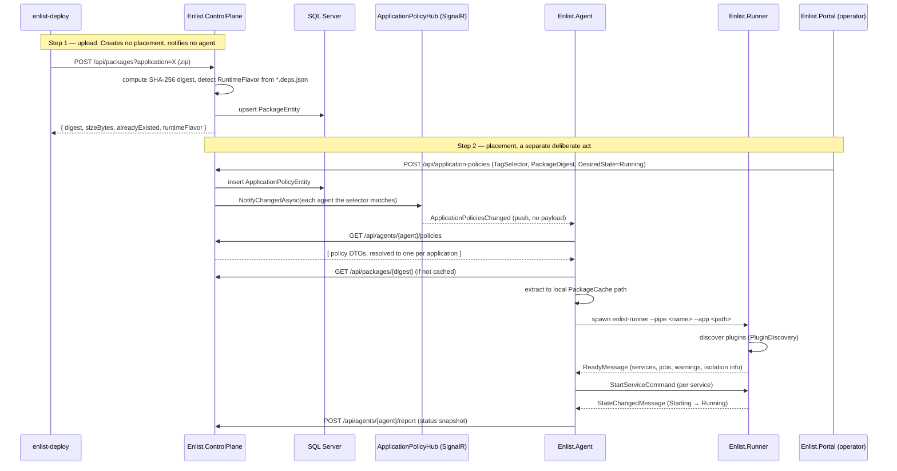
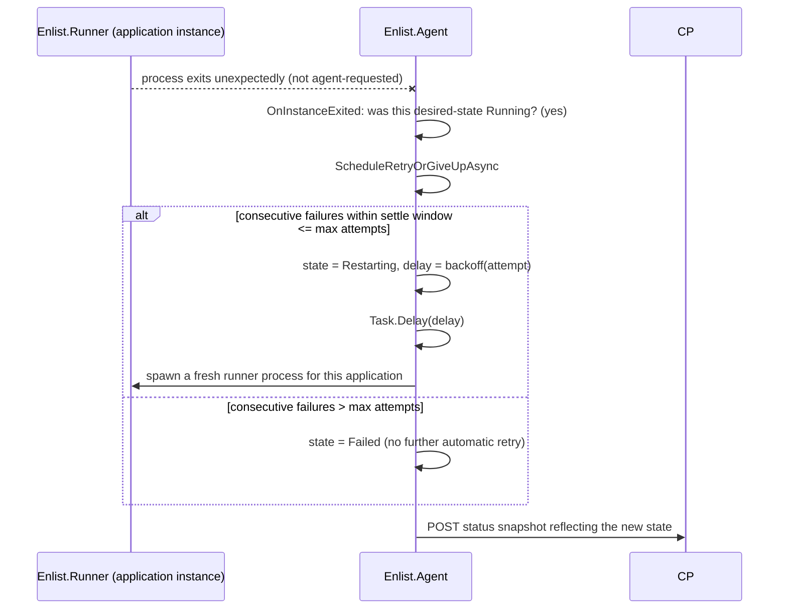
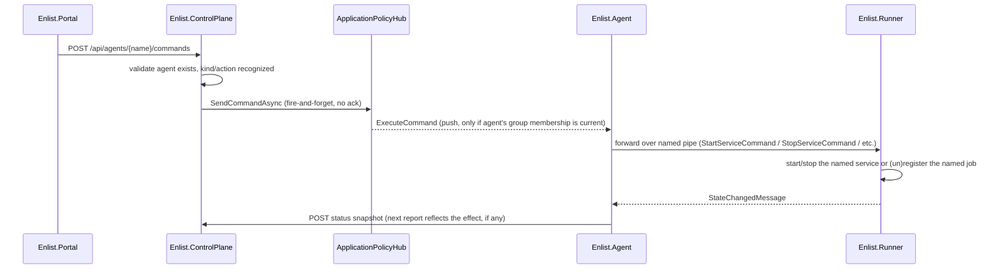

# High-Level Design (HLD)

**Product:** enList v3
**Document status:** Derived from the current implementation. Originally 2026-09-03; the Portal/Deploy module tables and the §2.1 sequence were corrected 2026-09-08 — they still listed five nav tabs, had `enlist-deploy` creating placements, and used pre-rename hub/method names. Sits between [`SAD.md`](SAD.md) (components and topology) and [`LLD.md`](LLD.md) (class/method-level detail).

---

## 1. Module Decomposition

### 1.1 Enlist.ControlPlane

| Module | Responsibility |
|---|---|
| `Program.cs` | Endpoint routing (minimal API), request validation, DTO mapping. All business logic for this component lives here as top-level local functions — there is no separate service/repository layer. |
| `Data/ControlPlaneDbContext.cs` + `Data/*Entity.cs` | EF Core model: `AgentEntity`, `ApplicationPolicyEntity`, `PackageEntity`, `AgentReportEntity`, `AgentLogEntity`. |
| `Hubs/ApplicationPolicyHub.cs` | SignalR hub: group join, and the two outbound notification helpers (`NotifyChangedAsync`, `SendCommandAsync`). |
| `PackageBlobStore` | Content-addressed file storage for package zip bytes (digest computation, save/read/delete). |
| `PackageRetentionSweepService` / `LogRetentionSweepService` / `ReportRetentionSweepService` | `IHostedService` background sweeps — mark-and-sweep GC for packages, straight age-based delete for log rows, age-based delete for status reports that always keeps each agent's newest. |
| `Authentication/` | The bearer scheme (`EnlistBearerHandler`: three token kinds by hash, claims), the endpoint policy table and its fail-closed handler, the listener rules (`Off` only on loopback; no plain HTTP off loopback under `Required`), and the management CLI verbs — [Authentication-Design.md](Authentication-Design.md). |
| `Migrations/` | EF Core migration history — `InitialCreate` and the three since ([Database-Design.md §6](Database-Design.md)). Auto-applied at startup in `Development` **only**; outside it the control plane verifies the schema and refuses to start rather than issuing DDL, because a production SQL login normally has neither `dbcreator` nor `CREATE`/`ALTER TABLE` rights (see [`Deployment-IaC.md` §1.4](../05-operations/Deployment-IaC.md)). |

### 1.2 Enlist.Agent

| Module | Responsibility |
|---|---|
| `AgentHost.cs` | The orchestrator. Owns reconciliation, crash/restart supervision, status snapshot assembly, command dispatch to runners, and all of its own background loops (reconciliation, retention sweep, heartbeat). |
| `Configuration/ControlPlaneAssignmentSource.cs` | Implements `IAssignmentSource` against the real control plane: REST fetch + SignalR push with a reconnect policy that never gives up, a `Closed` handler that reopens, and a 3-minute re-fetch floor + package-digest-to-local-path resolution via `PackageCache`. Presents the agent's credential on the REST calls and as the hub's access token. |
| `Configuration/AssignmentStore.cs` | The step-2 (local file) alternative assignment source, kept alongside the control-plane one behind the same `IAssignmentSource` interface. |
| `Configuration/PackageCache.cs` | Downloads and extracts a package by digest exactly once, reused across every assignment referencing it; prunes digests no longer in use. |
| `Credentials/AgentEnrollment.cs`, `AgentCredentialStore.cs`, `AgentCredential.cs` | Settles what the agent presents before anything else starts (a stored credential, an enrollment with `--join-token`, or nothing when the control plane says `Off`); the DPAPI + ACL credential file under `--data`; the one holder every `HttpClient` and the hub read the token from, which says a rejection once. |
| `Scheduling/JobScheduler.cs` | In-process cron scheduling (Cronos-based) per (application, job) key, with its own lock to prevent a double-registration race between a reconciliation pass and an imperative command. |
| `Status/AgentStatusSnapshot.cs`, `AgentStatusWriter.cs`, `ControlPlaneStatusReporter.cs` | The status model, its local on-disk mirror (`<data>/Logs/status.json` — under the LOG root, not the data root), and the HTTP reporter that POSTs it. |
| `Logging/AgentFileLogSink.cs`, `ControlPlaneLogForwarder.cs` | Per-application local log files plus best-effort forwarding to the control plane. |
| `Supervision/IRunnerInstance.cs`, `IRunnerBackend.cs`, `ProcessRunnerInstance.cs`, `ProcessRunnerBackend.cs`, `CrashBackoff.cs`, `JobObject.cs` | The runner seam (how a runner is created, and how a live one behaves), its one implementation today — a local child process on a named pipe — plus the backoff algorithm for restart timing and (Windows-only) OS-level process-tree cleanup. See docs/03-architecture/Container-Story.md §6. |
| `Supervision/CliContainerEngineBase.cs`, `DockerContainerEngine.cs`, `WslContainerEngine.cs` | The two container engines — over the `docker` and `wslc` CLIs — sharing one bounded, killed-on-expiry command runner. Chosen by `--container-engine`; nothing above `IContainerEngine` knows which. |
| `Staging/RunnerStaging.cs` | Prepares a per-application-instance working directory the runner is launched against. |

### 1.3 Enlist.Runner

| Module | Responsibility |
|---|---|
| `Program.cs` | Entry point: connects to the named pipe, discovers plugins, constructs `RunnerHost`, runs until the pipe closes or a `Shutdown` command arrives. |
| `Discovery/PluginDiscovery.cs`, `DiscoveredService.cs`, `DiscoveredJob.cs` | Attribute-name-based reflection scan producing the discovered shape. |
| `Hosting/PluginLoadContext.cs` | Per-application-instance `AssemblyLoadContext` with its own private dependency resolution. |
| `Execution/RunnerHost.cs` | The message loop: dispatches inbound commands to plugin instances, funnels outbound `Log`/`StateChanged`/`JobResult`/`Faulted` messages through one serialized pipe writer. |
| `Execution/ParameterBinder.cs`, `InvocationHelper.cs`, `SettingsLoader.cs`, `RunningServiceState.cs` | Binds a plugin method's declared parameters (`CancellationToken`, `Action<string>` logger, settings dictionary), invokes it, and tracks a running service's live instance/cancellation state. |
| `Protocol/MessageChannel.cs`, `RunnerMessage.cs`, `AgentCommand.cs` | The newline-delimited-JSON pipe protocol and its message types, shared source (not a compiled dependency) between the runner and the agent side that talks to it. |
| `Logging/LineBufferingTextWriter.cs` | Redirects plugin `Console.Out`/`Error` into the `Log` message stream, attributed to whichever plugin is currently executing. |

### 1.4 Enlist.Deploy

Single-file CLI (`Program.cs`): argument parsing, zip creation, upload. **No placement** — it creates no policy rule and touches no agent; declaring where an application runs is a separate act in the portal, so a redeploy cannot silently move things. No separate modules, by design (a thin, disposable client of the same public REST API everything else uses).

### 1.5 Enlist.Portal

| Module | Responsibility |
|---|---|
| `Services/ControlPlaneApiClient.cs` | The one HTTP client wrapper for every control-plane call the portal makes, plus its own local DTO mirror of the agent's status snapshot shape (deliberately decoupled from the control plane's opaque-blob storage — see [`SAD.md` §5](SAD.md#5-cross-cutting-design-decisions)). |
| `Services/ApplicationPolicyStateToggler.cs` | Shared enable/disable flow: confirm-then-fan-out, naming every agent a rule currently matches and warning that future matching agents are affected too. |
| `Services/TagSelectorMatcher.cs` | Client-side mirror of the control plane's own selector-matching predicate, used for aggregate counts and master-list resolution. |
| `Components/Pages/*.razor` | Three top-level nav items — Applications (landing, `/`), Agents (`/agents`), Logs (`/logs`) — plus two per-application screens reached from an Applications row rather than the nav: `ApplicationPolicyScreen` (`/applications/{name}/policy`) and `ApplicationPackagesScreen` (`/applications/{name}/packages`). The former standalone Assignments and Packages tabs were folded into those in the five-tabs-to-three restructure. |
| `Components/Panels/*.razor` | Shared building blocks for the expand-in-place rows: `RunningInstancesTable` (one row per service/job x agent under an application), `AgentRunningApplicationsTable` (the Agents tab's read-only counterpart) and `LogTailView`. These replaced the former `AppInstancePanel` / `ApplicationDetailPanel` / `AgentDetailPanel` master-detail cards in the five-tabs-to-three restructure. |
| `Components/Dialogs/*.razor` | `EditTagsDialog`, `ApplicationPolicyEditDialog`, `ApplicationPolicyWizardDialog` (3-step add-a-rule), `UploadPackageDialog`, `ApplicationContentsDialog` (what a package contains, via the package manifest endpoint). |
| `Components/Layout/MainLayout.razor`, `NavMenu.razor` | App shell, theming, navigation — see [`UI-UX-Design-Spec.md`](UI-UX-Design-Spec.md). |

---

## 2. Key Sequence Diagrams

### 2.1 Deploy and First Run



The split into two steps is the point: uploading a build and deciding where it runs are separate acts with separate actors. A redeploy re-runs only step 1, so it can change *what* an application is without changing *where* it runs.

### 2.2 Reconnect After Control-Plane Restart

```mermaid
sequenceDiagram
    participant A as Enlist.Agent
    participant Hub as ApplicationPolicyHub (SignalR)
    participant CP as Enlist.ControlPlane

    Note over CP: control plane restarts — any length of outage
    A--xHub: connection drops
    A->>A: PushChannel = reconnecting (agent log: "push connection lost")
    loop 0 / 2 / 5 / 10 / 20 / 30 s, then every 30 s for as long as it takes
        A->>Hub: reconnect attempt
    end
    Note over A: WaitForChangeAsync still returns every 3 min meanwhile — the GET fails while CP is down, is logged, and is retried next interval
    A->>Hub: reconnected (new ConnectionId)
    A->>Hub: JoinAgentGroupMethod(agentName)  // re-join, required every time
    A->>A: PushChannel = connected; ReleaseChangeSignal() // treat reconnect as "something might have changed"
    A->>CP: GET /api/agents/{agent}/policies
    CP-->>A: current assignment list
    A->>A: reconcile (usually a no-op if nothing changed)
    A->>CP: PUT /api/agents/{agent}/capabilities (PushChannel = connected)
```

SignalR's stock policy stops after four attempts (about 42 seconds); anything longer — a migration, a host reboot — used to leave the agent detached for good while it kept heartbeating over HTTP and showed Online. Three things now hold: the policy never returns null, a connection the server closes outright is reopened by the agent, and the 3-minute re-fetch is the floor under both. The portal shows an Online agent whose `PushChannel` is not `connected` as *not receiving*. `AgentReconnectTests` restarts a real control plane after a 50-second outage and proves the next change still arrives.

### 2.3 Crash / Restart with Backoff



### 2.4 Imperative Service Command



---

## 3. State Model

### 3.1 Application instance state (agent-tracked, `ApplicationState`)

```
Stopped → Starting → Running
                        ↓ (crash)
                    Restarting → Running   (if backoff succeeds)
                        ↓
                     Failed                (if max attempts exceeded)
```

`Stopped` is also the terminal state of a deliberate stop (declarative desired-state change, or agent shutdown) — it is reachable directly from `Running` via `StopApplicationAsync`, not only via the crash path.

### 3.2 Service/Job runner-reported state (`RunnerState`)

```
Starting → Running → Stopping → Stopped
      ↘ Faulted (from any state, on an unhandled exception)
```

### 3.3 Package retention (`PackageEntity.UnreferencedSinceUtc`)

```
referenced (UnreferencedSinceUtc = null)
    → unreferenced (sweep sets UnreferencedSinceUtc = now, first sweep with zero referencing assignments)
        → re-referenced (sweep clears UnreferencedSinceUtc back to null, e.g. rolled back to)
        → eligible for deletion (now - UnreferencedSinceUtc >= RetentionPeriod, next sweep deletes the row + blob)
```

---

## 4. Error Handling Strategy (high level)

| Failure | Handling |
|---|---|
| Agent cannot reach the control plane (report/log POST), or it answers with an error | Best-effort — never blocks or crashes the caller; the next successful report/log batch simply carries a bigger backlog. Not silent: the first failure, one line per five minutes while it lasts, and the recovery go to the agent log (`FailureNotice`). |
| One application's package fails to resolve during `GetCurrentAsync` | The whole reconciliation pass for that fetch throws; the next `ApplicationPoliciesChanged`/reconnect signal retries everything. A deliberate trade documented in `ControlPlaneAssignmentSource`: simpler than a per-app partial-failure path, at the cost of degrading "just this one app" into "nothing reconciles until the next signal." |
| A plugin's `[EnlistStart]`/`[EnlistExecute]` throws | Caught at the runner's dispatch boundary, reported as a `FaultedMessage`/`StateChangedMessage(Faulted)`, does not crash the runner process. |
| A runner process crashes outright | Detected by the agent's process-exit hook; goes through the crash/backoff state machine (§3.1). |
| An assignment references a digest the control plane doesn't have | Surfaces as an HTTP failure on package download; treated the same as "control plane unreachable" for that fetch. |
| Two racing writers try to register the same (application, job) scheduler key | Serialized by `JobScheduler`'s own lock — see [`LLD.md`](LLD.md) for the exact race this closes. |
| A job's next tick comes due while its previous run is still going | The tick is skipped and a Warning naming the running run goes to the application's log — never queued, never a second concurrent run. Cleared by the run's result, by a Stop, or by the application restarting. |
| A cron's next occurrence is further out than `Task.Delay` accepts (~49.7 days) | Slept in one-day slices and recomputed; a loop that stops for any other reason says so in the agent log instead of faulting unobserved. |
| A run command cannot be sent at fire time (the runner died that instant) | Written to the application's log as a lost firing; the next tick is tried normally. |
| A `docker` command never returns (a daemon that accepts the connection and hangs) | Every command except `wait` is bounded (60 s); on expiry the CLI is killed and a `TimeoutException` naming the command reaches the start/probe path, which reports it like any other start failure. The reconcile loop no longer waits on the daemon. |
| A start attempt fails or is given up on | The staged runner copy under `Runners/<application>` is removed on every failure path and on give-up; a retry stages afresh. |
| A runner message handler throws on one message | Logged to the agent log, that message is dropped, and the receive loop reads the next one. The loop ends only when the channel closes or fails — never because a handler faulted (see [`LLD.md` §8.1](LLD.md)). |
| A line arrives on the control channel that is not a message — a kind from a peer of another version, malformed JSON, a runaway log line past 1 MB | Skipped and reported (to the agent log, or the runner's own log), never thrown; the channel reads on. A throw there used to end the receive loop for the whole connection. |
| A crash-retry fires after the application was disabled, changed, or already restarted by a reconcile | The retry re-reads the current assignment after its backoff and stands down or starts the current version; the two operations are serialized per application through a lifecycle gate ([`LLD.md` §8.1](LLD.md)). |
