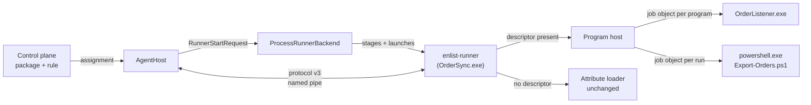
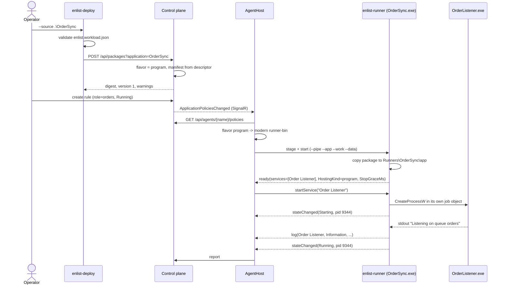
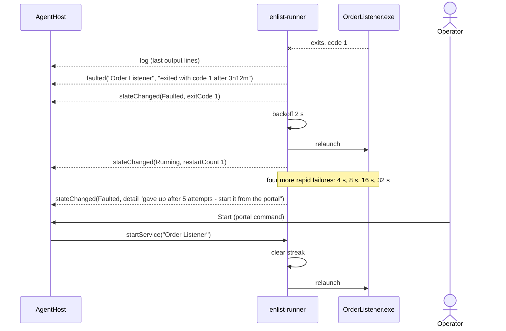
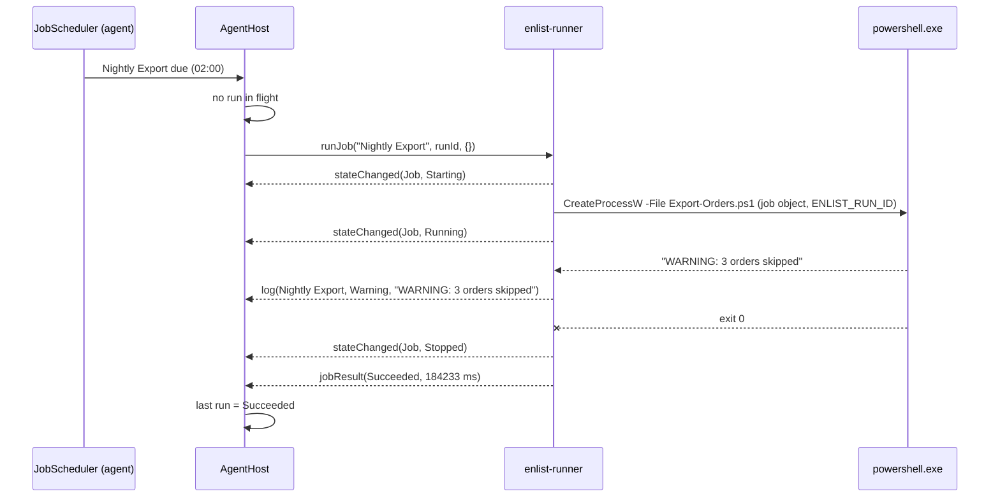
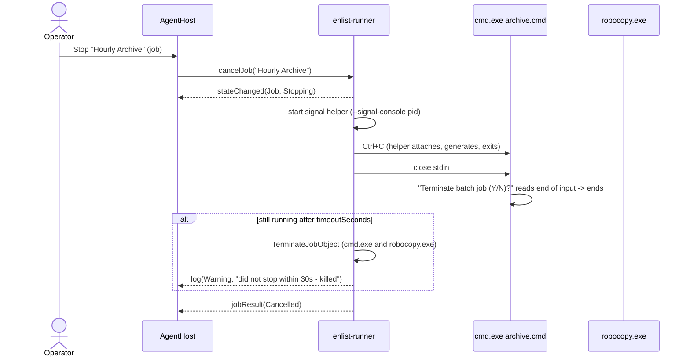

# enList Program Workloads — Design

**Product:** enList v3
**Document status:** **Design proposal — nothing here is built.** Written 2026-09-15 against `main` at `56002e5`, and **amended the same day after a review of the risk it poses to what already works** (§16.1). The amendments:
- the agent accepts runner protocol 2 and 3, instead of requiring an upgrade in lockstep (§8);
- agent shutdown stops applications in parallel, within explicit host and SCM time limits (§9 item 8);
- program workloads can be switched off per agent and fleet-wide (§9.1, §10.7);
- Ctrl+C is delivered by a helper process, so the runner never touches its own console (§7.5);
- P0 starts with characterization tests and a minimum CI (§16, §17.4).

This is the "generic workload mode" the sales-readiness brief of the same date names as the next move: letting enList run programs a customer already has, unchanged. Statements about *today* cite `src/` and are verifiable there; everything described as new is a proposal until §16's phases land. Sits alongside [`SAD.md`](SAD.md) (current components), [`Container-Story.md`](Container-Story.md) (the runner seam this builds on, and Design B), and [`enList-v3-Design.md`](enList-v3-Design.md) (why the attribute contract exists).

---

## 1. The question this answers

> "Can enList run what we already have — a console program, a PowerShell script, a batch file, a vendor tool — without us rewriting it against enList's attributes?"

Today the answer is no. The runner loads every top-level `*.dll` in the application directory and discovers types marked `[EnlistService]` or `[EnlistJob]` (`src/Enlist.Runner/Discovery/PluginDiscovery.cs`); a package with none of them uploads without complaint and then runs nothing. An `.exe`, a `.ps1` or a `.cmd` is invisible to it.

That is the right design for code written *for* enList. It is the wrong entry point for a customer, whose estate is exactly those invisible things: Windows services built years ago as console programs, jobs in Task Scheduler, scripts wrapped by NSSM, vendor tools copied onto servers by hand. The sales-readiness review put it first among the deal-blockers: every evaluation begins as a development project.

This document specifies **program workloads**: a way to describe an existing program in a small JSON file, deploy it like any other package, and have enList keep it running as a service or run it on a schedule as a job — with every mechanism enList already has (tag rules, desired state, restart with backoff, process-tree containment, logs, reports, portal control) applying unchanged.

---

## 2. Names used in this document

| Term | Means |
|---|---|
| **Attribute application** | What enList runs today: a .NET package whose services and jobs are marked with the attributes in `contracts/EnlistAttributes.cs`. Called "SDK" in the portal. |
| **Program workload** | New: a package whose services and jobs are *programs*, described by an `enlist.workload.json` descriptor. Called "Program" in the portal. |
| **Descriptor** | The `enlist.workload.json` file at the root of a program workload package. |
| **Entry** | One service or one job declared in a descriptor. |
| **Program** | The operating-system process an entry starts: an `.exe`, or a script host (`powershell.exe`, `pwsh.exe`, `cmd.exe`) running a script. |
| **Hosting kind** | Which of the two an application is. Decided by the package, never by the policy. |

"Generic workload mode" in the sales brief and "program workloads" here are the same feature.

---

## 3. Goals and non-goals

### Goals

- **G1 — Unmodified programs.** Run an existing executable or script as a **service** (started with the application, kept alive) or a **job** (run on a cron schedule, or on demand), with process isolation, on agents that are already deployed.
- **G2 — Everything already built applies.** Tag-selector rules, desired state, cron overrides, service Start/Stop and job Enable/Disable from the portal, restart with backoff, process-tree containment, log forwarding and retention, status reports, package versioning, digests, rollback by digest.
- **G3 — The agent does not learn a new concept.** The invariant in [`Container-Story.md`](Container-Story.md) §6.4 — `AgentHost` never branches on which backend it holds — is kept, and extended: `AgentHost`'s lifecycle code does not branch on hosting kind either. The one flavor-aware rule is a row in the protocol compatibility table (§8), not a condition in start, stop or restart.
- **G4 — One artifact, one tool.** A program workload is a zip, uploaded with `enlist-deploy` or the portal, stored and versioned exactly like today's packages.
- **G5 — An afternoon, not a project.** From "we have a folder with a program in it" to "it is running under enList on a test agent" in under an hour, with no code changes.
- **G6 — What already works keeps working.** Existing attribute applications, container runner images already distributed, and the agents already installed behave as they do today. Each shared path the design touches has a named control (§16.1), and program hosting can be switched off without touching a machine (§10.7).

### Non-goals for this design

| Not in scope | Why, and where it goes |
|---|---|
| Container isolation for programs | The runner image is Linux (`src/Enlist.Runner/Dockerfile`) and cannot run a Windows program. Running arbitrary software in containers is Design B ([`Container-Story.md`](Container-Story.md) §14). Refused at the control plane in this design (§10.4). |
| Adopting services registered with the Windows Service Control Manager | A different lifecycle owner (the SCM, not a child process). Outlined as a later phase (§16, P4). |
| Running a program as a different account | Needs credential storage enList does not have yet. Every program runs as the agent's account, as attribute applications do today. §13 and §16 P3. |
| Secrets | A platform-wide gap (BRD §5.2), not specific to programs. Descriptor environment values are explicitly non-secret. |
| Resource limits, health probes | Natural extensions of the per-program job object and the readiness pattern; §16 P3. |
| Replacing the attribute contract | It stays, unchanged. It is what gives per-service control and graceful stop *inside* one process, and is the premium path. |

---

## 4. The decision: the runner is the adapter

### 4.1 The shape

The agent already hosts every application through one narrow protocol (`src/Enlist.Runner/Protocol/`):

- the runner sends `ready` (services, jobs with a declared cron), `log`, `stateChanged`, `jobResult` and `faulted`;
- the agent sends `startService`, `stopService`, `runJob`, `cancelJob` and `shutdown`.

`AgentHost` acts only on those messages (`src/Enlist.Agent/AgentHost.cs`, `StartApplicationAsync` from line 538, `ExecuteCommandAsync` from 1037, `RunJobDueAsync` from 1138, `HandleMessageAsync` from 1182). It starts every service the `ready` message lists, registers every job with its cron in `JobScheduler`, and routes portal commands.

**So the runner gains a second discovery mode.** When the application directory contains `enlist.workload.json`, the runner reads the descriptor instead of loading assemblies, lists its entries in `ready`, and hosts each entry as a child process:

| Protocol message | Attribute application (today) | Program workload (new) |
|---|---|---|
| `ready` | Types found by attribute name | Entries read from the descriptor |
| `startService` | Invoke `[EnlistStart]` | Launch the program |
| `stopService` | Cancel the start token, invoke `[EnlistStop]` | Stop escalation (§7.5), then terminate its job object |
| `runJob` | Invoke `[EnlistExecute]` | Launch the program; wait for it to exit |
| `cancelJob` | Cancel the run's token | Stop escalation on every run of that job |
| `log` | `Console` output of plugin code | The program's stdout and stderr |
| `stateChanged` / `faulted` | Start returned / threw | Program started / exited unexpectedly |
| `jobResult` | Execute returned / threw / was cancelled | Exit code matched `successExitCodes` / didn't / was cancelled |

To the agent, a program workload is indistinguishable from an attribute application.



### 4.2 Alternatives considered

| Option | What it would take | Why not |
|---|---|---|
| **A. Runner-side program host** *(chosen)* | A new mode inside `enlist-runner`; a runtime flavor that routes program packages to the modern runner; small agent and control plane changes | — |
| B. A third `IRunnerBackend` in the agent that spawns programs directly | An `IRunnerInstance` that fakes `ready`, command semantics and log capture inside the agent | Re-implements per-service semantics the runner already has; puts arbitrary child processes directly under the agent service; cannot be exercised by `enlist-runner --check`/`--dev`; and `IRunnerBackend` is keyed by *isolation mode* — a program is *what* runs, not *how*, the same confusion [`Container-Story.md`](Container-Story.md) §4.2 already rejects |
| C. A separate `enlist-program-host` executable | A third runner build to stage, version and ship | No behaviour it could have that a mode of the existing runner cannot, and one more artifact to keep in protocol lockstep |
| D. Wrap programs at package time (generate an attribute shim) | `enlist-deploy` emits a generated .NET assembly that shells out | Hides the program behind generated code; cron and stop semantics end up in a generated class nobody reads; still needs everything in §7 |

### 4.3 Which runner hosts programs

**The modern runner (`src/Enlist.Runner`, net10.0), always** — whatever the program is. It never loads the program, so the program's own runtime is irrelevant: a .NET Framework 4.8 console program, a native executable, a Python script and a PowerShell script are all just processes to it.

The legacy runner (`src/Enlist.Runner.Legacy`) does not get this mode. A useful consequence: a .NET Framework application that can already run as a console program, hosted as a program workload, is **not** exposed to the in-process dependency-collision risk that net472 attribute applications carry ([`SAD.md`](SAD.md) §9), because it runs in its own process with its own `app.config` bindings.

---

## 5. What does not change

- **Agent:** reconciliation, crash backoff for the runner process, `JobScheduler` (the agent owns cron), overlap skipping (`AgentHost.RunJobDueAsync`), command routing, the container backend, orphan reaping, log files and forwarding, status reporting. §9 lists the handful of agent changes, none of which branch on hosting kind.
- **Protocol framing:** newline-delimited JSON over the existing transports (`MessageChannel.cs`). §8 adds optional fields and bumps the version, and the agent goes on accepting version-2 runners, so existing container runner images keep working.
- **The legacy runner:** `src/Enlist.Runner.Legacy` is not modified by this design at all (§8).
- **Packages:** upload, SHA-256 digests, per-application version numbers, 30-day retention of unreferenced packages, deletion refused while referenced, agent-side cache and digest verification (`src/Enlist.Agent/Configuration/PackageCache.cs`).
- **Rules:** tag selectors, the implicit `agent=<name>` tag, conflict detection, port-collision detection, scheduling on/off per agent.
- **Authentication and authorization:** uploading a package and creating a rule remain Operator actions (`src/Enlist.ControlPlane/Authentication/EndpointPolicies.cs`).
- **Database:** no migration (§10.6).
- **Attribute applications:** unaffected, byte for byte, except two small fixes that fall out of this work (§10.2 reads `[EnlistJob(Cron=)]` into the manifest; §9 moves one warning from the agent into the runner).

---

## 6. The workload descriptor

### 6.1 Where it lives, and what it switches

- **File name:** `enlist.workload.json`, at the **root** of the package (the root of the zip; the root of the folder a path-based rule points at).
- **Presence decides the hosting kind.** If it is there, the package is a program workload: the control plane labels it (§10.1), and the runner reads the descriptor and loads no assemblies — even if the package also contains `.dll` files or `.deps.json` files belonging to the programs.
- **No mixing in one package.** A package is one kind or the other. A package with a descriptor that *also* contains types marked with enList attributes uploads with a warning saying they will be ignored (§6.6). Mixing both kinds in one application is §18's open question 2.

### 6.2 Complete examples

Two descriptors, which between them use **every property §6.3 lists**, and every value of every property that has a fixed set of values. The first is a realistic package that exercises almost all of it. The second exists for the one value a single descriptor cannot also show: `appDirectory: "shared"`. §6.2.3 maps each property to where it appears and what it does there, and §6.2.4 shows what the runner actually launches.

#### 6.2.1 Example A — `OrderSync`, a mixed estate moved off Task Scheduler and NSSM

A warehouse company's order tools, of every kind a real estate contains:

| Kind | What it is |
|---|---|
| Services | A .NET Framework console service; a windowed vendor tool; a PowerShell 7 script that runs forever; a legacy batch loop |
| Jobs | A nightly Windows PowerShell export; an hourly `robocopy` batch file; a Python script run only on demand; a vendor command-line tool already installed on every server |

```json
{
  "schema": 1,
  "description": "Order sync tools, moved off Task Scheduler and NSSM",
  "appDirectory": "copy",
  "defaults": {
    "workingDirectory": "{appDir}",
    "environment": {
      "ORDERSYNC_ENV": "production",
      "ORDERSYNC_STATE": "{dataDir}\\state"
    },
    "stop": { "timeoutSeconds": 30 },
    "output": { "stderr": "Error", "encoding": "auto" }
  },
  "services": [
    {
      "name": "Order Listener",
      "description": "Watches the orders queue and writes to the ledger database",
      "command": "bin\\OrderListener.exe",
      "arguments": ["--queue", "orders", "--instance", "{name}", "--log-dir", "{dataDir}\\logs"],
      "workingDirectory": "bin",
      "environment": { "DOTNET_gcServer": "1" },
      "restart": "always",
      "readiness": { "logPattern": "Listening on queue \\w+", "timeoutSeconds": 90 },
      "stop": { "methods": ["console"], "timeoutSeconds": 45 },
      "output": {
        "stdout": "Information",
        "stderr": "Warning",
        "encoding": "utf-8",
        "prefixes": {
          "TRACE ": "Trace",
          "DEBUG ": "Debug",
          "INFO ": "Information",
          "WARN ": "Warning",
          "ERROR ": "Error",
          "FATAL ": "Critical"
        }
      }
    },
    {
      "name": "Label Printer Bridge",
      "description": "Windowed vendor tool that relays print jobs to the warehouse label printers",
      "command": "tools\\LabelBridge.exe",
      "restart": "on-failure",
      "stop": {
        "methods": ["close", "command"],
        "command": "tools\\LabelBridge.exe",
        "arguments": ["/shutdown", "/instance={name}"],
        "timeoutSeconds": 20
      },
      "output": { "encoding": "ansi" }
    },
    {
      "name": "Inbox Watcher",
      "description": "Files supplier documents dropped on the share",
      "script": "scripts\\Watch-Inbox.ps1",
      "shell": "pwsh",
      "arguments": ["-Share", "\\\\files01\\supplier-inbox"],
      "restart": "always"
    },
    {
      "name": "Queue Relay",
      "description": "Legacy batch loop that moves files between two queue folders",
      "script": "scripts\\relay.bat",
      "restart": "never",
      "stop": { "methods": ["console", "stdin"], "timeoutSeconds": 15 },
      "output": { "encoding": "oem" }
    }
  ],
  "jobs": [
    {
      "name": "Nightly Export",
      "description": "Exports yesterday's orders to the finance share",
      "script": "scripts\\Export-Orders.ps1",
      "shell": "powershell",
      "arguments": ["-Since", "yesterday", "-RunId", "{runId}"],
      "cron": "0 2 * * *",
      "timeoutMinutes": 90
    },
    {
      "name": "Hourly Archive",
      "description": "Moves processed files to the archive share with robocopy",
      "script": "scripts\\archive.cmd",
      "cron": "0 * * * *",
      "successExitCodes": [0, 1, 2, 3, 4, 5, 6, 7]
    },
    {
      "name": "Rebuild Search Index",
      "description": "Run on demand after a bulk import",
      "command": "python.exe",
      "arguments": ["{appDir}\\indexer\\rebuild.py", "--stamp-format", "{{yyyy-MM-dd}}"],
      "environment": { "PYTHONIOENCODING": "utf-8" },
      "timeoutMinutes": 30
    },
    {
      "name": "Supplier Sync",
      "description": "Vendor command-line tool already installed on every warehouse server",
      "command": "C:\\Program Files\\Vendor\\Sync\\SyncCli.exe",
      "arguments": ["sync", "--all"],
      "workingDirectory": "C:\\Program Files\\Vendor\\Sync",
      "cron": "*/15 6-20 * * 1-5",
      "timeoutMinutes": 10,
      "successExitCodes": [0, 2],
      "output": { "stdout": "Debug", "encoding": "utf-16le" }
    }
  ]
}
```

The package is the folder:

```
OrderSync\
  enlist.workload.json
  bin\OrderListener.exe
  bin\OrderListener.exe.config
  bin\*.dll
  tools\LabelBridge.exe
  scripts\Watch-Inbox.ps1
  scripts\relay.bat
  scripts\Export-Orders.ps1
  scripts\archive.cmd
  indexer\rebuild.py
```

`python.exe` and `SyncCli.exe` are not in it, on purpose.

**Uploading it succeeds with three warnings** (§6.4):
- `python.exe` will be resolved on each machine's `PATH`;
- *Supplier Sync*'s `command` is an absolute path;
- *Supplier Sync*'s `workingDirectory` is an absolute path.

#### 6.2.2 Example B — `VendorSyncAgent`, adopting what is already installed

The only property value Example A cannot also show is `appDirectory: "shared"`, because a descriptor has one `appDirectory`. This descriptor-only package adopts a vendor's agent that is already installed; §14 UC-4 is the same case with a stop command added.

```json
{
  "schema": 1,
  "description": "Keeps the vendor sync agent running on every warehouse server",
  "appDirectory": "shared",
  "services": [
    {
      "name": "Vendor Sync Agent",
      "command": "C:\\Program Files\\Vendor\\Sync\\SyncAgent.exe",
      "arguments": ["/service"]
    }
  ]
}
```

The zip holds nothing but `enlist.workload.json`. `"shared"` runs it without first copying a one-file package into a private directory. Nothing in the package would be written to anyway, since the program lives in its own install folder.

#### 6.2.3 Where each property is used

Every field in §6.3, in the same order. *Example A* unless marked **B**.

**Top level**

| Property | Used in | What it does there |
|---|---|---|
| `schema` | both | `1`, the only schema that exists. |
| `description` | both | Shown on the application in the portal: *Order sync tools, moved off Task Scheduler and NSSM*. |
| `appDirectory` = `"copy"` | A | Every application start gets a fresh copy of the package under `Runners\OrderSync\app\`. *Label Printer Bridge* saves its settings file next to its own executable, as a lot of older Windows software does; the copy keeps that write out of the shared package cache, and every start begins from the package as uploaded. State that must survive a restart goes in `{dataDir}` instead, as *Order Listener*'s logs do. |
| `appDirectory` = `"shared"` | **B** | Runs straight from the package cache; nothing is copied. |
| `defaults.workingDirectory` | A | `{appDir}` — every entry starts in the package root unless it says otherwise. *Order Listener* and *Supplier Sync* say otherwise. |
| `defaults.environment` | A | `ORDERSYNC_ENV` and `ORDERSYNC_STATE` reach every program. *Order Listener* adds `DOTNET_gcServer` on top of them, and *Rebuild Search Index* adds `PYTHONIOENCODING`; neither loses the two defaults, because `environment` merges key by key. |
| `defaults.stop` | A | Gives every entry a 30-second stop timeout, but sets no `methods`. So each entry keeps the built-in methods for its kind: *Hourly Archive*, a `.cmd`, still gets `["console", "stdin"]`. Precedence, lowest first: built-in defaults for the entry's kind → `defaults` → the entry. |
| `defaults.output` | A | `stderr` is `Error` and `encoding` is `auto` for every entry that does not override them. *Order Listener* overrides both; *Queue Relay* overrides only `encoding`, and keeps `stderr: Error`. |
| `services` | both | Four services in A, one in B. |
| `jobs` | A | Four jobs. B has none; `jobs` can be omitted when `services` has entries. |

**Every entry**

| Property | Used in | What it does there |
|---|---|---|
| `name` | every entry | `Order Listener`, `Label Printer Bridge`, `Inbox Watcher` and the rest: what the portal lists, what Start/Stop and Enable/Disable target, and the `Source` of each log line. Unique across services and jobs. |
| `description` | every entry of A | Shown beside the name in the portal. *Vendor Sync Agent* in B has none; it is optional. |
| `command` — relative path | *Order Listener*, *Label Printer Bridge* | `bin\OrderListener.exe` and `tools\LabelBridge.exe`, inside the package. |
| `command` — bare name | *Rebuild Search Index* | `python.exe`: not in the package, so resolved on the machine's `PATH` (upload warning). |
| `command` — absolute path | *Supplier Sync*; B's *Vendor Sync Agent* | Software already installed on the machine (upload warning). |
| `script` — `.ps1` | *Inbox Watcher*, *Nightly Export* | Launched through PowerShell; which one is `shell`. |
| `script` — `.bat` | *Queue Relay* | Launched through `%SystemRoot%\System32\cmd.exe`. |
| `script` — `.cmd` | *Hourly Archive* | Launched through `cmd.exe`. |
| `shell` = `"pwsh"` | *Inbox Watcher* | PowerShell 7, resolved on `PATH`. |
| `shell` = `"powershell"` | *Nightly Export* | Windows PowerShell 5.1, from `%SystemRoot%`. Also what an omitted `shell` means. |
| `arguments` | *Order Listener*, *Label Printer Bridge* (under `stop`), *Inbox Watcher*, *Nightly Export*, *Rebuild Search Index*, *Supplier Sync*; B | One array element per argument, never re-split: `\\files01\supplier-inbox` arrives as one argument. |
| `workingDirectory` — relative | *Order Listener* | `bin`, so `OrderListener.exe` finds `OrderListener.exe.config` and its DLLs as it always has. |
| `workingDirectory` — absolute | *Supplier Sync* | The vendor tool expects to start in its own install folder. |
| `environment` | *Order Listener*, *Rebuild Search Index* | Added to `defaults.environment` for that entry only. |
| `stop` | *Order Listener*, *Label Printer Bridge*, *Queue Relay* | See `stop` below. |
| `output` | *Order Listener*, *Label Printer Bridge*, *Queue Relay*, *Supplier Sync* | See `output` below. |

**Services only**

| Property | Used in | What it does there |
|---|---|---|
| `restart` = `"always"` | *Order Listener*, *Inbox Watcher* | Restarted whenever the program exits unasked, including with exit code 0. |
| `restart` = `"on-failure"` | *Label Printer Bridge* | A warehouse supervisor closing the tool normally (exit 0) leaves it `Stopped`; a crash restarts it. |
| `restart` = `"never"` | *Queue Relay* | The old batch loop is never restarted automatically: exit 0 leaves it `Stopped`, anything else `Faulted`, and someone starts it from the portal. |
| `readiness.logPattern` | *Order Listener* | Stays `Starting` until a line matches `Listening on queue \w+`. Until then, a rule's service shows *Starting*, not a misleading *Running*. |
| `readiness.timeoutSeconds` | *Order Listener* | 90 seconds. The listener connects to its database first, and a cold database is slow; after 90 seconds the start counts as failed and is retried with backoff. |

**Jobs only**

| Property | Used in | What it does there |
|---|---|---|
| `cron` | *Nightly Export*, *Hourly Archive*, *Supplier Sync* | `0 2 * * *` (02:00 daily), `0 * * * *` (hourly), and `*/15 6-20 * * 1-5` (every 15 minutes, 06:00–20:59, Monday to Friday). *Rebuild Search Index* has no `cron`, so it never fires on a schedule and runs only when triggered. |
| `timeoutMinutes` | *Nightly Export*, *Rebuild Search Index*, *Supplier Sync* | 90, 30 and 10 minutes; a run still going then is stopped and reported **Failed**, *timed out*. |
| `successExitCodes` | *Hourly Archive*, *Supplier Sync* | `robocopy`'s 0–7 all mean success. The vendor tool's 2 means *nothing to sync* and must not be reported as a failure. |

**`stop`**

| Property | Used in | What it does there |
|---|---|---|
| `methods` = `"console"` | *Order Listener*; *Queue Relay* | Ctrl+C through the signal helper (§7.5). The .NET Framework listener handles `Console.CancelKeyPress` and drains its queue. |
| `methods` = `"stdin"` | *Queue Relay* | Closes standard input right after Ctrl+C, so `cmd.exe`'s *Terminate batch job (Y/N)?* reads end of input and ends the batch. |
| `methods` = `"close"` | *Label Printer Bridge* | `WM_CLOSE` to the tool's window, the same as clicking its close button. |
| `methods` = `"command"` | *Label Printer Bridge* | Also runs the tool's own `/shutdown` verb, for the case where it is minimised to the tray with no top-level window. |
| `timeoutSeconds` | `defaults`; *Order Listener*, *Label Printer Bridge*, *Queue Relay* | 30 by default for the application; 45, 20 and 15 where set. After that the whole process tree is terminated. |
| `command` | *Label Printer Bridge* | `tools\LabelBridge.exe`: the stop command resolves exactly like an entry's `command`. |
| `arguments` | *Label Printer Bridge* | `/shutdown /instance=Label Printer Bridge`, with `{name}` substituted. |

**`output`**

| Property | Used in | What it does there |
|---|---|---|
| `stdout` | *Order Listener*, *Supplier Sync* | `Information` for the listener. `Debug` for the vendor tool, whose chatter should not fill the portal at `Information`. |
| `stderr` | `defaults`; *Order Listener* | `Error` for every entry. The listener sets `Warning`, because it writes its retry notices to stderr. |
| `encoding` = `"auto"` | `defaults` | Per-line UTF-8, falling back to the OEM code page (§7.4). Used by every entry that does not name an encoding. |
| `encoding` = `"utf-8"` | *Order Listener* | The listener sets `Console.OutputEncoding` to UTF-8 itself, so no guessing is needed. |
| `encoding` = `"ansi"` | *Label Printer Bridge* | An old native tool that prints in the ANSI code page. |
| `encoding` = `"oem"` | *Queue Relay* | `cmd.exe` output, pinned rather than detected. |
| `encoding` = `"utf-16le"` | *Supplier Sync* | The vendor tool writes UTF-16. |
| `prefixes` | *Order Listener* | Maps its `TRACE `, `DEBUG `, `INFO `, `WARN `, `ERROR ` and `FATAL ` line prefixes to all six log levels — `Trace`, `Debug`, `Information`, `Warning`, `Error`, `Critical` — so the portal colours its lines properly. *Nightly Export* uses the built-in PowerShell prefixes (`WARNING: `, `VERBOSE: `, `DEBUG: `) without declaring any. |

**Tokens** (§6.5)

| Token | Used in | Becomes |
|---|---|---|
| `{appDir}` | `defaults.workingDirectory`; *Rebuild Search Index*'s first argument | `C:\ProgramData\enList\Agent\Runners\OrderSync\app` |
| `{dataDir}` | `defaults.environment.ORDERSYNC_STATE`; *Order Listener*'s `--log-dir` | `C:\ProgramData\enList\Agent\AppData\OrderSync` |
| `{name}` | *Order Listener*'s `--instance`; *Label Printer Bridge*'s stop arguments | The entry's own name |
| `{runId}` | *Nightly Export*'s `-RunId` | The run's id, e.g. `7f3c9a1e…`, so the script's own log can be matched to enList's |
| `{{` / `}}` | *Rebuild Search Index*'s `--stamp-format` | A literal `{yyyy-MM-dd}`, passed to Python unchanged |

#### 6.2.4 What the runner launches

On a machine with the default data directory, `C:\ProgramData\enList\Agent`, where `{appDir}` is `C:\ProgramData\enList\Agent\Runners\OrderSync\app`:

| Entry | Process created (§7.2) | Working directory |
|---|---|---|
| Order Listener | `{appDir}\bin\OrderListener.exe --queue orders --instance "Order Listener" --log-dir C:\ProgramData\enList\Agent\AppData\OrderSync\logs` | `{appDir}\bin` |
| Label Printer Bridge | `{appDir}\tools\LabelBridge.exe` | `{appDir}` |
| Inbox Watcher | `C:\Program Files\PowerShell\7\pwsh.exe -NoLogo -NoProfile -NonInteractive -ExecutionPolicy Bypass -File {appDir}\scripts\Watch-Inbox.ps1 -Share \\files01\supplier-inbox` (wherever `pwsh.exe` resolves) | `{appDir}` |
| Queue Relay | `C:\Windows\System32\cmd.exe /d /s /c ""{appDir}\scripts\relay.bat""` | `{appDir}` |
| Nightly Export | `C:\Windows\System32\WindowsPowerShell\v1.0\powershell.exe -NoLogo -NoProfile -NonInteractive -ExecutionPolicy Bypass -File {appDir}\scripts\Export-Orders.ps1 -Since yesterday -RunId 7f3c9a1e…` | `{appDir}` |
| Hourly Archive | `C:\Windows\System32\cmd.exe /d /s /c ""{appDir}\scripts\archive.cmd""` | `{appDir}` |
| Rebuild Search Index | `python.exe`, as resolved on `PATH`, e.g. `C:\Python312\python.exe {appDir}\indexer\rebuild.py --stamp-format {yyyy-MM-dd}` | `{appDir}` |
| Supplier Sync | `"C:\Program Files\Vendor\Sync\SyncCli.exe" sync --all` | `C:\Program Files\Vendor\Sync` |
| Vendor Sync Agent (**B**) | `"C:\Program Files\Vendor\Sync\SyncAgent.exe" /service` | `C:\Program Files\Vendor\Sync` (the command's own directory, since B sets no working directory) |

Every one of them also receives the `ENLIST_*` variables (§6.5), and `ORDERSYNC_ENV` and `ORDERSYNC_STATE` in Example A.

### 6.3 Field reference

#### Top level

| Field | Type | Required | Default | Meaning |
|---|---|---|---|---|
| `schema` | integer | **yes** | — | Must be `1`. A runner or control plane that does not know the number refuses the descriptor rather than guessing at fields it does not understand. |
| `description` | string | no | none | The application description: `ReadyMessage.ApplicationDescription` and `PackageManifestDto.ApplicationDescription`. |
| `appDirectory` | `"copy"` \| `"shared"` | no | `"copy"` | Whether programs run from a fresh private copy of the package or directly from the shared package cache. §7.8. |
| `defaults` | object | no | none | Any of `workingDirectory`, `environment`, `stop`, `output`, applied to every entry that does not set its own. `environment` merges key by key; `stop` and `output` merge field by field. Precedence, lowest first: built-in defaults for the entry's kind (for example a batch file's stop methods, §6.3 `stop`) → `defaults` → the entry. |
| `services` | array of entries | at least one entry in `services` or `jobs` | `[]` | §6.3 entries and service fields. |
| `jobs` | array of entries | | `[]` | §6.3 entries and job fields. |

Unknown fields produce a **warning**, not an error, so a descriptor written for a later schema-1 runner still loads on an earlier one and says what it ignored.

#### Every entry

| Field | Type | Required | Default | Meaning |
|---|---|---|---|---|
| `name` | string | **yes** | — | 1–100 characters, no control characters, unique case-insensitively across services **and** jobs. What the portal shows, what commands target, and the `Source` of every log line the program produces. Spaces allowed, as attribute service names allow them today ("Sample Service"). |
| `description` | string | no | none | Shown in the portal. |
| `command` | string | exactly one of `command` / `script` | — | The executable. A path relative to the application directory, an absolute path, or a bare file name. §6.4. |
| `script` | string | | — | A `.ps1`, `.cmd` or `.bat` file, relative or absolute. Launched through the matching script host. §6.4. |
| `shell` | `"powershell"` \| `"pwsh"` | no | `"powershell"` | Which PowerShell runs a `.ps1`: Windows PowerShell 5.1 or PowerShell 7. Only valid with a `.ps1` script. |
| `arguments` | array of strings | no | `[]` | One element per argument, passed without shell interpretation (`ProcessStartInfo.ArgumentList` quoting rules). Tokens (§6.5) substituted. |
| `workingDirectory` | string | no | The directory containing the resolved command or script; the application directory for a PATH-resolved command | Relative to the application directory, or absolute. Tokens allowed. |
| `environment` | object of string → string | no | `{}` | Added to the inherited environment. Keys beginning `ENLIST_` are refused (reserved, §6.5). **Not for secrets** — values are in the package, visible to anyone who can download it. |
| `stop` | object | no | §7.5 | How the program is asked to stop, and how long it gets. |
| `output` | object | no | §7.4 | How stdout and stderr become log lines. |

#### Services only

| Field | Type | Required | Default | Meaning |
|---|---|---|---|---|
| `restart` | `"always"` \| `"on-failure"` \| `"never"` | no | `"always"` | What happens when the program exits without being asked to. §7.6. |
| `readiness` | object | no | none — **Running** as soon as the process has started | `{ "logPattern": "<.NET regex>", "timeoutSeconds": 1–600 (default 60) }`. The service reports **Running** when a line of its output matches the pattern; if none does within the timeout it is stopped and counts as a failed start. |

#### Jobs only

| Field | Type | Required | Default | Meaning |
|---|---|---|---|---|
| `cron` | string | no | none | 5- or 6-field Cronos expression (`CronExpressions.Validate`), exactly as `[EnlistJob(Cron=)]`. A rule's `CronOverrides` replace it by job name. With neither, the job never fires on a schedule — the same meaning, and the same agent log line, as an attribute job with no cron (`AgentHost.cs:732-736`). |
| `timeoutMinutes` | integer, 1–10080 | no | none | A run still going after this long is stopped (§7.5) and reported **Failed**, "timed out". |
| `successExitCodes` | array of integers | no | `[0]` | Exit codes that mean **Succeeded**. `robocopy`'s 0–7 is the canonical reason this exists. |

#### `stop`

| Field | Type | Default | Meaning |
|---|---|---|---|
| `methods` | array of `"console"`, `"stdin"`, `"close"`, `"command"` | `["console"]`; for `.cmd`/`.bat` scripts `["console", "stdin"]` | Signals sent, in order, at the moment a stop is requested. §7.5. |
| `timeoutSeconds` | integer, 1–600 | `30` | After this, the program's whole process tree is terminated. |
| `command`, `arguments` | as for an entry | — | Required when `methods` contains `"command"`: the program to run to ask the service to stop (for example `tool.exe --shutdown`). |

#### `output`

| Field | Type | Default | Meaning |
|---|---|---|---|
| `stdout` | log level name | `"Information"` | Level of every stdout line. Levels are `LogLevel`'s names: `Trace`, `Debug`, `Information`, `Warning`, `Error`, `Critical`. |
| `stderr` | log level name | `"Error"` | Level of every stderr line — the same default as attribute applications' `Console.Error` (`RunnerHost.CreateConsoleWriters`). Set `"Information"` for tools that write normal progress to stderr. |
| `encoding` | `"auto"`, `"utf-8"`, `"oem"`, `"ansi"`, `"utf-16le"` | `"auto"` | How output bytes are decoded. §7.4. |
| `prefixes` | object of prefix → level | For PowerShell scripts: `{"WARNING: ": "Warning", "VERBOSE: ": "Debug", "DEBUG: ": "Debug"}`; otherwise `{}` | A line beginning with a prefix (case-insensitive, after leading whitespace) takes that level instead. The prefix stays in the text. |

### 6.4 Resolving commands and scripts

**A `command` or `script` value is one of three things:**

| Form | Example | Resolved as | Upload says |
|---|---|---|---|
| Relative path (contains `\` or `/`) | `bin\OrderListener.exe` | Under the application directory. The normalised result must stay inside it: `..\..\Windows\System32\x.exe` is refused. | Error if the file is not in the zip. |
| Absolute path | `C:\Program Files\Vendor\tool.exe` | As written. | **Warning:** the package now depends on that file existing on every machine a rule places it on. This is deliberate — it is how software that is already installed gets adopted without repackaging (§14 UC-4). |
| Bare file name (no separator) | `OrderListener.exe`, `python.exe` | First the application directory's root; then the `PATH` of the runner's environment (the agent account's), trying each `PATHEXT` extension when none is given. | Nothing if found in the zip; otherwise a **warning** that it will be resolved on each machine's `PATH`. |

A command that cannot be resolved on the machine fails that entry with the Win32 error text ("the system cannot find the file specified: python.exe"), reported as `faulted` for a service and a **Failed** run for a job — never silently skipped.

**Scripts are launched through a fixed host, by full path:**

| Script | Launched as |
|---|---|
| `.ps1`, `shell: powershell` | `%SystemRoot%\System32\WindowsPowerShell\v1.0\powershell.exe -NoLogo -NoProfile -NonInteractive -ExecutionPolicy Bypass -File <script> <arguments…>` |
| `.ps1`, `shell: pwsh` | `pwsh.exe` resolved on `PATH`, same arguments |
| `.cmd`, `.bat` | `%SystemRoot%\System32\cmd.exe /d /s /c ""<script>" <arguments…>"` |

Windows PowerShell and `cmd.exe` are taken from `%SystemRoot%`, not `PATH`, so a writable directory early on `PATH` cannot substitute the host. `-ExecutionPolicy Bypass` is at process scope; a policy set by Group Policy still takes precedence over it, so organisations that require signed scripts stay enforced (§13). `pwsh.exe` has no fixed location and is resolved on `PATH` like any bare command, with the same warning.

### 6.5 Tokens and environment

**Tokens** may appear in `arguments`, `workingDirectory`, `environment` values and `stop.arguments`:

| Token | Value | Valid in |
|---|---|---|
| `{appDir}` | The directory programs run from — the private copy, or the shared cache directory (§7.8) | everything |
| `{dataDir}` | The application's persistent data directory (§7.8) | everything |
| `{name}` | The entry's name | everything |
| `{runId}` | The run's id from `RunJobCommand.RunId` | jobs only — a service using it is a validation error |

`{{` and `}}` are literal braces. An unknown token is a validation error, not an empty string.

**Environment variables** set for every program, after `defaults.environment` and the entry's `environment` (so they cannot be overridden):

| Variable | Value |
|---|---|
| `ENLIST_APP_DIR` | `{appDir}` |
| `ENLIST_DATA_DIR` | `{dataDir}` |
| `ENLIST_WORKLOAD_NAME` | The entry name |
| `ENLIST_WORKLOAD_KIND` | `Service` or `Job` |
| `ENLIST_RUN_ID` | The run id (jobs only) |
| `ENLIST_SETTING_<KEY>` | One per entry in `RunJobCommand.Settings`; the key upper-cased, every character outside `A–Z0–9_` replaced by `_` |

Precedence, lowest first: the runner's inherited environment → `defaults.environment` → the entry's `environment` → `ENLIST_*`.

`RunJobCommand.Settings` is empty when the agent's scheduler fires a job today (`AgentHost.cs:1161-1169`); it is populated by `enlist-runner --dev`'s `run <job> k=v`. Mapping it to environment variables gives programs the same per-run parameter path attribute jobs have, and a future "run now with parameters" button (§19) something to use.

### 6.6 Validation, and where each rule is enforced

The descriptor model and its validator are **one source file**, `contracts/WorkloadDescriptor.cs`, shared by source inclusion exactly as `contracts/EnlistAttributes.cs` is (`Enlist.Contracts.props`). The runner has zero `PackageReference`s by rule and does not reference `Enlist.ControlPlane.Contracts`; a source-shared file compiled with in-box `System.Text.Json` keeps that true while guaranteeing the deploy tool, the control plane and the runner agree on every rule.

| Rule | `enlist-deploy` (before upload) | Control plane (upload) | Runner (start) |
|---|---|---|---|
| Valid JSON; `schema` is `1` | error | error | fault |
| At least one service or job | error | error | fault |
| Names present, valid, unique across services and jobs | error | error | fault |
| Exactly one of `command` / `script`; `shell` only with `.ps1`; script extension is `.ps1`, `.cmd` or `.bat` | error | error | fault |
| Relative paths stay inside the application directory | error | error | fault |
| Relative command, script or working directory exists in the package | error | error | fault |
| Absolute path | warning | warning | fault if missing on this machine |
| Bare command not in the package | warning | warning | fault if not on `PATH` |
| `cron` parses | error | error | — (the agent validates at registration, as today) |
| Timeouts and exit codes in range; `stop.command` present when `"command"` is a method | error | error | fault |
| Tokens known; `{runId}` only in jobs | error | error | fault |
| `environment` keys valid and not `ENLIST_`-prefixed | error | error | fault |
| `readiness.logPattern` compiles as a .NET regular expression | error | error | fault |
| Unknown fields | warning | warning | warning |
| Package also contains enList attribute types | warning | warning | — |

**Errors reject the upload.** This is stricter than attribute packages, whose manifest scan is tolerant (a failed scan still stores the package — `Program.cs:1081-1092`), and deliberately so: a descriptor is a declaration, and a broken declaration discovered at upload costs one person a minute, where the same mistake discovered at start fails on every machine a rule reaches. Every error is reported at once, not just the first.

**"Fault" at the runner** means the same thing wherever it happens: `ready` is sent with the entries that *are* valid, a `faulted` message and a warning name each problem, and the invalid entries never start. At the runner these can only arise for path-based rules (whose folder the control plane never saw) or for machine-specific resolution (a missing absolute path, a command not on `PATH`).

---

## 7. The runner: hosting a program

New code lives in `src/Enlist.Runner/Programs/`. Nothing in `Discovery/`, `Hosting/` or the attribute half of `Execution/` changes.

### 7.1 Discovery and `ready`

`Program.cs` (runner) checks for `enlist.workload.json` in the `--app` directory before loading any assembly (today's loading is `Program.cs:289-367`).

- **Descriptor present:** load and validate it (§6.6), resolve every entry against this machine (§6.4), and send

  ```
  ReadyMessage(
    Services:    one ServiceInfo(Name, Description, TypeName: "program") per valid service,
    Jobs:        one JobInfo(Name, Description, TypeName: "program", DeclaredCron: cron) per valid job,
    Warnings:    every warning and machine-specific resolution problem,
    Isolation:   IsolationInfo(0, 0, 0, []),
    ApplicationDescription: description,
    ProtocolVersion: 3,
    StopGraceMs: (largest stop.timeoutSeconds across entries + 5 s) × 1000,   // new, §8
    HostingKind: "program")                                                    // new, §8
  ```

- **Descriptor absent:** exactly today's path. The only difference is §9 item 3: the runner, not the agent, now adds the "isolation did not engage (no deps.json found)" warning to `Warnings` when it loaded plugins without a `.deps.json`, because the runner is the only one that knows it loaded plugins.

### 7.2 Launching a program

`ProgramLauncher` builds one launch from an entry:

1. Resolve the executable or script host (§6.4) and the full argument list (§6.3, §6.5).
2. Resolve the working directory and the environment block (§6.5).
3. Create the program's job object (§7.3).
4. Create the process with `CreateProcessW` directly — not `System.Diagnostics.Process` — with:
   - `bInheritHandles = TRUE` for three anonymous pipes (stdin, stdout, stderr), the runner keeping the far ends;
   - `CREATE_NO_WINDOW` — the program gets a console with no window, which is what keeps Ctrl+C deliverable (§7.5). That `AttachConsole` reaches a console created this way is the first thing P1 proves (§17.2, S1). If it does not, the launcher uses `CREATE_NEW_CONSOLE` with `STARTF_USESHOWWINDOW` and `SW_HIDE` instead, which is certain to create an attachable console, invisible in session 0 either way;
   - **never** `CREATE_NEW_PROCESS_GROUP`, which disables Ctrl+C for the new group;
   - `CREATE_UNICODE_ENVIRONMENT` and `EXTENDED_STARTUPINFO_PRESENT`, with the job object in `PROC_THREAD_ATTRIBUTE_JOB_LIST` so the process is in its job **from its first instruction**.
5. Start the output readers (§7.4) and a wait on the process handle.
6. Log, at `Information` with `Source` = the entry name: `started: "<full command line>" (pid 4812, working directory C:\…)`.

`System.Diagnostics.Process` cannot create a process suspended or inside a job, and cannot choose `CREATE_NO_WINDOW` together with redirected handles and a custom console arrangement; §7.3 explains why "start, then assign" is not good enough for programs even though `ProcessRunnerBackend` does exactly that for the runner (`ProcessRunnerBackend.cs:79-90`). All of it is P/Invoke to in-box Windows APIs, so the runner's zero-`PackageReference` rule holds.

The standard input pipe is **kept open and never written to**, so a program that reads stdin blocks rather than exiting at once; closing it is a stop method (§7.5).

### 7.3 Containment: one job object per program, assigned at creation

Each launch — each service process, and each individual job run — gets its own Windows job object with:

- `JOB_OBJECT_LIMIT_KILL_ON_JOB_CLOSE` — when the runner's handle closes, the program and everything it started die;
- `JOB_OBJECT_LIMIT_DIE_ON_UNHANDLED_EXCEPTION` — a crashing program exits instead of waiting on a Windows Error Reporting dialog that nobody in session 0 will ever click;
- no `JOB_OBJECT_LIMIT_BREAKAWAY_OK` — children cannot leave the tree.

The runner itself is already inside the agent's job object (`ProcessRunnerBackend.cs:73-90`, `src/Enlist.Agent/Hosting/JobObject.cs`). Windows nests job objects, which gives every failure a defined outcome:

| What happens | Result |
|---|---|
| The agent dies | The agent's job closes → the runner and every program under it are killed |
| The runner dies (crash, or killed by the agent after a shutdown overran) | Every per-program job closes → every program is killed; the agent restarts the application through its existing crash backoff |
| A stop escalation runs out of time | `TerminateJobObject` → the program **and its descendants** are killed: `cmd.exe` → `OrderListener.exe` → a helper it spawned |
| A program spawns a child and exits | The child stays in the job and is still killed when the entry stops, so a "launcher" program cannot leave orphans behind |

**Why assignment must happen at creation.** `cmd.exe /c` and many launchers start their real work in the first milliseconds. With start-then-assign there is a window in which a grandchild is created outside the job and survives every stop. `PROC_THREAD_ATTRIBUTE_JOB_LIST` (Windows 10 / Server 2016 and later) closes that window. On an older system the launcher uses `CREATE_SUSPENDED` → `AssignProcessToJobObject` → `ResumeThread`, which closes it equally.

### 7.4 Output becomes log lines

For each of stdout and stderr, a reader task reads raw bytes and produces `LogMessage(Source: <entry name>, Level, Text, TimestampUtc)` through the runner's existing message pump (`RunnerHost`).

**Decoding.** Windows has no reliable answer to "what encoding is this program's output in". `cmd.exe`, Windows PowerShell 5.1 and .NET programs by default all write the console's code page — the machine's OEM code page, for a console created without `chcp` — while PowerShell 7, many modern tools and anything that calls `SetConsoleOutputCP(65001)` write UTF-8. So `encoding: "auto"` decides **per line**:

1. If the line's bytes are valid UTF-8, decode them as UTF-8. Pure ASCII is both, and decodes identically either way.
2. Otherwise, decode them with the machine's OEM code page (`GetOEMCP`).

The rule is safe in the direction that matters. Text in a single-byte OEM code page that uses characters above 127 is almost never valid UTF-8 by accident, so the fallback catches it. And genuine UTF-8 is never misread as OEM. An explicit `encoding` overrides the heuristic for a program known to write something else, such as `"ansi"` for an old native program printing in the ANSI code page. The test matrix (§17) pins `.exe`, `cmd.exe`, Windows PowerShell and `pwsh` output containing non-ASCII text, because mojibake in a log is the first thing an evaluator notices.

**Lines.**

- Split on LF. A CR immediately before the LF is dropped.
- A **lone CR** resets the line: the text kept is what follows the last CR, which is what a console would have shown. A progress bar that redraws itself 10,000 times becomes one line, not one enormous one.
- A line longer than **16,384 characters** is truncated, with ` [truncated N characters]` appended. The protocol drops any message over 1 MiB whole (`MessageChannel.MaxLineChars`); the runner must never produce one.
- A final line without a trailing newline is emitted when the stream closes — before the `stateChanged` or `jobResult` that reports the exit, so a crashed program's last words precede its obituary.

**Levels.** The stream's level (`output.stdout` / `output.stderr`), unless a `prefixes` rule matches.

**Rate guard.** The runner's message pump is unbounded, which is fine for code enList wrote and wrong for arbitrary output. Each entry gets a token bucket of **500 lines per second, bursting to 2,000**. Lines beyond it are counted, not sent, and once a second a single `Warning` says `suppressed 12,408 lines of output in the last second`. This protects the pipe, the agent's log files and the control plane's `AgentLogs` table from a runaway loop, while keeping the fact that it happened.

**Timestamps** are the time the runner read the line. A program's own timestamps stay in its text.

### 7.5 Stopping a program on Windows

A stop is requested by `stopService`, by `cancelJob`, by a job's `timeoutMinutes`, by a failed `readiness` check, or by `shutdown` (application stop, agent stop). Every one runs the same escalation for each affected program:

1. Send `stateChanged(Stopping)`.
2. At once, send each signal in `stop.methods`, in order.
3. If the program is still running after `stop.timeoutSeconds`, `TerminateJobObject` — the whole tree — and log `did not stop within 20s - killed` at `Warning`.
4. Report the outcome (§7.6, §7.7).

Programs of one application are stopped in parallel, each on its own clock, as the runner's `StopAllAsync` already does for services and runs (`Task.WhenAll`).

**The stop methods:**

| Method | Mechanism | Works for |
|---|---|---|
| `console` | Delivers **Ctrl+C** to the program's console through a **signal helper**, so the runner never touches a console itself. The runner starts a short-lived copy of its own executable, `<runner> --signal-console <pid>`, created with `CREATE_NO_WINDOW`. The helper does `FreeConsole` → `AttachConsole(pid)` → `SetConsoleCtrlHandler(NULL, TRUE)` (so it ignores its own copy) → `GenerateConsoleCtrlEvent(CTRL_C_EVENT, 0)`, then exits: 0 when the event was delivered, 1 with the Win32 error when attaching failed, which the runner logs before relying on the timeout. The event reaches every process attached to that console, so a batch file and the tool it is running both receive it. This is the attach-and-generate technique NSSM has used for years; the helper is what makes it safe here (see below). | .NET Generic Host workers (graceful shutdown), .NET Framework programs handling `Console.CancelKeyPress`, PowerShell (stops the pipeline and runs `finally` blocks), Python (`KeyboardInterrupt`), Node and Go (`SIGINT`) |
| `stdin` | Closes the program's standard input | Programs that finish at end of input. **Required for `cmd.exe` batch files:** Ctrl+C makes `cmd.exe` ask *Terminate batch job (Y/N)?* and read the answer from stdin; end of input ends the batch. That is why `.cmd` and `.bat` default to `["console", "stdin"]`. |
| `close` | Posts `WM_CLOSE` to every top-level window the process owns (`EnumWindows` filtered by `GetWindowThreadProcessId`) | Windowed programs: a WinForms or WPF tool that exits when its window closes. Session 0 has no visible desktop, but window messages are still delivered. |
| `command` | Runs `stop.command` with `stop.arguments`, in its own job object, on the same clock; its output is logged with `Source` `<name> (stop)` | Programs with their own shutdown verb, such as `tool.exe --shutdown` or a `net stop`-style script |

**Programs that ignore every signal** are still stopped — by step 3 — and the log says they were killed, so an operator can see which programs need a better stop method.

**Why Ctrl+C goes through a helper process.** Doing the attach inside the runner, as first drafted, had two defects. Both were found in the regression-risk review of this design (§16.1):

- **`--dev` would lose the developer's terminal.** `FreeConsole` detaches the calling process from its console, and under `enlist-runner --dev` that console is the developer's own terminal.
- **Launches would race deliveries.** The "ignore Ctrl+C" state that `SetConsoleCtrlHandler(NULL, TRUE)` sets is inherited by every process created while it is set. A program launched mid-delivery would ignore Ctrl+C for its whole life, unless launches and deliveries shared a runner-wide lock.

A helper process has neither problem. Its console state dies with it, and the runner's console — agent-launched or a developer's terminal — is never detached, attached or masked. The cost is one short process start per stop, a few tens of milliseconds, inside a timeout measured in seconds. The helper is the runner's own executable in another mode, like the existing `--log-sink`, so there is nothing extra to stage or ship.

**The agent's clock must not cut the program's short.** Three things bound how long a program really gets, and the design fixes each:

1. **The per-application grace.** Today `AgentHost.StopApplicationAsync` gives the runner `AgentHostOptions.StopGracePeriod` — **10 seconds** by default (`AgentHostOptions.cs:8`, used at `AgentHost.cs:789`) — before killing it, and killing the runner kills every program through §7.3. A program whose descriptor asks for 30 seconds would be killed at 10. So `ready` carries `StopGraceMs` (§8), and the agent waits `max(StopGracePeriod, StopGraceMs)` for that application (§9 item 4). This is not specific to programs: an attribute application may report one too.
2. **Applications are stopped one after another at agent shutdown.** `AgentHost.StopAsync` awaits each application in turn (`AgentHost.cs:1443-1446`), so the total is the *sum* of their graces. The generic host bounds that total with `HostOptions.ShutdownTimeout`, which the agent never sets (`src/Enlist.Agent/Program.cs:250-260`), so .NET's default applies. Four applications at 10 seconds each already overrun a 30-second host timeout **today**; the host then stops waiting, the process exits, and the job object ends every runner mid-shutdown. §9 item 8 stops applications **in parallel** — each still under its own lifecycle gate — and sets the host timeout explicitly.
3. **The Service Control Manager.** A service that takes long to stop must keep telling the SCM it is still stopping, or `sc stop`, an MSI upgrade and the Services console report that it did not respond in time. §9 item 8 requests additional time from the SCM while applications are stopping.

**Machine shutdown remains a hard limit.** Windows bounds how long services may take while the machine itself shuts down, whatever a service asks for. Parallel stops make the most of that window. A program still running when Windows ends the agent is terminated through the job objects, and the Program Workload Guide says so plainly.

### 7.6 Services: lifecycle, restart and backoff

**States** use the protocol's existing `RunnerState`: `Starting`, `Running`, `Stopping`, `Stopped`, `Faulted`.

| Event | What the runner does |
|---|---|
| `startService` while the program is running | Logs "Start requested but the service is already running - ignored", exactly as attribute services do today (`RunnerHost.cs:248`) |
| `startService` otherwise | `Starting` → launch → `Running` immediately, or when `readiness.logPattern` matches |
| `readiness` timeout | Stop escalation → `Faulted`, detail `not ready within 60s`; counts as a failure for backoff |
| Launch failure (file not found, access denied) | `Faulted` with the Win32 error; counts as a failure |
| Program exits while `Starting` or `Running`, not asked to | Log `exited with code 3221225477 (0xC0000005, access violation) after 42s`; `faulted` message; `stateChanged(Faulted)`; then the restart policy below |
| `stopService` | Escalation → `Stopped`; **no restart** |
| `shutdown` | Escalation for every program → `Stopped` |

**Restart policy** (`restart`):

| Value | Exit code 0 | Non-zero exit or crash |
|---|---|---|
| `always` | restart | restart |
| `on-failure` | `Stopped`, no restart | restart |
| `never` | `Stopped` | `Faulted`, no restart |

**Backoff** is the same shape and the same defaults as the agent's application restarts (`AgentHostOptions`: 5 attempts, 2 s doubling, 60 s cap, a run lasting 2 minutes resets the streak), implemented by the **same class**: `CrashBackoff` moves from `src/Enlist.Agent/Supervision/` into `src/Enlist.Runner/`, which the agent already references for the protocol. There is one backoff in enList, used at two levels.

**Giving up.** After the fifth rapid failure the service stays `Faulted` with the detail `gave up after 5 attempts - start it from the portal`, and no further restarts happen. A `startService` — the portal's Start button — clears the streak and tries again.

**Why services restart inside the runner** rather than by the runner exiting and letting the agent restart the application: an application with three services should not bounce two healthy ones because the third crashed. The agent's application-level backoff is untouched and still covers the runner itself.

**What the report shows** for a program service, through the new optional fields in §8: its real `Pid` (the program's, not the runner's), `RestartCount`, `LastExitCode` and `Detail`. An operator can `Get-Process -Id` the number the portal shows.

### 7.7 Jobs: runs, exit codes, timeouts, cancellation

A run follows the same message sequence as an attribute job today — `stateChanged(Job, Starting)`, `Running`, then `Stopped` or `Faulted`, then `jobResult` — so the agent's in-flight tracking, overlap skipping and last-run bookkeeping (`AgentHost.cs:1202-1226`) work unchanged.

| How the run ends | `JobOutcome` | `Error` |
|---|---|---|
| Exit code in `successExitCodes` | `Succeeded` | — |
| Cancelled by `cancelJob` or `shutdown` (whatever the exit code) | `Cancelled` | — |
| `timeoutMinutes` reached | `Failed` | `timed out after 60 minutes and was stopped` |
| Any other exit code | `Failed` | `exited with code 2; last error output: <last stderr line, at most 500 characters>` |
| Launch failure | `Failed` | The Win32 error message |

- **No retry within a run.** As with attribute jobs, the next scheduled tick is the retry.
- **Concurrency.** The runner accepts concurrent runs keyed by `RunId`, as today; the agent is what skips a tick while a run is in flight.
- **Duration** is measured from process creation to exit.
- **Settings** arrive as `ENLIST_SETTING_*` environment variables (§6.5).

### 7.8 The application directory: a private copy, and a data directory

**The problem.** `PackageCache.EnsureExtractedAsync` extracts a digest once into `<data>\Packages\<digest>`, writes a `.complete` marker, and from then on returns that directory to every application using that digest (`PackageCache.cs:39-63`). Nothing re-verifies it after extraction. Legacy Windows software routinely writes next to itself — log files, edited `.config` files, local caches. Run in place, such a program would change the shared copy, every later start would inherit the change, and two applications on the same digest would see each other's writes.

**`appDirectory: "copy"` (the default).** At each **application** start — not each service restart, not each job run — the runner deletes and recreates `<data>\Runners\<application>\app\` and copies the package into it. `<data>\Runners\<application>\` is the directory `RunnerStaging` already gives each application (`src/Enlist.Agent/Staging/RunnerStaging.cs`) and that `IRunnerBackend.Cleanup` already deletes on teardown, so the copy inherits a lifecycle that exists and is tested. Every start begins from the package exactly as uploaded, like a container's writable layer.

**`appDirectory: "shared"`.** Programs run from the cache directory as-is. For large payloads that are genuinely read-only. The program must not write to `{appDir}`.

**The data directory** — `<data>\AppData\<application>\` — is for state a program must keep: created on first start, **kept** across restarts, redeploys, rule changes and agent uninstall (`%ProgramData%` is retained by design). It is exposed as `{dataDir}` and `ENLIST_DATA_DIR`. It is never deleted automatically; removing an application's data is an operator decision.

**How the runner learns the directories.** `ProcessRunnerBackend.StartAsync` passes two new arguments, `--work <data>\Runners\<application>` and `--data <data>\AppData\<application>`, alongside `--pipe` and `--app` (`ProcessRunnerBackend.cs:53-60`). They are kind-agnostic — an attribute application could be given the data directory later — and the container backend does not pass them, because program workloads do not run in containers in this design.

**Cost.** One directory copy per application start. For a 50 MB package that is well under a second on local disk. A 500 MB vendor payload is what `"shared"` is for.

### 7.9 `--check` and `--dev`

Both work on program workloads with no new flags, because both already sit on the protocol:

- **`enlist-runner --check --app <dir>`** validates the descriptor, resolves every command and script *on this machine*, and prints the inventory: each entry's kind, name, resolved command line, working directory, cron and stop methods, plus every warning. Exit code 0 when at least one entry is valid, 1 otherwise — unchanged semantics, so it remains a CI gate (`src/Enlist.Runner/Dev/CheckReport.cs`).
- **`enlist-runner --dev --app <dir>`** runs the real program host against the in-process dev driver (`src/Enlist.Runner/Dev/DevHost.cs`): services auto-start, `start`/`stop <service>`, `run <job> key=value` (arriving as `ENLIST_SETTING_KEY`), `cancel <job>`, Ctrl+C to shut down. An evaluator can watch their own program under enList's supervision in one terminal, before a control plane is involved.

  The developer's terminal is safe in `--dev`: programs run in consoles of their own (`CREATE_NO_WINDOW`), so a Ctrl+C typed in the terminal reaches the dev host — which shuts down in order — and not the programs directly. And stop signals go through the signal helper (§7.5), so the runner never detaches from the terminal it is running in.

---

## 8. Protocol version 3 — accepted alongside version 2

`RunnerProtocol.Version` goes from **2** to **3** (`src/Enlist.Runner/Protocol/RunnerProtocol.cs:39`). The rule in that file requires a bump for "adding a field the receiver must act on", and the agent must act on `StopGraceMs`.

**The agent accepts both 2 and 3. It does not require the two sides to move in lockstep.** Today the check is exact equality (`DescribeMismatch`, `RunnerProtocol.cs:54-64`). Keeping that, as this document first proposed, would have been the single largest regression risk in the whole design (§16.1). Process-mode runners are staged from the agent's own installation, so they would always match. But a **container** application's runner lives in an image built and distributed separately:

- the side-loaded `enlist-runner-<version>.tar` a customer loaded last month;
- the `enlist/runner:dev` image the container tests use, which is rebuilt by hand;
- a demo's `enlist/runner:wslc`.

With exact equality, a new agent meeting any of those images fails **every container application** with a protocol mismatch, while every process application goes on working and every test that does not rebuild the image goes on passing.

So `DescribeMismatch` becomes a range check:

| Runner reports | Agent response |
|---|---|
| `3` (`Version`) | Accepted. |
| `2` (`MinimumSupported`) | **Accepted.** Every v3 field is optional, and absent means exactly today's behaviour: no `StopGraceMs` means the agent's default grace, no `HostingKind` means an attribute application, no per-service fields means the report carries none. |
| `2`, for an application whose flavor is `program` | Refused, without retry: *this runner speaks protocol 2, which predates program workloads; use a runner from the same enList release as this agent.* A version-2 runner given a program package would discover no attribute types and report an empty application — the silent failure the version check exists to prevent. |
| `0` (unreported), or anything above `3` | Refused, as today. |

The one flavor-aware rule lives **inside the compatibility check** — `RunnerProtocol.DescribeMismatch(reported, runtimeFlavor)` answers "can this runner host this flavor?" as a table — not in `AgentHost`'s lifecycle code, which keeps G3.

**The legacy runner does not change at all.** It stays at protocol 2: it never hosts programs, never needs `StopGraceMs`, and has no per-service fields to send. That removes a second risk — edits to the legacy runner's *copied* protocol source (`Enlist.Runner.Legacy.Protocol`) drifting from the modern runner's, which the 12 September review had already caught happening once.

All changes are **additive, optional fields**:

| Message | New field | Type | Meaning |
|---|---|---|---|
| `ReadyMessage` | `HostingKind` | string, `"attributes"` \| `"program"` | For the report and diagnostics. The agent does not branch on it. |
| `ReadyMessage` | `StopGraceMs` | int? | How long this application needs to shut down (§7.5). Null means the agent's default. |
| `StateChangedMessage` | `Pid` | int? | The program's process id (service `Starting`/`Running`) |
| `StateChangedMessage` | `ExitCode` | int? | Set on `Stopped`/`Faulted` after an exit |
| `StateChangedMessage` | `RestartCount` | int? | The service's restarts since the application started |
| `StateChangedMessage` | `Detail` | string? | One human-readable line: `gave up after 5 attempts - start it from the portal` |

No new message kinds and no new commands. Attribute applications send none of the new `StateChangedMessage` fields.

**When exact matching can come back.** Once no supported release ships a version-2 container runner image, `MinimumSupported` rises to 3 in a release of its own. That release must say so in its notes, because it is the one that makes customers re-download the runner image.

---

## 9. Agent changes

Nine changes, none of which make `AgentHost`'s lifecycle code branch on hosting kind or backend type:

1. **Route the `program` flavor to the modern runner — behind a switch.** In the `AgentHost` constructor, register `RuntimeFlavors.Program` against the same runner-bin directory as `RuntimeFlavors.Default` (beside `AgentHost.cs:178`), **only when program workloads are enabled on this agent** (§9.1). This one line is the routing, and leaving it out is the whole of "disabled". Either way — switched off, or an agent that predates it — the application fails with the existing, clear message, *requires runtime flavor 'program', but this agent has no runner-bin configured for it* (`AgentHost.cs:584-592`), rather than running an empty application.
2. **Advertise flavors.** `GetCapabilitiesAsync` (`AgentHost.cs:117`) adds the keys of its runner-bin directories to a new `AgentCapabilitiesDto.RuntimeFlavors` (§10.5). A switched-off agent therefore reports that it cannot host `program`, and the portal's matching-agents warning (§11) says so before a rule is saved.
3. **Move the deps.json warning into the runner — for runners that take it over.** A version-3 runner adds the warning to `ready.Warnings` when, and only when, it loaded plugins without a `.deps.json` (§7.1). The agent keeps emitting it itself (`AgentHost.cs:699-705`) only for a runner that reports no `HostingKind` — a version-2 runner, including the unchanged legacy runner (§8) — so a net472 application logs exactly what it logs today. Without this, every program workload would log a false "isolation did not engage" warning at each start.
4. **Honour the application's stop grace.** Keep `ready.StopGraceMs` on `AppTrackedState`; `StopApplicationAsync` waits `max(_options.StopGracePeriod, StopGraceMs)` (`AgentHost.cs:789`).
5. **Carry the per-service fields.** In `HandleMessageAsync`'s `StateChangedMessage` case (`AgentHost.cs:1193-1200`), keep `Pid`, `ExitCode`, `RestartCount` and `Detail` beside the state, and append them to `ServiceStatusEntry` (`src/Enlist.Agent/Status/AgentStatusSnapshot.cs`) as optional fields. Pure pass-through.
6. **Pass the directories.** `ProcessRunnerBackend` takes the application-data root in its constructor and adds `--work` and `--data` (§7.8).
7. **Move `CrashBackoff`** into `src/Enlist.Runner/` (§7.6). The agent keeps using it, from its new namespace.
8. **Shut down in parallel, within explicit bounds** (§7.5):
   - **Parallel stops.** `AgentHost.StopAsync` stops all applications with `Task.WhenAll` over `WithLifecycleGateAsync(name, () => StopApplicationAsync(name))`, instead of awaiting each in turn (`AgentHost.cs:1443-1446`). Each application's own gate still serialises *its* lifecycle; applications never needed to wait for one another.
   - **An explicit host timeout.** `Program.cs` sets `HostOptions.ShutdownTimeout` to the largest grace an application may report (`stop.timeoutSeconds` is capped at 600, §6.3), plus a margin. The host's default then no longer ends the process under a shutdown that is still progressing correctly.
   - **Time from the SCM.** While applications are stopping, the service lifetime requests additional time from the Service Control Manager in regular increments, so `sc stop`, MSI upgrades (`ServiceControl Wait="yes"` in `Agent.wxs`) and the Services console wait instead of reporting a hung service. This is done by overriding the stop handling of the `WindowsServiceLifetime` that `AddWindowsService` registers (`Program.cs:251`); the exact extension point is confirmed against the `Microsoft.Extensions.Hosting.WindowsServices` version in use when P0 is built.

   This is a fix for **today's** agent too: a host with four attribute applications already overruns the default host timeout at shutdown (§7.5).
9. **Accept protocol 2 and 3** (§8). `StartApplicationAsync` passes the assignment's `RuntimeFlavor` to `RunnerProtocol.DescribeMismatch` (`AgentHost.cs:680`), which now answers from its compatibility table.

Not changed: reconciliation, `JobScheduler`, command routing, crash backoff for runners, the container backend, orphan reaping, status and log reporting pipelines.

### 9.1 The agent's switch

**`--program-workloads enabled|disabled`**, on the agent's command line.
- **Default:** `enabled` in a release. `disabled` on `main` until P1's exit criteria pass, so work in progress can merge without reaching any installed agent.
- **Installer:** the `AGENT_PROGRAM_WORKLOADS` property (`1`/`0`) in `Enlist.Agent.msi`, added to the service arguments exactly as `AGENT_ENGINE` is today (`SetAgentArgsEngine` in `Agent.wxs`).
- **Changing it without uninstalling:** run setup again in modify mode with the property, or `enlist-agent` with the flag when run by hand.

Disabled means the flavor is never registered, so nothing program-specific in the agent runs. The flag is read once at startup, in `Program.cs`, and changes no other behaviour.

This is the per-machine lever. The fleet-wide one, which needs no machine touched at all, is on the control plane (§10.7).

---

## 10. Control plane changes

### 10.1 Detection, and the `program` runtime flavor

`DetectRuntimeFlavor` (`src/Enlist.ControlPlane/Program.cs:1104-1110`) gains a first rule:

| Order | If the zip… | Flavor |
|---|---|---|
| 1 (new) | has `enlist.workload.json` at its root | **`program`** |
| 2 | has any entry ending `.deps.json` | `net10.0` (unchanged) |
| 3 | otherwise | `net472` (unchanged) |

**Rule 1 has to come first,** and not only for tidiness: a folder of scripts or native executables has no `.deps.json`, so today it would be labelled `net472`, routed to the legacy runner and forbidden from containers for the wrong reason. A program package that happens to contain a .NET program's `.deps.json` must still be a program package.

`RuntimeFlavors` (`src/Enlist.ControlPlane.Contracts/ApplicationPolicyDto.cs:77-81`) gains `Program = "program"`, added to `All`.

**Why a flavor, rather than a new field.** The flavor already means *which runner build hosts this*, already flows from package to rule to agent (`ApplicationAssignment.RuntimeFlavor`), and already produces a clear failure on an agent that cannot host it (§9 item 1). A new field would need its own plumbing, validation and failure path to arrive at the same place.

**Path-based rules** name the flavor explicitly (`"runtimeFlavor": "program"`), exactly as a path-based net472 rule does today: the control plane cannot see a folder on a machine.

Existing packages are unaffected; flavor is re-detected only on upload.

### 10.2 Manifest

`TryScanManifestJson` (`Program.cs:1052-1092`) reads the descriptor when the flavor is `program`, through the shared `WorkloadDescriptor` (§6.6), and produces the **same** `PackageManifestDto` the portal already consumes. Additive, append-only fields, following the contracts' existing convention:

| Type | New field | Value |
|---|---|---|
| `PackageManifestDto` | `Kind` | `"attributes"` or `"program"` |
| `PackageManifestDto` | `Warnings` | The descriptor's warnings (§6.6); empty for attribute packages |
| `PackageManifestEntryDto` | `DeclaredCron` | A job's `cron` — **and**, for attribute packages, `[EnlistJob(Cron=)]`, which `PackageManifestScanner` does not read today even though it is in metadata |
| `PackageManifestEntryDto` | `Command` | For a program entry, the command or script as declared, e.g. `scripts\Export-Orders.ps1`; null for attribute entries |

`Entries[].Type` stays `"Service"` or `"Job"`.

### 10.3 Upload

For a `program` package, `POST /api/packages` (`Program.cs:797-862`) validates the descriptor after storing the blob:

- **Errors:** `400` with a problem-details body whose `errors` array lists **every** error, and the blob is deleted if this upload created it — the same cleanup the invalid-zip path already does (`Program.cs:817-828`).
- **Warnings:** the upload succeeds, and `UploadPackageResponse` gains `Kind` and `Warnings` (append-only) so `enlist-deploy` and the portal can show them.

Attribute packages keep today's tolerant behaviour.

### 10.4 Rules

- **Container isolation is refused** for `program`. `ValidateIsolationAgainstFlavor` (`Program.cs:1567-1578`) adds a second case beside net472: *Program workloads run as processes in this release. Running a program in a container needs an image that contains its runtime — see Container-Story §14 (Design B).*
- **Cron overrides are checked against the manifest** for `program` packages. `ValidateCronOverrides` (`Program.cs:1507-1523`) today checks only that the expression parses; for a program package, an override naming a job the descriptor does not declare is a `400` that lists the jobs it does declare. The descriptor is authoritative in a way an attribute scan is not, so this is safe to enforce. (Doing the same for attribute packages is §18's open question 5.)

### 10.5 Capabilities

`AgentCapabilitiesDto` (`src/Enlist.ControlPlane.Contracts/AgentCapabilitiesDto.cs`) gains `RuntimeFlavors`, the list an agent reports (§9 item 2). The control plane stores it with the rest (`AgentEntity.CapabilitiesJson`) and returns it from `GET /api/agents`.

**Placement is not refused on it.** A tag rule describes intent that outlives today's fleet — an agent upgraded tomorrow should pick the rule up on its own — and the agent already fails clearly. What changes is visibility: the portal's rule wizard counts matching agents that cannot host the package's flavor (§11), before anyone saves the rule.

### 10.6 Database

**No migration.** Flavor is a string column (`Packages.RuntimeFlavor`, `ApplicationPolicies.RuntimeFlavor`); the manifest, capabilities, isolation and reports are JSON columns or raw JSON; the report is stored unparsed (`AgentReportEntity.SnapshotJson`). Production's refusal to start with pending migrations (`Program.cs:170-177`) is not triggered.

### 10.7 The fleet-wide switch

**`ProgramWorkloads:Enabled`** in the control plane's `appsettings.json`, default `true`. Read at startup.

It exists so that program workloads can be turned off everywhere, at once, **without touching a single machine** — for a defect found in the field, or a customer who wants the feature unavailable. When `false`:

| Surface | Behaviour |
|---|---|
| `POST /api/packages` | A package with a descriptor is refused: `400`, *program workloads are disabled on this control plane (ProgramWorkloads:Enabled)*. Attribute packages are unaffected. |
| `POST` / `PUT /api/application-policies` | A rule pointing at a `program` package, or naming the `program` flavor for a path, is refused with the same message. Existing rules are kept, not deleted, so turning the switch back on restores them exactly. |
| `GET /api/agents/{name}/policies` | Every `program` rule is delivered with `ConflictReason` set to that message — the field existing agents already act on — and with a new, append-only `ApplicationPolicyDto.DisabledReason` carrying the same text. The portal reads `DisabledReason` to tell a switched-off rule from a real conflict; nothing parses message text. `GET /api/application-policies` sets `DisabledReason` the same way. |
| `GET /health` | `HealthDto` gains `ProgramWorkloads`, `"enabled"` or `"disabled"`, so a monitor or the portal can show it. |

The agent side needs **no new code, and works on agents already deployed**. `ConflictReason` is part of `SameAssignment` (`AgentHost.cs:504-510`), so a reason appearing is a changed assignment:

1. The agent stops the running application (`ReconcileAsync`, `AgentHost.cs:391-395`).
2. It marks the application `Failed` without retry, through the configuration-failure path that policy conflicts already use (`AgentHost.cs:573-582`).
3. Turning the switch back on clears the reason. That is another change, and the fresh intent starts the application again, even after a give-up (`AgentHost.cs:554-571`).

Port collisions already reuse `ConflictReason` in the same way (`ApplyPortCollisions`, `Program.cs:1226-1285`).

**How fast it acts.** At the control plane's restart, agents reconnect to the hub and fetch their policies, so a running program workload is stopped within seconds of the control plane coming back, and within one three-minute refetch at worst.

**Wording in the portal.** The portal shows `ConflictReason` in a *conflict* chip. For this reason it shows *disabled* instead (§11), because telling an operator their rules conflict, when an administrator has switched the feature off, would send them looking for a problem that does not exist.

---

## 11. Portal changes

| Where | Change |
|---|---|
| **Packages page** (`ApplicationPackagesScreen.razor`) | A **Kind** column — *SDK* or *Program*. An expandable row showing the manifest: Type, Name, Command, Declared cron, Description. Today this page shows no manifest information at all, and no flavor, although `PackageInfo` has it. |
| **Upload dialog** (`UploadPackageDialog.razor`) | Shows the upload's warnings; for a `400`, lists every descriptor error. |
| **Applications page** card | A *Program* chip beside the version chips. `ApplicationContentsDialog` gains Command and Cron columns. |
| **Rule wizard** (`ApplicationPolicyWizardDialog.razor`) step "What" | For a program package: *Runs as* is fixed to *Process*, with one line saying why and linking to §4.3's reasoning in the docs. Cron override **Job name** becomes a select of the manifest's jobs, with each job's declared cron as the placeholder, instead of free text. |
| **Rule wizard** step "Confirm" | When some matching agents do not report the `program` flavor: *2 of 7 matching agents can't run program workloads yet — upgrade their enList agent.* The rule can still be saved (§10.5). |
| **Rule edit dialog** (`ApplicationPolicyEditDialog.razor`) | The same job select and the same fixed *Runs as*. |
| **Running instances table** (`RunningInstancesTable.razor`) | For a service with the new fields: pid, restart count, and the last exit code with `Detail` as a tooltip. For every job: last run time and outcome — already in `AgentJobStatusDto` and not shown anywhere today. |
| **When program workloads are switched off** (§9.1, §10.7) | A rule with `DisabledReason` set shows a *Disabled* chip with the reason, instead of the *Conflict* chip its `ConflictReason` would otherwise produce. The Applications page shows one banner for the whole control plane when `/health` reports `ProgramWorkloads: disabled`. The upload dialog shows the refusal message as-is. |
| **Portal DTO mirror** (`Services/ControlPlaneApiClient.cs:242-259`) | The appended fields from §8 and §10. |
| Logs page | No change: `Source` already shows the service or job name. |

---

## 12. `enlist-deploy` changes

**Upload (`--source`), unchanged flags, new behaviour** (`src/Enlist.Deploy/Program.cs`):

- With a descriptor: validate it with the shared validator **before** zipping. Errors: print all of them, exit 1, upload nothing. Otherwise print the inventory, then upload.
- Without a descriptor, and without any `.deps.json`, but with `.exe`, `.ps1`, `.cmd` or `.bat` files at the top level: upload as today, then print —
  *This folder looks like a program rather than an enList SDK application, and nothing in it will run. Describe it with: `enlist-deploy init --source <dir>`.*
  This is the moment an evaluator would otherwise lose an afternoon.

**`enlist-deploy init --source <dir>`** writes `enlist.workload.json`:

- `--service <path>` and `--job <path> --cron "<expr>"`, repeatable, each producing an entry named after the file.
- With no `--service`/`--job`: if the folder has exactly one `.exe`, one service entry for it; otherwise a descriptor with a single placeholder entry, and a list of the candidate programs and scripts it found.
- Refuses to overwrite an existing descriptor.

**`enlist-deploy check --source <dir>`** validates without uploading or touching the network: the shared validator plus the package-side resolution checks. `enlist-runner --check` remains the machine-side check.

Example session:

```
> enlist-deploy init --source .\OrderSync --service bin\OrderListener.exe --job scripts\Export-Orders.ps1 --cron "0 2 * * *"
Wrote .\OrderSync\enlist.workload.json: 1 service, 1 job.

> enlist-deploy --control-plane https://enlist.corp.local:5293 --app OrderSync --source .\OrderSync
Program workload: 1 service, 1 job.
  service  OrderListener       bin\OrderListener.exe
  job      Export-Orders       scripts\Export-Orders.ps1   0 2 * * *
Packaging... 41.2 MB
Uploaded. digest: 3f9c…e1a7   version 1   runtime flavor: program
Done. Declare where this runs from the Applications tab, or with a rule.
```

---

## 13. Security

**What does not get worse.** Uploading a package and placing it with a rule already amounts to running code, as the agent's account, on every matching machine: an attribute application's constructor is arbitrary code. Program workloads make that more visible, not more possible. Both actions stay behind the Operator role.

**What this design adds or depends on:**

| Concern | Position |
|---|---|
| **The agent data folder's ACL — a prerequisite.** | Programs run from `<data>\Runners\<application>\app\` and `<data>\Packages\<digest>\`. Today `%ProgramData%\enList\Agent` inherits `%ProgramData%`'s ACL, and `BUILTIN\Users:(CI)(WD,AD)` reaches `Runners\` (confirmed with `icacls`; recorded in `installer/README.md` "Still outstanding"). A standard user could plant a DLL beside a program that then loads it as LocalSystem. **Phase P0 locks `Packages\`, `Runners\` and `AppData\` to SYSTEM, Administrators and the agent's account, and no program workload ships before it** (§16). |
| Programs run as the agent's account (LocalSystem by default) | Unchanged from attribute applications, and the largest remaining risk for arbitrary software. Per-workload run-as is P3. The portal's Program chip and the docs say plainly which account programs run as. |
| `PATH` resolution | Bare commands resolve on the agent account's `PATH`. `enlist-runner --check` and the start log name the full resolved path; `--check` warns when the resolved file's directory is writable by non-administrators. Script hosts come from `%SystemRoot%` (§6.4). |
| PowerShell execution policy | `-ExecutionPolicy Bypass` at process scope; Group Policy–set policies take precedence, so AllSigned estates stay enforced. |
| Batch argument quoting | `cmd.exe` re-parses its command line, the class of problem behind 2024's "BatBadBut" advisories. Here every argument comes from the descriptor, which is authored by the same person who authored the script; per-run settings arrive as environment variables, never as command-line text, so no operator- or runtime-supplied value reaches a `cmd.exe` command line. |
| Environment values | In the package; not secret; the docs and the field reference say so. |
| Output | May contain anything a program prints, and is forwarded to the control plane and kept 3 days — as attribute applications' output is today. |
| Absolute paths | Allowed, warned at upload, resolved and named at start. They add no capability: an attribute application can already start any executable on the machine. |
| Denial of service by output | The rate guard (§7.4). |
| Turning it off | An administrator can switch program workloads off fleet-wide from the control plane (§10.7), which stops every running program workload with no machine touched, or on one machine through the agent's own switch (§9.1). |

---

## 14. Use cases and worked examples

### UC-1 — Keep a legacy console service alive on a role

A .NET Framework 4.8 program, `OrderListener.exe`, runs on twelve servers under NSSM. It exits when its database connection drops and relies on NSSM to restart it.

```json
{
  "schema": 1,
  "services": [
    { "name": "Order Listener", "command": "OrderListener.exe", "arguments": ["--queue", "orders"] }
  ]
}
```

Rule: package `OrderSync` v1, `role=orders`, Running. Each of the twelve agents stages a runner named `OrderSync.exe`, copies the package, and starts `OrderListener.exe` inside a job object. When the database drops, the portal shows *Order Listener — Faulted — exited with code 1 after 3h12m*, then *Running*, restarts 1; the log shows the program's last lines, the exit, and the restart. NSSM can be uninstalled.

The resulting report entry (abridged):

```json
{
  "name": "OrderSync",
  "state": "Running",
  "pid": 7128,
  "restartCount": 0,
  "services": [
    { "name": "Order Listener", "state": "Running", "pid": 9344, "restartCount": 1, "lastExitCode": 1,
      "detail": "exited with code 1 after 3h12m - restarted" }
  ],
  "jobs": []
}
```

`pid` 7128 is the runner; 9344 is the program.

### UC-2 — Replace a Task Scheduler PowerShell job

`Export-Orders.ps1` runs at 02:00 from Task Scheduler on three machines, and nobody notices when it fails.

```json
{
  "schema": 1,
  "jobs": [
    { "name": "Nightly Export", "script": "Export-Orders.ps1", "arguments": ["-Since", "yesterday"],
      "cron": "0 2 * * *", "timeoutMinutes": 60 }
  ]
}
```

At 02:00 each agent's scheduler fires the job; the runner launches Windows PowerShell with `-File`; `Write-Warning` lines arrive at `Warning` through the default prefixes; a thrown terminating error exits with code 1 and the run is reported **Failed** with the error line. Changing the schedule for one site is a rule's cron override, validated against the job's name.

### UC-3 — A batch file whose "success" is a range

`archive.cmd` wraps `robocopy`, which exits 0–7 on success and 8 or above on failure.

```json
{
  "schema": 1,
  "jobs": [
    { "name": "Hourly Archive", "script": "archive.cmd", "cron": "0 * * * *",
      "successExitCodes": [0, 1, 2, 3, 4, 5, 6, 7] }
  ]
}
```

Stopping it from the portal while it runs sends Ctrl+C and closes stdin (the batch defaults), so `cmd.exe`'s *Terminate batch job (Y/N)?* reads end of input and the batch ends; `robocopy`, in the same job object, is terminated with it if it has not already exited.

### UC-4 — Adopt software that is already installed

A vendor's `SyncAgent.exe` is installed at `C:\Program Files\Vendor\Sync\` on forty machines and must stay running. The package is **only the descriptor** — a zip of one small file:

```json
{
  "schema": 1,
  "appDirectory": "shared",
  "services": [
    { "name": "Vendor Sync", "command": "C:\\Program Files\\Vendor\\Sync\\SyncAgent.exe",
      "arguments": ["/service"],
      "stop": { "methods": ["command"], "command": "C:\\Program Files\\Vendor\\Sync\\SyncAgent.exe",
                "arguments": ["/stop"], "timeoutSeconds": 45 } }
  ]
}
```

The upload warns that the package depends on an absolute path. On a machine where the vendor software is missing, the service is **Faulted** with *the system cannot find the file specified: C:\Program Files\Vendor\Sync\SyncAgent.exe*, which is itself useful fleet inventory.

(`"shared"` here only avoids copying a one-file package. The program runs from its own install directory either way.)

### UC-5 — The evaluation afternoon

What a prospect does, start to finish:

1. Install the control plane, portal and one agent with the installer (the wizard defaults are enough).
2. Copy a folder containing a program they already run to their workstation.
3. `enlist-deploy init --source .\MyTool --service MyTool.exe`
4. `enlist-runner --dev --app .\MyTool` — watch it start, stop it, start it (optional, and the fastest way to learn the stop behaviour).
5. `enlist-deploy --control-plane … --app MyTool --source .\MyTool`
6. In the portal: Applications → MyTool → New rule → the agent → Save.
7. Watch it run, read its logs, stop and start it, kill its process in Task Manager and watch enList bring it back.

No code. No enList SDK. That sequence is G5, and §16's P1 exit criteria test it literally.

---

## 15. Sequence diagrams

### 15.1 Deploy and start a program service



### 15.2 A program crashes, restarts, and gives up



### 15.3 A scheduled job run



### 15.4 Stop escalation



---

## 16. Phased plan

Sizes are rough, for one engineer who knows the codebase: **S** up to a week, **M** one to three weeks, **L** more than three.

| Phase | Contents | Size | Exit criteria |
|---|---|---|---|
| **P0 — Safety net, then prerequisites** | In this order (§16.1):<br>1. **Characterization tests** for the paths P0 and P1 touch that the suite does not cover today (§17.4).<br>2. **Minimum CI** (§16.1).<br>3. **Parallel agent shutdown** with explicit host and SCM time (§9 item 8).<br>4. **Protocol 3 fields**, accepted alongside protocol 2 (§8, §9 item 9), with `StopGraceMs` honoured (§9 item 4).<br>5. **Lock** `<data>\Packages`, `Runners` and `AppData`, reusing the Images-folder pattern: its own component, applied on every install, with a conditioned grant for a named agent account.<br>6. `CrashBackoff` moved into the runner; the deps.json warning taken over by version-3 runners. | M | CI green on every push, with container tests failing rather than skipping when Docker is missing. The characterization tests pass before and after P0. A current `enlist/runner:3.0.0` image (protocol 2) still runs its container applications under the P0 agent. `verify.ps1` checks the three ACLs and that their components are neither Permanent nor NeverOverwrite. `live-e2e.ps1` passes on a **fresh install**, on an **upgrade over the previous build**, and with the agent under a **named account**. An agent with four slow applications stops cleanly within the SCM's patience. |
| **P1 — Program hosting** | `contracts/WorkloadDescriptor.cs` and validator; runner program host (§7.1–§7.8): launcher, job objects at creation, output capture, stop escalation with the signal helper, service restart, jobs, application copy and data directory; `program` flavor end to end (control plane detection, manifest, upload validation, rule validation; agent routing and capabilities); both switches (§9.1, §10.7); `enlist-runner --check`/`--dev` over programs; `enlist-deploy` validation, `check` and the "looks like a program" hint. Merged with the agent switch **disabled by default** until the exit criteria pass. | L | The §17 matrix passes. UC-1, UC-2 and UC-3 pass as automated agent end-to-end tests. `live-e2e.ps1` deploys a program workload (a console service and a PowerShell job) to an installed LocalSystem agent and proves: running as SYSTEM, logs arriving, stop, restart after a kill, the job's outcome — **and** that flipping `ProgramWorkloads:Enabled` off stops it on the agent with no agent action, and on again starts it. Only then does the agent switch default to enabled. |
| **P2 — Portal and onboarding** | §11 in full; `enlist-deploy init`; a new `docs/02-building-applications/Program-Workload-Guide.md`; samples under `samples/`: a console service, a PowerShell job, a batch job with a success range, a descriptor-only adoption package; installer README "What to hand out" mentions `enlist-deploy`. | M | UC-5 performed literally by someone who has not seen enList, in under an hour, with the guide as their only help. |
| **P3 — Enterprise hardening** | Run-as account per workload (gMSA first; `CreateProcessAsUser`/`LogonUser` with credentials stored DPAPI-protected like the agent credential); resource limits on the per-program job object (memory, CPU rate); HTTP/TCP readiness and liveness probes; "run now" with parameters from the portal. | L | Each with its own tests and a security review of the credential path. |
| **P4 — Adjacent capabilities** (separate specs) | Adopting SCM-registered Windows services (status, start/stop and file deployment for services the SCM owns); programs in containers (Windows containers, or Design B images). | — | Own design documents. |

**Ordering note.** P0 is independently valuable, and would be worth shipping even if program workloads never were:
- the ACL fix closes a real gap for attribute applications too;
- parallel shutdown fixes a host-timeout overrun today's agent already has;
- `StopGraceMs` lifts a 10-second ceiling every application lives under;
- the characterization tests and CI protect everything that follows.

### 16.1 Keeping what already works working

Most of this design is new code that runs only when a package contains `enlist.workload.json`, a file no existing package has. The regression risk to today's system is concentrated in the shared paths the design also changes. This register is the result of reviewing each of them against the code, and every control in it is already written into the sections above.

| # | Shared path | What could break for existing users | Control | Where |
|---|---|---|---|---|
| R1 | Protocol version 2 → 3 | A new agent refuses every container application whose runner image is older: customers' side-loaded tars, `enlist/runner:dev`, demo images | The agent accepts 2 and 3; only a `program` application requires 3; the legacy runner is not touched | §8, §9 item 9 |
| R2 | Locking the agent data folders | A named-account agent loses write access to `Packages` or `Runners` after upgrade and every application fails. Installer ACL work has produced two surprises in a row (the Images lock skipped on reinstall, found only by a live run) | Its own ordinary component; a conditioned grant for the agent account; `verify.ps1` checks; live runs on a fresh install, an upgrade, and a named account before release | §13, §16 P0 |
| R3 | Stop timing | Longer graces stacked sequentially overrun the host's shutdown timeout, ending runners mid-stop; `sc stop` and MSI upgrades see an unresponsive service | Parallel stops, an explicit `HostOptions.ShutdownTimeout`, additional time from the SCM | §7.5, §9 item 8 |
| R4 | Runner discovery branch | A mistake in the new branch reaches attribute applications | The descriptor check is the first statement and returns early only when the file exists; runner lifecycle, check-mode and legacy tests run unchanged | §7.1, §17 |
| R5 | Control plane detection, manifest, DTOs | A scan or detection defect affects every upload | Descriptor detection matches no existing package; appended record fields with defaults; the cron-reading addition runs inside the scan's existing tolerant failure path (a failed scan still stores the package) | §10.1, §10.2 |
| R6 | Portal screens operators use most | Visual or behavioural regressions in the running-instances table and rule wizard | Changes are additive columns and a conditional path in the wizard; portal tests extended; a manual pass over every changed screen with an attribute application before merge | §11, §17.3 |
| R7 | `CrashBackoff` move, deps.json warning | A namespace move; one log line relocated | Compile-checked; the warning is kept verbatim for version-2 runners; no test pins its text today, so one is added | §9 items 3 and 7 |
| R8 | A defect in program hosting found in the field | Runaway or misbehaving programs across a fleet | The fleet-wide switch stops every program workload with no machine touched; the agent switch removes the flavor on one machine | §9.1, §10.7 |

**Process controls — the larger risk than any one line of code:**

- **Minimum CI before P0's code changes.** Today there is no pipeline: no `.github` workflows and no Azure Pipelines file. The ~350 test methods, `verify.ps1` and the live runs all happen by hand, and container tests skip silently when Docker is not running, which happened during the week this design was written. The pipeline:
  - runs on a Windows runner with Docker;
  - rebuilds `enlist/runner:dev` from the checked-out source before testing, since a stale image already produced green runs against an old runner;
  - runs `dotnet test enList_v3.slnx` and `installer\verify.ps1`;
  - **fails** when a container test skips.

  `live-e2e.ps1` stays a manual gate before each release: it needs an elevated, disposable machine.
- **Characterization tests before changing shared paths** (§17.4). The Test Plan already admits that imperative commands — the portal's Start and Stop — and the heartbeat have no automated tests, and §9 item 5 changes how service state messages are handled, which is part of that command path.
- **Small commits, shared paths first.** In this order, each landing with CI green, so that any regression is traced to one change:
  1. characterization tests
  2. CI
  3. parallel shutdown
  4. protocol fields and the range check
  5. the ACL lock
  6. flavor routing and both switches
  7. the runner's program host
  8. control plane detection and validation
  9. the portal
- **Dark by default until proven.** The agent switch defaults to `disabled` on `main` through P1, so program-hosting work in progress can merge without reaching an installed agent.
- **The agent runs on every machine and cannot update itself.** A regression there costs an MSI rollout to undo. That is why R2 and R3 are proven on real installs, not only in tests, before any release that contains them.

---

## 17. Test plan

### 17.1 A test-programs project

`tests/Enlist.TestPrograms` — one small console program, `testprog.exe`, whose behaviour is chosen by argument, so every runner test drives a real process:

| Mode | Behaviour |
|---|---|
| `--print N` | Writes N numbered lines to stdout and N to stderr, then exits 0 |
| `--graceful` | Runs until Ctrl+C, then writes `graceful shutdown` and exits 0 |
| `--ignore-ctrl-c` | Ignores Ctrl+C; runs until killed |
| `--exit C [--after-ms T]` | Exits with code C, optionally after T ms |
| `--spawn-grandchild` | Starts a copy of itself with `--ignore-ctrl-c`, then runs until Ctrl+C |
| `--launcher` | Starts a grandchild and exits at once |
| `--stdin-eof` | Exits 0 at end of standard input |
| `--flood` | Writes lines as fast as it can |
| `--encoding oem\|utf8` | Writes a line containing `ÄÖÜ € ✓` in that encoding |
| `--progress` | Redraws a progress line with CR 1,000 times, then writes `done` |
| `--long-line N` | Writes one line of N characters |
| `--crash` | Throws an unhandled exception |
| `--window` | Creates a hidden top-level window and exits 0 on `WM_CLOSE` |
| `--print-env` | Prints its `ENLIST_*` variables and working directory |

Plus scripts under `tests/Enlist.TestPrograms/scripts/`: `graceful.ps1` (a `finally` block that writes `cleanup ran`), `warning.ps1` (`Write-Warning`, then `throw`), `wait.cmd` (loops with `timeout`), `exitcode.cmd`.

### 17.2 The stop and containment matrix — the part that must be proven, not assumed

| # | Program | Stop methods | Must observe |
|---|---|---|---|
| S1 | `testprog --graceful` | `console` | `graceful shutdown` logged; exit 0; well inside the timeout — which also proves a `CREATE_NO_WINDOW` console is attachable (§7.2) |
| S2 | `testprog --ignore-ctrl-c` | `console` | Killed at the timeout; `did not stop within Ns - killed` logged |
| S3 | `testprog --spawn-grandchild` | `console` | Parent and grandchild both gone after stop; no process left with that image name |
| S4 | `testprog --launcher` | — (entry stops) | The grandchild the launcher left behind is killed when the service stops |
| S5 | `testprog --stdin-eof` | `stdin` | Exit 0 without a kill |
| S6 | `testprog --window` | `close` | Exit 0 without a kill |
| S7 | `graceful.ps1` via `powershell` and via `pwsh` | `console` | `cleanup ran` logged |
| S8 | `wait.cmd` | `console`, `stdin` (defaults) | Batch ends without a kill; no *Terminate batch job* hang |
| S9 | Any program; **the runner process is killed** | — | Every program under it gone within a second |
| S10 | Any program; **the agent process is killed** | — | Runner and every program gone (extends `AgentJobObjectTests`) |
| S11 | Stop timeout 30 s under agent default grace 10 s | `console` on `--ignore-ctrl-c`, application stopped | The agent waits `StopGraceMs`; the program is killed by the runner at 30 s, not by the agent at 10 s |
| S12 | **Agent shutdown with four applications**, each with a program that takes 20 s to stop gracefully | `console` | All four stop gracefully within about 20 s in total — in parallel, not 80 s — and none is killed by the host's shutdown timeout. Under the Windows service host, the SCM keeps waiting (no "did not respond" error from `sc stop`) |
| S13 | `enlist-runner --dev` in an interactive terminal; `stop` a program service, then `start` it, then Ctrl+C in the terminal | `console` | The terminal is still attached and accepting commands after the stop; the program stops gracefully; Ctrl+C reaches the dev host, which shuts every program down in order |
| S14 | The signal helper cannot attach (the program has exited in the instant before delivery) | `console` | The helper exits 1; the runner logs the reason once and does not wait out the full timeout for a process that is already gone |

### 17.3 By layer

| Layer | Tests |
|---|---|
| **Descriptor** (shared source; tested in `Enlist.ControlPlane.Tests` and `Enlist.Deploy.Tests`) | Every §6.6 rule, one failing case each; every error reported at once; tokens; defaults merging; unknown fields warn; path escape refused; `{runId}` in a service refused |
| **Runner** (`Enlist.Runner.Tests`, via `StubAgent`) | `ready` contents and `HostingKind`; each §17.2 row; output: stdout/stderr levels, prefixes, encodings (the `auto` heuristic on `.exe`, `cmd.exe`, Windows PowerShell and `pwsh` output), CR handling, truncation at 16,384, rate guard notice, final partial line before the exit report; service restart policies and backoff and give-up; Start clears the streak; `readiness.logPattern` success and timeout; job outcomes: success codes, failure with last stderr line, timeout, cancel, launch failure; concurrent runs; `appDirectory` copy is fresh per start and `shared` is not; data directory persists; `--check` output and exit codes; `--dev` start/stop/run with settings |
| **Agent** (`Enlist.Agent.Tests`) | `program` flavor routes to the modern runner; an agent without the flavor, **or with `--program-workloads disabled`**, fails the application with the existing message and does not advertise the flavor; capabilities list flavors; **a stub runner reporting protocol 2 is accepted for an attribute application and refused for a `program` one; 0 and 4 are refused**; `StopGraceMs` honoured; **parallel shutdown (S12)**; service fields reach the report; the deps.json warning absent for program workloads, emitted by a version-3 runner for attribute packages without one, and still emitted by the agent — verbatim — for a version-2 runner; **a `ConflictReason` appearing on a running program application stops it and fails it without retry, and clearing it starts it again**; UC-1–UC-3 end to end with real processes |
| **Control plane** (`Enlist.ControlPlane.Tests`) | Detection precedence (descriptor beats `.deps.json`; scripts-only zip is `program`, not `net472`); manifest fields including attribute `DeclaredCron`; upload `400` with all errors and blob cleanup; warnings in the response; program × container refused; cron override names checked for program packages only; **with `ProgramWorkloads:Enabled=false`: program uploads and rules refused, attribute uploads and rules unaffected, existing program rules delivered with `ConflictReason` and `DisabledReason`, `/health` reports it** |
| **Deploy** (`Enlist.Deploy.Tests`) | Validation before upload; nothing uploaded on error; `init` variants and refusal to overwrite; `check`; the "looks like a program" hint |
| **Portal** (`Enlist.Portal.Tests`) | Kind column and manifest rows; wizard fixes *Runs as* and offers manifest jobs; incompatible-agent warning; service pid/restarts/exit shown |
| **Installer** | `verify.ps1`: the P0 ACL components are neither Permanent nor NeverOverwrite, lock the three folders, and grant a named agent account; `AGENT_PROGRAM_WORKLOADS` reaches the service arguments. `live-e2e.ps1`: fresh install, upgrade over the previous build, and a named-account agent (P0); the P1 exit criteria, including the fleet-wide switch |

### 17.4 Characterization tests — written first, against today's code

These pin behaviour that exists today and that P0 or P1 touch, but that no automated test covers. They are written and passing **before** the first P0 change, and they must pass unchanged after it. A failure then points at a regression, not at a test written to match new behaviour.

| Test | Pins | Why now |
|---|---|---|
| Imperative service commands, end to end | A portal `POST /api/agents/{name}/commands` Stop reaches the runner through the hub and comes back as `Stopped` in the next report; Start likewise | The Test Plan lists imperative commands as untested (§5); §9 item 5 changes the `StateChangedMessage` handling on exactly this path |
| Imperative job commands, end to end | Disable unregisters and cancels an in-flight run (reported `Cancelled`); Enable re-registers with the same cron | Same path; §7.7 relies on the existing `Cancelled` semantics |
| Agent shutdown with several applications | Every application is stopped and the final report is sent; records today's timing as the baseline S12 improves on | §9 item 8 rewrites the shutdown loop |
| The deps.json warning | The exact line an attribute package without a `.deps.json` logs today, for both runner builds | §9 item 3 moves it; nothing asserts it today |
| Container application with the current runner image | An `enlist/runner` image built from `main` before P0 runs a container application under the agent | R1: the image is the peer that ships separately |
| Protocol mismatch messages | Today's refusal text for unreported (0) and wrong versions | §9 item 9 turns the check into a table; the messages operators see must not regress |
| Heartbeat | A quiet agent sends a report within `HeartbeatInterval` | The Test Plan lists it as untested; the P0 shutdown and reporting changes sit beside it |

---

## 18. Open questions — decisions needed

| # | Question | Recommendation |
|---|---|---|
| 1 | Default `appDirectory`: `copy` or `shared`? | **`copy`.** Correct for the legacy software this exists for; the cost is one copy per application start, and `shared` is one line for large read-only payloads. |
| 2 | Should one application mix attribute types and programs? | **Not in v1.** One discovery answer per package keeps `ready`, the manifest and the portal simple. Revisit if a real customer needs a sidecar program beside an SDK application. |
| 3 | Should descriptors expose the application and agent names as tokens? | **Yes, in P1** — `{application}` and `{agent}` — by adding `--application` and `--agent` to the runner's arguments, which the agent already knows. Deferred here only because it touches both backends. |
| 4 | Default level for stderr: `Error` (consistent with attribute applications) or `Information` (realistic for chatty tools)? | **`Error`**, for consistency and because a quiet stderr is the common case in services; the guide shows the one-line override. |
| 5 | Should cron-override names be validated against the manifest for attribute packages too? | **Yes, once `DeclaredCron` is in the manifest** (§10.2) — but as a warning first, because attribute scans are tolerant and a stored package may predate the scan fix. |
| 6 | Portal wording: *Program* / *SDK*? | *Program* and *SDK* for chips; "program workload" and "SDK application" in prose. |
| 7 | Is program hosting in every licensed edition? | **Yes.** It is the door-opener the sales brief describes; the SDK's per-service control inside one process, and P3's run-as and limits, are the natural premium features. A product decision, not a technical one. |

---

## 19. Deliberately later

- Run-as accounts, resource limits, HTTP/TCP probes (P3).
- "Run now" and "run now with parameters" from the portal — the protocol path exists (`RunJobCommand.Settings` → `ENLIST_SETTING_*`); the portal and API do not.
- Remembering a portal Stop across an application restart — a platform-wide gap ([`SAD.md`](SAD.md) §9.1, the sales brief's pilot-stage findings), affecting program and attribute services alike.
- Job run history — only the last run is kept today, for every kind of job.
- Parsing structured log output (JSON lines, Serilog compact) into levels and properties.
- SCM-registered Windows services; programs in containers (P4).
- Linux agents — the program host is Windows-specific by construction (job objects, consoles, window messages), and a Linux agent would need its own.
