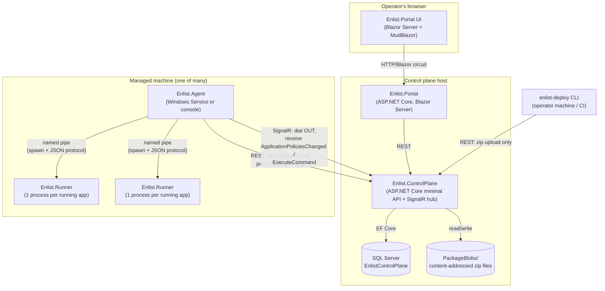

# System Architecture Document (SAD)

**Product:** enList v3
**Document status:** Derived from the current implementation as of 2026-09-03.

---

## 1. Architectural Goals

1. **Outbound-only managed machines.** No component running on a managed machine ever accepts an inbound connection for enList's own purposes.
2. **One source of truth for desired state.** A machine's running state is never inferred from what happens to be on disk; it is always driven by a row in the control plane's database.
3. **Zero-coupling plugin contract.** A plugin (Service/Job) author's project has no compiled dependency on any enList assembly — the runner discovers plugins by attribute **name**, not type identity, so a plugin and the runner can each evolve independently without a version collision.
4. **Two independent control layers.** Declarative desired state (what should eventually be true) and imperative commands (do this one thing right now) are separate mechanisms with separate delivery guarantees, not the same mechanism at two granularities.
5. **Content-addressed, deduplicated distribution.** A build artifact is identified by the hash of its own bytes, uploaded once, and reused by every machine and every redeploy that needs it.

## 2. Component Overview



## 3. Components

### 3.1 Enlist.ControlPlane

ASP.NET Core minimal-API service. Owns the SQL Server database and the package blob store. Exposes:

- A REST API (machines, assignments, packages, status reports, logs, imperative commands) — see [`API-Specification.md`](API-Specification.md).
- A SignalR hub (`ApplicationPolicyHub`, at `/hubs/application-policies`) agents dial into to receive push notifications.
- Three background hosted services: `PackageRetentionSweepService` (garbage-collects unreferenced packages after a grace period), `LogRetentionSweepService` (prunes old forwarded log rows) and `ReportRetentionSweepService` (prunes status reports older than a day, always keeping each agent's newest).

Never initiates a connection to an agent — every agent-facing interaction is either the agent calling in (REST) or the agent's own outbound hub connection receiving a push. The control plane never opens a connection to a managed machine.

Hosting-mode neutral: the same published output runs as a Windows Service (`AddWindowsService`), under IIS, or from `dotnet run`, with no rebuild and nothing in configuration selecting the mode — see [`Deployment-IaC.md` §1.6](../05-operations/Deployment-IaC.md). Schema is applied automatically only in `Development`; outside it the process verifies and refuses to start rather than issuing DDL (§1.4 there).

### 3.2 Enlist.Agent

Runs on every managed machine, as a Windows Service (`AddWindowsService`) or interactively (console, Ctrl+C-driven shutdown — same `AgentHost.StopAsync` either way). Responsibilities:

- Fetches its own assignment list from the control plane and reconciles: starts/stops/restarts application instances (one child `Enlist.Runner` process per running application) to match desired state.
- Maintains a SignalR connection to `ApplicationPolicyHub`, dialing **out**; reconnects for as long as it takes (never SignalR's stock four attempts), re-joins its agent group on every reconnect, and re-fetches on a 3-minute timer as a floor under push. The connection's state is reported with its capabilities so the portal can tell *Online* and *not receiving* apart.
- Supervises each `Enlist.Runner` child process: restarts a crashed one with exponential backoff up to a limit, then marks it `Failed`.
- Downloads and locally caches content-addressed packages (`PackageCache`), pruning digests no longer referenced by any current assignment, only after reconciliation has actually stopped whatever was using the old one.
- Forwards application log lines and status snapshots to the control plane; sends a heartbeat status snapshot on a fixed timer even when nothing has changed.
- Relays imperative service/job commands received over the hub to the specific runner process that owns the target application.
- On Windows, optionally assigns every runner process to a Job Object so an abnormal agent exit still kills its orphaned children.

### 3.3 Enlist.Runner

One process per **running application instance** (not one per application definition — if the same application runs on two machines, that is two separate runner processes, one on each machine). Responsibilities:

- Loads every `*.dll` in its assigned application directory into a private `AssemblyLoadContext` (`PluginLoadContext`) for dependency isolation.
- Discovers Service/Job types by attribute **name** matching (never compiled type identity — see `contracts/EnlistAttributes.cs`).
- Hosts the discovered services (start/stop lifecycle) and executes jobs on command.
- Captures `Console.Out`/`Console.Error` from plugin code before any plugin assembly loads, attributing lines to whichever service/job is currently executing.
- Speaks a small newline-delimited-JSON protocol with its parent agent over a named pipe (`MessageChannel<TOut,TIn>`): `Ready`, `Log`, `StateChanged`, `JobResult`, `Faulted` upward; `StartService`/`StopService`/`RunJob`/`CancelJob`/`Shutdown` downward.
- Treats the pipe closing (parent gone) exactly like an explicit `Shutdown`: stops every running service and exits — there is no orphaned-runner state.

The same executable also carries two developer-facing modes that no agent ever uses: `--dev` runs an application standalone with no agent, control plane, portal or database, and `--check` prints what discovery would find and exits. Neither is a second execution path — `--dev` stands up a real named pipe in-process and drives the ordinary `RunnerHost` with ordinary `AgentCommand`s, precisely so a debugging host cannot behave differently from production. See [`Application-Developer-Guide.md`](../02-building-applications/Application-Developer-Guide.md).

### 3.4 Enlist.Deploy

A CLI (`enlist-deploy`), not a service — packages a build output directory and uploads it, printing the resulting digest and the server-detected runtime flavor. It creates no policy rule and contacts no agent: placement is a separate, deliberate act in the portal, so a redeploy cannot silently change where an application runs. Upload is idempotent by construction (content-addressed). Used interactively or from automation/CI.

### 3.5 Enlist.Portal

Blazor Server web application (MudBlazor 8.6.0 component library). Talks to the control plane exclusively over the same public REST API everything else uses — the portal has no special/private API surface and no direct database access. Maintains its own client-side resolution helper (`TagSelectorMatcher`) mirroring the control plane's tag-matching logic, since aggregate counts shown in master lists are computed from a full assignment fetch rather than one per-machine call.

Hosting-mode neutral in the same way as the control plane, with one caveat that follows from Blazor Server: per-user circuit state lives in memory over a SignalR WebSocket, so under IIS the app pool's idle timeout and periodic recycling must both be set to 0 or users are dropped mid-session, and more than one instance requires sticky sessions — see [`Deployment-IaC.md` §1.6](../05-operations/Deployment-IaC.md).

### 3.6 contracts/EnlistAttributes.cs

Not a project — a single source file, copied (via MSBuild `<Compile Include>`, see `contracts/Enlist.Contracts.props`) directly into each plugin project's compilation. Defines the attributes a plugin author applies: `EnlistServiceAttribute`, `EnlistStartAttribute`, `EnlistStopAttribute`, `EnlistJobAttribute`, `EnlistExecuteAttribute`, `EnlistApplicationAttribute`. Because it's source, not a package, a plugin project has zero `PackageReference`/`ProjectReference` on anything called "Enlist" — nothing to version-collide against.

## 4. Key Data Flows

### 4.1 Deploy → Run

```
enlist-deploy → POST /api/packages (zip, content-addressed; flavor detected server-side)
             → prints the digest and STOPS. It creates no policy and notifies no agent.

operator     → POST /api/application-policies (TagSelector, PackageDigest, DesiredState=Running)
   (portal)     — a separate, deliberate act, so a redeploy cannot silently change placement
             → control plane pushes ApplicationPoliciesChanged over SignalR
             → agent re-fetches GET /api/agents/{agent}/policies
             → agent downloads package via PackageCache (if not already cached)
             → agent spawns enlist-runner --pipe <name> --app <extracted path>
             → runner discovers plugins, reports Ready, agent sends StartServiceCommand per service
             → runner starts services, registers cron jobs with agent-side JobScheduler
             → agent POSTs status snapshot → portal polls and displays it
```

### 4.2 Imperative Command

```
Portal → POST /api/agents/{name}/commands
       → control plane relays over SignalR (fire-and-forget, no ack)
       → agent's CommandReceived handler forwards to the owning runner's pipe
       → runner starts/stops the named service, or (un)registers the named job
       → effect becomes visible only in the runner's next StateChangedMessage → agent's next status snapshot
```

### 4.3 Status / Staleness

```
Agent: on every state change, on every reconciliation pass, AND on a 2-minute heartbeat
     → POST /api/agents/{machine}/report (opaque JSON snapshot) — also upserts LastSeenUtc
Portal: polls GET /api/agents/{machine}/report/latest every ~3s while a detail view is open
      → compares report age against a 5-minute threshold to decide Online/Offline and Stale/live
```

## 5. Cross-Cutting Design Decisions

| Decision | Rationale |
|---|---|
| Assignments and status are **separate** tables (`ApplicationPolicyEntity` normalized, `AgentReportEntity` an opaque JSON blob) | Desired state is queried/filtered/joined constantly (needs a real schema); reported state is only ever read whole, by machine, most-recent-first, and its shape evolves with the agent — a migration per shape change would be friction with no query benefit. |
| tag-selector resolution lives in exactly one function server-side (`ResolveEffectivePoliciesForAgentAsync`), reused by both the agent-facing and portal-facing endpoints | Two independent implementations of "does this machine match this selector" previously drifted (a machine reachable only via tag selector showed 0 assignments in one view and the correct count in another) until they were unified — see [`Runbook.md`](../05-operations/Runbook.md) for the incident this produced. |
| Agent → control plane is fetch-and-push, not poll-only | A push (`ApplicationPoliciesChanged`) makes convergence near-instant. Push is the fast path, not the only path: the agent reconnects indefinitely and re-fetches on every reconnect, and `WaitForChangeAsync` also returns every 3 minutes, so a push lost to a dead connection costs at most one interval — one small GET per agent per interval, not a poll loop that trades latency for load. |
| Package identity is a content hash, not a caller-supplied version string | Removes an entire class of "which build is actually on this machine" ambiguity — the digest either matches or it doesn't, and re-uploading identical bytes is provably a no-op rather than trusted metadata. |
| Runner isolation is per-application-**instance** (`AssemblyLoadContext`), not per-application-**definition** | Two machines running the same application are two independent processes with independent isolation contexts; there is no shared runtime state between them to keep in sync. |

## 6. Technology Stack

| Layer | Technology |
|---|---|
| Runtime | .NET 10 |
| Control plane API | ASP.NET Core minimal APIs |
| Data access | Entity Framework Core 10, SQL Server provider |
| Real-time push | ASP.NET Core SignalR (server) / `Microsoft.AspNetCore.SignalR.Client` 10.0.0 (agent) |
| Agent process hosting | `Microsoft.Extensions.Hosting`, `Microsoft.Extensions.Hosting.WindowsServices` 10.0.0 |
| Cron parsing | Cronos 0.11.0 |
| Web UI | Blazor Server + MudBlazor 8.6.0 |
| Testing | xUnit across all four test projects |

## 7. Deployment Topology

See [`Deployment-IaC.md`](../05-operations/Deployment-IaC.md) for the full deployment specification. In summary:

- **One** Enlist.ControlPlane instance (plus its SQL Server database and package blob storage) per environment.
- **One** Enlist.Portal instance per environment, pointed at that control plane's base URL.
- The control plane and portal each run as a Windows Service, under IIS, or in a container — the choice is per-host and needs no rebuild (§1.6 of the deployment spec).
- **One** Enlist.Agent instance **per managed machine**, each given a distinct `--agent` identity, all pointed at the same control plane URL.
- `enlist-deploy` and `enlist-runner`'s build output are not standing services — the CLI runs on demand, and a runner binary set is staged onto each machine by its own agent, one copy per running application instance.

## 8. Known Architectural Limitations

- Authentication is partly in place: the control plane authenticates every request under `Authentication:Mode=Required` and can be `Off` only on loopback ([Authentication-Design.md](Authentication-Design.md), steps 1 and 2 of 3, 2026-09-11), and agents enroll with a join token and present their own credential; the portal does not authenticate people yet, so a deployment with a portal still runs `Off` on loopback.
- No multi-region/multi-control-plane federation — one control plane serves one fleet.
- No phased/canary rollout primitive — an assignment update is applied to every currently-matching machine as soon as each one reconciles.
- **Overlapping tag selectors are not ranked.** Two rules whose selectors both match one agent for the same application are resolved by AGREEMENT, not by precedence: if they agree on what to run they are equivalent and either will do; if they disagree the application is reported with a `ConflictReason` naming the rules rather than one being silently chosen. There is deliberately no "most specific selector wins" rule — see [`LLD.md` §3.2](LLD.md). (This limitation previously described `GoverningAssignment`, an explicit-versus-selector tiebreak that disappeared with explicit targeting.)

## 9. Design vs. Implementation

The system was built against a real, prior design document (**[`enList-v3-Design.md`](enList-v3-Design.md)**), not designed from scratch by reverse-engineering the code. Most of that document's decisions shipped exactly as specified — the zero-`PackageReference` runner, name-based attribute matching, agents dialing out over SignalR, content-addressed packages, the three-tier process topology, and the five-step incremental sequencing (§11 of the design doc) are all present in the code exactly as designed, including step 2's "local-file assignment source" still existing today as `AssignmentStore`/`IAssignmentSource`, not deleted once step 3 (the control plane) landed. Where the shipped system **deviates** from that document, deliberately or by simplification, is recorded here so the design doc isn't mistaken for a description of the current schema or feature set.

| Design doc called for (§ reference) | What actually shipped |
|---|---|
| A first-class `Applications` table — "logical app identity" (§10) | No such table. `ApplicationName` is a bare string, consistent by convention across `Assignments`/`Packages`/`AgentReports`/`AgentLogs`, with no row of its own carrying independent identity or metadata. An application's description (`[EnlistApplication]`) lives only in the runtime status snapshot, never persisted to a control-plane table. |
| A `Manifests` table — a manifest **generated at publish time** by a metadata scanner, declaring services/jobs/assemblies ahead of any run (§4, "Declare, do not carry") | Present as a column rather than a table: `Packages.ManifestJson`, scanned once at upload by `PackageManifestScanner` (metadata-only, nothing executed) and served by `GET /api/packages/{digest}/manifest`. The runner still discovers live — the manifest is for the portal, not for hosting. |
| A `JobRuns` table — durable per-execution history: run id, job, machine, start, end, outcome, output (§10) | Not implemented. Only the **most recent** run is kept (`JobStatusEntry.LastRunUtc`/`LastRunOutcome`), inside the opaque `AgentReports.SnapshotJson` blob — there is no queryable history of past job executions, and no `output` capture beyond whatever reached the forwarded log stream. |
| An `Events` table — structured lifecycle/monitoring events (§10) | Not implemented as a distinct concept. `AgentLogs` (raw forwarded log lines) and `AgentReports` (opaque status snapshots) cover what an `Events` table would have, but neither is a structured, queryable event stream. |
| `Assignment.DesiredState` including `Paused`, plus a `Replicas` field (§5) | `DesiredState` supports only `Running`/`Stopped` (`IsValidDesiredState`) — no assignment-level `Paused`. Pause ended up at a different level entirely: an **imperative**, per-job command (`AgentCommandRequest`, §3.6 of [`SRS.md`](../04-requirements/SRS.md)) that unregisters or re-registers one job's schedule, not a declarative desired-state value. `Replicas` does not exist anywhere — there is no scale-out/instance-count concept; placement resolves to "however many machines currently match," never "N instances on one machine." |
| `[EnlistPause]`/`[EnlistResume]` — plugin-declared suspend of a run already executing (§3) | **Built, then removed.** The pair was wired through discovery, the wire protocol and the runner, with samples and tests. It was then cut: nothing in the portal or control plane ever sent it (the UI's per-job control is Enable/Disable, which is the *scheduler*-level stop), suspending a run holds its connections, handles and locks indefinitely, and the operator's actual question is "stop this" rather than "hold this". What replaced it is the thing that was genuinely missing — `CancelJobCommand`, which cancels the `CancellationToken` every `[EnlistExecute]` already receives. Until then that token was never cancelled by anything, so every sample's `IsCancellationRequested` check was dead code. |
| A Roslyn analyzer validating `[EnlistStart]`/`[EnlistExecute]` presence at compile time — flagged as "the strongest answer" though acknowledged as a separate deliverable (§3, "The trade being made") | Not built. Only the "floor" the design doc itself named as the acceptable fallback exists: a runtime discovery warning (`PluginDiscovery`'s `warnings` list) for a `[EnlistService]` with no `[EnlistStart]` or `[EnlistJob]` with no `[EnlistExecute]` — still a publish-time-invisible, runtime-only signal, exactly the gap the analyzer was proposed to close. |
| Step 5 of the sequencing plan — a legacy net472 runner, same attribute contract, no shared assembly (§11) | **Shipped, with one documented gap.** `src/Enlist.Runner.Legacy` is a real net472 runner with the same attribute contract and wire protocol as `Enlist.Runner`, discovered from `samples/Enlist.Sample.Legacy` and proven end-to-end against the live demo fleet (flavor auto-detected from the uploaded package, then staged and started by `AgentHost` alongside net10.0 apps on the same machine). `RuntimeFlavor` on `ApplicationPolicyDto`/`ApplicationPolicyEntity` declares which flavor an assignment needs; `AgentHost` resolves it to a configured runner-bin directory (`--runner-bin` for `net10.0`, `--legacy-runner-bin` for `net472`) and `RunnerStaging` copies whichever build's actual output shape it finds there (the net472 build has no separate managed `.dll` and an arbitrary set of NuGet dependency assemblies, unlike the modern runner's fixed apphost/`.dll`/`.deps.json`/`.runtimeconfig.json` set) — a `net472` assignment on an agent with no `--legacy-runner-bin` configured is correctly marked `Failed` with a clear reason rather than guessed at (see [`Runbook.md`](../05-operations/Runbook.md) and `AgentHost.StartApplicationAsync`). The one deliberate simplification: `LegacyPluginLoadContext` loads plugin assemblies via plain `Assembly.LoadFrom`, not a separate `AppDomain` — .NET Framework has no `AssemblyLoadContext` equivalent, and real per-application isolation there would require `MarshalByRefObject`-based remoting; two co-hosted net472 applications on the same machine are not isolated from each other's loaded assemblies the way two net10.0 applications are. |
| Attribute usage example syntax, `[EnlistService(Name = "...")]` (named property, §3) | Shipped as a positional constructor argument, `[EnlistService("...")]` (`EnlistServiceAttribute(string name)`), with `Description` as the named property. Cosmetic only — the by-name matching and zero-shared-assembly properties the design doc cared about are unaffected either way. |

### 9.1 Open questions the design doc left unresolved (§12)

These were explicitly flagged as undecided in the original design and, as far as this codebase shows, remain so:

- **Is desired-state reconciliation actually warranted at the current fleet size**, versus honest imperative start/stop? The design doc frames this as a real trade-off above vs. below "three or four machines," not a settled question.
- **What is the story for a plugin that wants to host its own ASP.NET Core listener** inside `[EnlistStart]`? Nothing in the runner's discovery or hosting code currently distinguishes a short-lived plugin from one that owns a long-lived listening socket.
- **Can a run that ignores its `CancellationToken` be stopped at all?** Not from inside the runner — it has no safe way to halt a thread it does not own, so `CancelJobCommand` and shutdown both degrade to logging that the grace period expired. The only real lever is the agent killing the runner process, which takes the whole application's other services with it.
