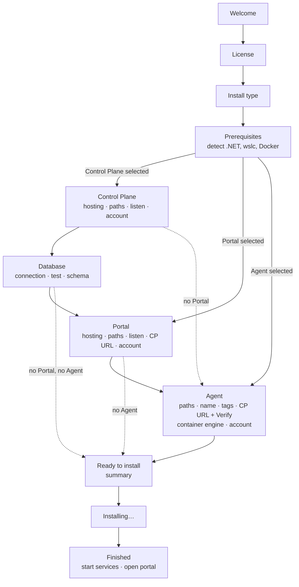

# enList Installer — UI Design (WiX)

**Product:** enList v3
**Document status:** Design draft, 2026-09-11. **Nothing in this document is implemented** — there is no installer project in the repository yet. It exists to agree on the shape of the installer, page by page, before any WiX is authored. Where it describes current product behaviour (ports, flags, config keys) it is accurate to the code; where it describes the installer it is a proposal.

> **Read with [`Deployment-IaC.md`](Deployment-IaC.md).** That document records how the platform is deployed *today* (by hand, with `sc.exe`). This one proposes the installer that replaces those hand steps, and its silent-install surface (§10) is what the IaC shape proposed in Deployment-IaC §4 would drive.

---

## 1. What the installer has to do

Two requirements, restated with what they imply:

1. **Install the portal and/or the control plane, each either as a Windows service or in a container.** Implies: they are separately selectable; hosting mode is a per-component choice; the installer knows how to create a service *and* how to provision a container; and it collects an install path, a listen address, a service logon account, and (for the control plane) a database connection.
2. **Install the agent on its own** — an agent-only install on a machine that will never host the control plane. Implies: the agent is its own installable unit; the installer detects whether the machine can run containers (`wslc` and/or Docker) and configures the agent accordingly; it asks for the control plane URL and **verifies it before finishing**; it asks for an install path; and — "provide a login for the portal / control plane if they are installed as a service" — it collects credentials where the product actually has a place to put them (§8 is candid about where it does not).

Everything else below follows from those two.

---

## 2. Recommended shape: one bundle, three MSIs, a managed bootstrapper application

**Use a Burn bundle with a managed (C#/WPF) bootstrapper application (BA), chaining three small MSIs — `Enlist.ControlPlane.msi`, `Enlist.Portal.msi`, `Enlist.Agent.msi` — plus the prerequisite packages.** WiX 5.

Why that and not a single MSI with custom dialogs:

- **The required pages are beyond MSI's dialog toolkit.** "Verify this URL" with a spinner and a result, "test this database connection", "detect wslc and Docker and grey out what is missing" — MSI's built-in UI can do none of these without deferred custom actions fighting the sequencing engine. A managed BA is ordinary WPF: a `Verify` button awaits an `HttpClient` call and updates a label. All detection and verification (§4, §6) lives in the BA, on the UI thread, **before** anything is installed.
- **Three MSIs is what "agent-only" means.** Each MSI is independently installable, upgradable and removable with its own `UpgradeCode`. The bundle presents them as one product; an agent-only install simply installs one of the three. Nothing in the agent MSI knows the other two exist.
- **Burn chains prerequisites the MSIs cannot.** The .NET 10 runtime/hosting bundle is a bundle-level `ExePackage`, installed once, before any MSI. An MSI cannot install another installer.
- **The BA itself must not need .NET 10.** It runs *before* the .NET 10 runtime is installed. Target the BA at **.NET Framework 4.7.2** (inbox on every supported Windows 10/11 and Server 2019+), not .NET (Core). WiX 5 supports both hosts; the Framework one has no bootstrap-the-bootstrapper problem.
- **The MSIs stay dumb.** Files, `ServiceInstall`/`ServiceControl`, a config file, an environment-free service. All decisions arrive as properties the BA sets. That is also what makes silent install (§10) trivial: the same properties on the command line.

What the MSIs never do: run migrations, call HTTP, or store a password anywhere but the SCM. Those are BA responsibilities or deliberately out of scope (§8).

---

## 3. Install types

The first real page. One radio group; it decides which MSIs are in the chain and which configuration pages appear.

| Install type | Installs | Typical machine |
|---|---|---|
| **Server** | Control Plane + Portal, optionally a local Agent | The one box that hosts enList |
| **Agent only** | Agent | Every machine that will *run* applications |
| **Custom** | Any combination | Split tiers (portal on a DMZ host, control plane inside), or adding a component later |
| **Demo** | Everything on this machine, seeded with the sample applications and run as a session launcher rather than as services | A presenter or evaluator laptop. Designed separately in [Demo-Install-Design.md](Demo-Install-Design.md) |

Selecting a component adds its configuration page(s) to the flow (§5). "Custom" with all three unticked disables *Next*.

---

## 4. Prerequisites and detection

Detected by the BA on the **Prerequisites** page, shown as a table with a *Re-check* button, *before* any configuration page — so every later page already knows what the machine can do.

| Prerequisite | Needed by | How detected | If missing |
|---|---|---|---|
| **.NET 10 ASP.NET Core Runtime** (Hosting Bundle) | Control Plane, Portal | Registry `HKLM\SOFTWARE\dotnet\Setup\InstalledVersions\x64\sharedfx\Microsoft.AspNetCore.App` | Bundle installs it (`ExePackage`, chained, silent) |
| **.NET 10 Runtime** | Agent | same, `Microsoft.NETCore.App` | Bundle installs it |
| **.NET Framework 4.7.2** | Agent, **only** for `net472` applications (the legacy runner) | Registry `Release` ≥ 461808 | Informational. Agent still installs; the page notes that net472 policies will fail on this agent until it is present |
| **WSL 2.9.11+ with `wslc`** | Agent container isolation (`--container-engine wslc`); container hosting of CP/Portal | `%ProgramFiles%\WSL\wslc.exe` exists **and** `wslc version` ≥ 2.9.11 **and** `wslc list` succeeds (the service answers) | Not installable by us (`wsl --update` needs the Store and an interactive session). Show status + the command; container options on later pages are disabled |
| **Docker Desktop (Linux engine)** | Alternative container engine | `docker.exe` on PATH **and** `docker version --format {{.Server.Version}}` succeeds (daemon up, Linux engine) | Same treatment as wslc. Either engine enables container options |
| **SQL Server** | Control Plane | Not here — tested on the Database page (§6.5) against the connection the user enters | — |

Two rules that keep this honest:

- **Container support is never a requirement to install the agent.** An agent without an engine is a perfectly good process-only agent; the control plane already reports its lack of container capability on the Agents tab, and a container-mode policy targeting it fails *that application* with a clear reason. The installer says this on the page and moves on.
- **Detection is a snapshot, not a promise.** Both engines can be up at install time and down at 3 a.m. The agent re-probes on every heartbeat (`ContainerEngineStatus`); the installer only decides the *initial* `--container-engine` value.

---

## 5. Wizard flow



Pages appear only for selected components, in the order Control Plane → Database → Portal → Agent, so a locally-installed control plane can prefill the portal's and agent's *Control plane URL* with `http://localhost:5293` before those pages are reached.

---

## 6. Page specifications

Each page lists its fields, defaults, validation, and the **property** it sets (the same name silent install uses, §10). Passwords are `Hidden` properties: never logged, never echoed in the MSI log, never written to disk (§8).

### 6.1 Welcome, 6.2 License

Standard. License is the product licence text; *Next* requires acceptance.

### 6.3 Install type

See §3. Property `INSTALLTYPE` = `Server | AgentOnly | Custom`; with `Custom`, `ADDLOCAL` lists the MSIs.

### 6.4 Control Plane

```
 ┌─ Control Plane ──────────────────────────────────────────────────────┐
 │ Hosting        (•) Windows service   ( ) Container  [wslc ▾]         │
 │                                     container options need wslc or   │
 │                                     Docker — detected: wslc 2.9.11   │
 │ Install to     [C:\Program Files\enList\ControlPlane        ] [...]  │
 │ Data           [C:\ProgramData\enList\ControlPlane          ] [...]  │
 │                package blobs, logs, appsettings                       │
 │ Listen on      [http://+:5293                               ]        │
 │                 ✓ port 5293 is free                                   │
 │ Service account (•) Network Service  ( ) This account:               │
 │                 user [                 ]  password [        ] [Test] │
 └──────────────────────────────────────────────────────────────────────┘
```

| Field | Default | Validation / behaviour | Property |
|---|---|---|---|
| Hosting | Windows service | *Container* enabled only when an engine was detected (§4); engine dropdown lists the detected ones | `CP_HOSTING` = `Service | Container`, `CP_ENGINE` = `wslc | docker` |
| Install to | `%ProgramFiles%\enList\ControlPlane` | Writable, not a system directory; hidden in Container mode (nothing is installed there) | `CP_INSTALLDIR` |
| Data | `%ProgramData%\enList\ControlPlane` | Writable. Becomes `PackageStorage:Root` (`\PackageBlobs`) and the home of `appsettings.json`. In Container mode it is the bind-mounted volume | `CP_DATADIR` |
| Listen on | `http://+:5293` | Parses as a URL prefix; port not currently bound (`GetActiveTcpListeners`). This is what goes into the service's `--urls` — a service has no shell, so the flag in `binPath` is how it learns its address (Deployment-IaC §1.6) | `CP_URLS` |
| Service account | Network Service | *This account*: `LogonUser` test on *Test*; the MSI grants *Log on as a service* and write access to `CP_DATADIR`. Hidden in Container mode | `CP_ACCOUNT`, `CP_PASSWORD` (Hidden) |

### 6.5 Database (Control Plane only)

```
 ┌─ Database ───────────────────────────────────────────────────────────┐
 │ Server         [sql01.corp.local,1433                       ]        │
 │ Database       [EnlistControlPlane                          ]        │
 │ Authenticate   (•) as the service account (Windows)                  │
 │                ( ) SQL login   user [        ] password [        ]   │
 │                [ Test connection ]  ✓ connected · schema not present │
 │ Schema         (•) Create or upgrade it now (runs the migrations     │
 │                    bundle under your elevated credentials)           │
 │                ( ) A DBA will apply it — the service will not start  │
 │                    until the schema exists                           │
 └──────────────────────────────────────────────────────────────────────┘
```

| Field | Validation / behaviour | Property |
|---|---|---|
| Server, Database | *Test connection* opens a `SqlConnection`, runs `SELECT 1`, then checks for `__EFMigrationsHistory` and reports **present / not present / behind by N** so the Schema choice is informed | `DB_SERVER`, `DB_NAME` |
| Authenticate | Windows: the connection string gets `Integrated Security=True` and the BA reminds the user to grant the service account on the server (it cannot do that itself). SQL login: password Hidden | `DB_AUTH`, `DB_USER`, `DB_PASSWORD` (Hidden) |
| Schema | *Create or upgrade now* runs the **EF Core migrations bundle** (`efbundle.exe`, shipped in the MSI) from the BA, elevated, against the entered connection — the production path Deployment-IaC §1.4 describes, so the control plane itself never migrates. *A DBA will apply it* skips this; the Finish page then says plainly that `enlist-controlplane` will refuse to start (Production verifies the schema) until it is done | `DB_MIGRATE` = `1 | 0` |

*Test connection* is required before *Next* in either case: an unreachable database is the most common failed install, and this is the cheapest place to find out.

### 6.6 Portal

Same layout as §6.4 (hosting, install path, data path for `appsettings.json` and logs, listen `http://+:5231`, service account) plus:

| Field | Default | Validation / behaviour | Property |
|---|---|---|---|
| Control plane URL | `http://localhost:5293` when the Control Plane is in this install, else empty | *Verify* as on the Agent page (§6.7). Becomes `ControlPlane:BaseUrl` in the portal's `appsettings.json` | `PORTAL_CPURL` |

The portal never touches SQL, so there is no database page for it.

### 6.7 Agent

```
 ┌─ Agent ──────────────────────────────────────────────────────────────┐
 │ Install to     [C:\Program Files\enList\Agent               ] [...]  │
 │ Data           [C:\ProgramData\enList\Agent                 ] [...]  │
 │                package cache, staged runners, logs                    │
 │ Agent name     [WEB-07                                      ]        │
 │ Tags           [env=prod  role=web                          ] (opt)  │
 │ Control plane  [https://enlist.corp.local:5293              ] [Verify]│
 │                 ✓ reachable — 14 agents registered                   │
 │ Containers     ( ) None — process isolation only                     │
 │                (•) wslc 2.9.11 (detected)   ( ) Docker (not found)   │
 │                Image  [enlist/runner:3.0.0                  ]        │
 │ Service account (•) Local System  ( ) This account: [...]            │
 └──────────────────────────────────────────────────────────────────────┘
```

| Field | Default | Validation / behaviour | Property |
|---|---|---|---|
| Install to | `%ProgramFiles%\enList\Agent` | Writable. Holds the agent, both runners (`enlist-runner`, and the net472 `enlist-runner.exe` for legacy applications) | `AGENT_INSTALLDIR` |
| Data | `%ProgramData%\enList\Agent` | Becomes `--data`: `Packages\`, `Runners\`, `Logs\` (the layout `.demo/README.md` documents) | `AGENT_DATADIR` |
| Agent name | machine name | Must be unique in the fleet — **two agents with one name silently corrupt each other's reports** (Runbook). *Verify* below also checks the name is not already registered and warns if it is | `AGENT_NAME` |
| Tags | empty | `key=value` pairs; applied with `PUT /api/agents/{name}/tags` on first start — policies target agents by tag, so an agent installed with `env=prod` is schedulable the moment it registers | `AGENT_TAGS` |
| Control plane URL | prefilled if CP is in this install | **Verify** (BA, `HttpClient`, 5 s timeout): `GET {url}/health` → 200 whose body names `enList control plane` = *reachable — enList control plane {version}, database healthy*; 503 with that same body = *reachable, but its database is down* (allowed, with a warning); a connection error or a non-JSON body = *not an enList control plane*. A second call, `GET {url}/api/agents/{name}`, warns if the agent name is already registered. Verification is **required** to proceed, with one escape hatch: *Continue anyway* for machines imaged before the control plane exists — recorded in the summary and on the Finish page | `AGENT_CPURL` |
| Containers | the detected engine, else *None* | Radios enabled per §4 detection. Sets `--container-engine` and `--container-image`. Note under the group: *net472 applications cannot run in a container* (Deployment-IaC) | `AGENT_ENGINE` = `none | wslc | docker`, `AGENT_IMAGE` |
| Service account | Local System | Local System is the pragmatic default: the agent starts child runners, enrols them in a Job Object, and (with an engine) drives `wslc`/`docker`, all of which want a broad host account. *This account* is offered for locked-down hosts, with the same *Test* | `AGENT_ACCOUNT`, `AGENT_PASSWORD` (Hidden) |

The resulting service is `enlist-agent`, `binPath` = `"…\enlist-agent.exe" --control-plane {AGENT_CPURL} --agent {AGENT_NAME} --runner-bin "…\runner" --legacy-runner-bin "…\runner-legacy" --data "{AGENT_DATADIR}" [--container-engine {AGENT_ENGINE} --container-image {AGENT_IMAGE}]` — exactly the flags [`demo/start-demo.ps1`](../../demo/start-demo.ps1) passes today, so the installer and the demo cannot drift apart on what an agent needs.

### 6.8 Ready to install

A read-only summary of every choice above (passwords shown as `••••`), including anything the user overrode with *Continue anyway*. This is the page a screenshot of goes into a ticket.

### 6.9 Installing, 6.10 Finished

Progress per package. Finish offers *Start services now* (checked) and *Open the portal* (`http://localhost:5231`, only when the portal was installed). If the schema was skipped (§6.5) or verification was overridden (§6.7), Finish repeats that in red — those are the two things that will make the fleet look broken an hour later.

---

## 7. "As a service" and "in a container" — what each actually does

**Windows service** is the well-trodden path and matches Deployment-IaC §1.6 exactly: the MSI lays down the published app, `ServiceInstall` creates `enlist-controlplane` / `enlist-portal` / `enlist-agent` with `binPath` carrying `--urls` (or the agent flags), `ServiceControl` starts it, and configuration lives in `%ProgramData%\enList\<component>\appsettings.json` with an ACL of *SYSTEM + Administrators + the service account*. Environment-variable overrides are deliberately not used — a service has no shell to export into.

**Container** hosting of the control plane or portal is not one thing but three, and it is worth being explicit because none of it exists yet:

1. **An image for each.** Only the *runner* has a Dockerfile today. The control plane and portal need their own (`mcr.microsoft.com/dotnet/aspnet:10.0`, publish output, `--urls http://+:5293`). The MSI would carry each image as a `docker save`/`wslc save` tarball and `load` it, so an install needs no registry access.
2. **Provisioning.** The BA creates the container: published port (`0.0.0.0:5293:5293` — a hosted control plane must be reachable from other machines, unlike the loopback-only runner control channel), the data directory as a volume, configuration as `--env` (`ConnectionStrings__ControlPlane`, `ControlPlane__BaseUrl`).
3. **A host-side supervisor service.** `wslc` has **no restart policy** (Docker's `restart: unless-stopped` has no equivalent — learned the hard way on the demo, [`demo/sql-server/README.md`](../../demo/sql-server/README.md)), so a container hosted this way is simply stopped after every reboot. The MSI therefore installs a tiny service, `enlist-<component>-host`, whose whole job is `wslc start`/`docker start` at boot and `stop` on shutdown. With Docker the supervisor is redundant but harmless, so ship one shape.

Two consequences the Database page has to respect: a control plane *in* a container reaches SQL Server from the container's network, so `localhost` on the Server field means the container, not the host (the BA rewrites `localhost` to the host address for the container's env, and says so); and Windows authentication to SQL Server is unavailable from a Linux container, so *SQL login* becomes the only Authenticate option when Container hosting is selected.

**Recommendation:** build the installer with **Service** hosting for the control plane and portal in v1 and keep **Container** hosting behind the same UI as a v2 item — the radio is present and disabled with "coming in a later release", so the page shape does not change when it lands. The three pieces above are real work (two Dockerfiles, an image-distribution story, and the supervisor pattern, which the demo's `demo-db.ps1 up` is already a working prototype of), and none of them should gate shipping an agent installer, which is the one every machine needs.

---

## 8. Credentials — what "login" can and cannot mean today

Three different things get called a login on an installer page. Only two of them exist in this product.

| Credential | Exists today? | Where the installer puts it |
|---|---|---|
| **Service logon account** — the Windows identity each service runs as | Yes | Collected per component (§6.4, §6.6, §6.7), validated with `LogonUser`, applied through `ServiceInstall` `Account`/`Password`. The password is a Hidden property: it reaches the SCM and nothing else — not the MSI log, not a config file, not the registry |
| **Database credentials** — how the control plane reaches SQL Server | Yes | Windows auth via the service account (preferred; nothing stored) or a SQL login written into the ACL-restricted `appsettings.json`. If SQL auth must be used, the connection string should be **DPAPI-protected at machine scope** rather than plaintext — a small addition to the control plane's configuration loading that is worth doing before an installer ships it |
| **An application login for the portal / control plane** — a user and password to sign in to enList | **No.** enList has no authentication or authorization on any surface; that is review finding **C2**, the one open item in [`enList-v3-Review-2026-09-09.md`](../06-background/enList-v3-Review-2026-09-09.md), and Deployment-IaC leads with the trusted-network assumption it implies | Nothing to put it in. The installer **must not** ask for one — a page that collects an "admin password" for a system that then accepts every request would be actively misleading |

So for requirement 2's "provide a login for the portal / control plane if they are installed as a service": that is the **service logon account**, and it is designed in. An *initial administrator* page is reserved in the flow (between Database and Portal) and appears only once C2 is implemented; until then the Finish page carries the trusted-network warning verbatim from Deployment-IaC. The installer should be one of the reasons to resolve C2, not a way of papering over it.

**Update, 2026-09-11 - C2 is designed** ([Authentication-Design.md](../03-architecture/Authentication-Design.md) section 14 lists the page changes). In short: the reserved initial-administrator page is not needed at all, because operators authenticate with Windows and the Portal page asks for the Operators and Viewers group names instead of any password; the Agent page gains a Join token field (`AGENT_JOINTOKEN`), which the installer exchanges for the agent credential before the service is created; the Control Plane and Portal pages gain a TLS certificate, because authentication that is required off loopback refuses plain HTTP; and the installer creates the management key the portal uses with the control plane CLI verb and stores it DPAPI-protected.

---

## 9. Install paths and on-disk layout

Binaries under Program Files, everything that changes under ProgramData, per component, so an upgrade can replace the former and must never touch the latter.

| | Control Plane | Portal | Agent |
|---|---|---|---|
| Binaries | `%ProgramFiles%\enList\ControlPlane` | `%ProgramFiles%\enList\Portal` | `%ProgramFiles%\enList\Agent` (+ `runner\`, `runner-legacy\`) |
| Configuration | `%ProgramData%\enList\ControlPlane\appsettings.json` | `%ProgramData%\enList\Portal\appsettings.json` | none — the agent is configured entirely by service arguments |
| Data | `…\ControlPlane\PackageBlobs` (`PackageStorage:Root`) | — | `…\Agent\{Packages,Runners,Logs}` (`--data`) |
| Logs | `…\ControlPlane\Logs` | `…\Portal\Logs` | `…\Agent\Logs` |
| Service | `enlist-controlplane` | `enlist-portal` | `enlist-agent` |

Every path is overridable on its page; the defaults are what `sc.exe` deployments have used, just under `%ProgramFiles%` instead of `C:\enlist`.

---

## 10. Silent / unattended install

The same properties, on the command line. This is the surface Deployment-IaC §4's proposed IaC would call, and the reason the UI sets properties rather than doing work itself.

```powershell
# Server: control plane + portal as services, migrate now, Windows auth to SQL
enList-3.0.0-Setup.exe /quiet /log install.log `
  INSTALLTYPE=Server `
  CP_URLS=http://+:5293 CP_ACCOUNT="NT AUTHORITY\NetworkService" `
  DB_SERVER=sql01.corp.local DB_NAME=EnlistControlPlane DB_AUTH=Windows DB_MIGRATE=1 `
  PORTAL_URLS=http://+:5231 PORTAL_CPURL=http://localhost:5293

# Agent only, on a machine with wslc
enList-3.0.0-Setup.exe /quiet /log install.log `
  INSTALLTYPE=AgentOnly `
  AGENT_NAME=WEB-07 AGENT_TAGS="env=prod role=web" `
  AGENT_CPURL=https://enlist.corp.local:5293 `
  AGENT_ENGINE=wslc AGENT_IMAGE=enlist/runner:3.0.0
```

Rules: verification still runs in silent mode and **fails the install** on an unreachable control plane or database unless `AGENT_CPURL_SKIPVERIFY=1` / `DB_SKIPTEST=1` is passed explicitly — the same escape hatches as the UI's *Continue anyway*, spelled out so a script cannot skip them by accident. Passwords on a command line are visible in process listings; the documented alternative is a response file (`/response install.rsp`) with an ACL.

---

## 11. Upgrade, repair, uninstall

- **Upgrade:** major upgrades (stable `UpgradeCode` per MSI, new `ProductCode` per version). Services are stopped, binaries replaced, `%ProgramData%` untouched, services started. If `DB_MIGRATE=1` was chosen originally the bundle re-runs the migrations bundle on upgrade — the control plane will refuse to start against an old schema otherwise. Agent upgrade is the one that must be smooth, since it is the fleet-wide one: stop, replace, start; the agent's package cache and staged runners survive, running applications restart under the new agent.
- **Repair:** re-lays binaries and re-registers services; never touches configuration or data.
- **Uninstall:** removes binaries and services, **keeps** `%ProgramData%\enList` by default; a *Remove all data* checkbox on the confirmation page (and `REMOVEDATA=1` silently) deletes it. Uninstalling an agent does not deregister it from the control plane — a machine being rebuilt should keep its registration; the portal's Agents tab is where an operator retires one deliberately.

---

## 12. Open decisions

These need a call before WiX is written. My recommendation is in bold.

1. **Container hosting of the control plane and portal in v1 or v2?** **v2** — see §7. It needs two Dockerfiles, an image-distribution story and the supervisor service; the agent installer is the one every machine needs and it should not wait.
2. **Default service accounts.** **Network Service for the control plane and portal, Local System for the agent** (§6.7 says why). Group-managed service accounts (`gMSA`) should be accepted in the *This account* field (name ending `$`, no password) — cheap to support and what a domain will want.
3. **Who applies the schema by default?** **The installer, when the person running it has the rights** (`DB_MIGRATE=1` default in the UI), with the DBA path one radio away. The migrations bundle keeps the control plane itself from ever migrating, which is the property Deployment-IaC §1.4 cares about.
4. **Add `GET /health` to the control plane.** **Done (2026-09-11).** `GET /health` reports product, version and database reachability, 200 when the database answers and 503 when it does not — see [API-Specification §5b](../03-architecture/API-Specification.md). *Verify* on the Agent and Portal pages targets it, and so should service monitors.
5. **Where do runner images come from for an agent install?** **Bundled tarball, loaded at install** (`wslc load` / `docker load`), so a fleet install needs no registry and no internet. Add a *pull from registry* option later if image size in the MSI becomes a problem (the runner image is ~200 MB).
6. **Authentication (C2).** The installer is designed around its absence (§8). **Decide C2 first** — the per-agent-credential shape the review describes is exactly what an installer would provision on the Agent page, and retrofitting it later means a second installer flow.
7. **Code signing.** The bundle and all three MSIs should be Authenticode-signed; an unsigned installer that creates three services is what a SmartScreen warning is for. Needs a certificate decision, not a design one.

---

*Related:* [`Deployment-IaC.md`](Deployment-IaC.md) (current manual deployment; §4 the IaC shape this installer's silent mode serves) · [`Runbook.md`](Runbook.md) (the duplicate-agent-name failure §6.7 guards against) · [`demo/README.md`](../../demo/README.md) (the demo's `start-demo.ps1` is the living reference for what each service is started with).
